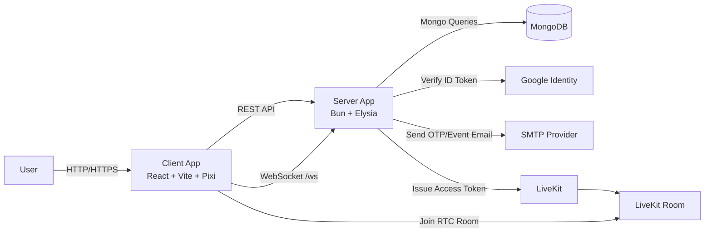
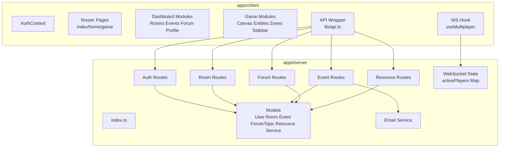
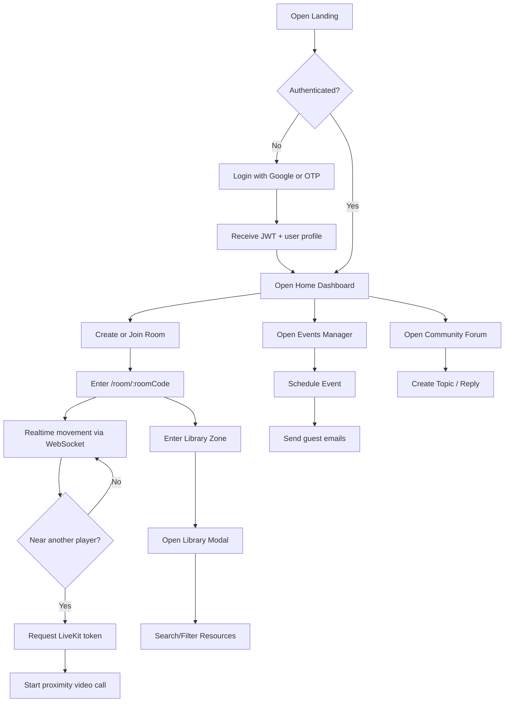
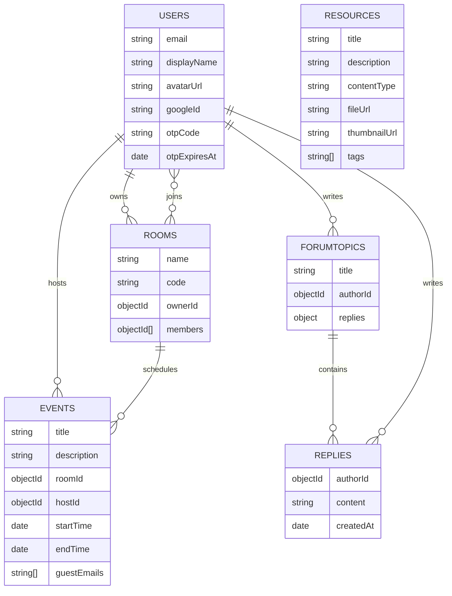

# Software Requirements Specification (SRS)

Project: The Gathering

Version: 2.0

Date: 2026-04-23

## I. Introduction

### 1. Purpose

Tai lieu nay dac ta yeu cau he thong cho The Gathering, mot nen tang virtual co-working ket hop:

- dashboard SaaS (rooms, events, forum, profile), va
- khong gian 2D realtime (PixiJS + WebSocket + LiveKit proximity call).

Tai lieu dung de dong bo giua team phat trien, QA, va stakeholder ve pham vi, chuc nang, rang buoc va tieu chi chat luong cua he thong.

### 2. Scope

The Gathering cung cap:

- xac thuc nguoi dung (Google One Tap, Email OTP),
- quan ly phong hop/lam viec ao,
- quan ly su kien va gui email moi,
- dien dan cong dong,
- thu vien so (digital library),
- multiplayer 2D office/classroom voi giao tiep realtime.

### 3. Definitions

- Room: khong gian lam viec ao co `code` de tham gia.
- Event: lich hen lien ket voi mot room.
- Topic: bai viet forum, co replies.
- Library Zone: khu vuc trong map de mo Digital Library.
- Proximity Call: video call kich hoat khi hai player o gan nhau.

## II. Overall Description

### 1. Product Perspective

He thong la monorepo gom 2 ung dung:

- `apps/client`: React SPA + game canvas
- `apps/server`: Elysia REST API + WebSocket + DB integration

### 2. User Classes

- Guest: xem landing, thuc hien dang nhap.
- Authenticated User: su dung dashboard va game.
- Room Owner: co them quyen quan tri room (rename/delete/kick).
- Event Host: tao/xoa event cua minh.

### 3. Operating Environment

- Client: Browser (Chrome/Edge), giao tiep HTTP + WS.
- Server: Bun runtime, ElysiaJS.
- DB: MongoDB (local/Atlas).
- Third-party: Google Identity, Gmail SMTP, LiveKit.

### 4. System Context Diagram (Mermaid)

### 5. Container/Component View (Mermaid)

## III. Functional Requirements

Danh sach chuan nam o `docs/FunctionalRequirement.md`.

Tom tat nhom chuc nang:

- Authentication: Google One Tap, OTP request/verify, JWT session.
- User Profile: cap nhat display name/avatar.
- Room Management: tao/join/list/rename/delete room, member list, kick member.
- 2D Multiplayer: render tilemap, di chuyen player, WS sync, hien thi online state.
- Event Management: tao event, xem event, xoa event, gui email moi.
- Forum: tao topic, reply topic, xoa topic (author).
- Digital Library: search/filter resources theo text/type/tag.
- In-game Utilities: room sidebar tabs (participants/forum/events), library zone interaction.

### 1. Use Flow (Mermaid)

## IV. External Interface Requirements

### 1. API Interface

API chi tiet nam o `docs/api_schema_2026.md`.

Nhom endpoint chinh:

- `/api/auth/*`
- `/api/rooms/*`
- `/api/events/*`
- `/api/forum/*`
- `/api/resources/*`
- `/api/livekit/token`

### 2. WebSocket Interface

Endpoint: `/ws?room=<roomCode>`

Message types:

- Client -> Server: `move`
- Server -> Client: `initial_state`, `player_moved`, `player_left`

### 3. Data Interface (MongoDB)

Collection chinh: `users`, `rooms`, `events`, `forumtopics`, `resources`, `services`.

ERD (logical view):

## V. Non-Functional Requirements

Danh sach day du nam o `docs/NonFunctionalRequirement.md`.

Tom tat:

- Security: JWT-protected routes, env secrets, input validation.
- Performance: API p95 muc tieu duoi 500ms (tai trung binh), realtime latency thap.
- Reliability: error handling co cau truc, khong crash khi email service loi.
- Maintainability: module theo domain, TypeScript + ESLint.
- Scalability: hien tai WS state in-memory, can path nang cap shared state.
- Documentation: cap nhat dong bo giua SRS, implement, api_schema.

## VI. Constraints and Assumptions

### 1. Constraints

- Runtime va package manager: Bun.
- Client chay tren web browser (khong co native mobile app trong codebase hien tai).
- Realtime player state hien tai khong persist sau server restart.

### 2. Assumptions

- MongoDB va cac bien moi truong duoc cau hinh dung.
- Google, SMTP, LiveKit credentials hop le khi test full flow.

## VII. Out of Scope (Current Release)

- Admin dashboard va role management tong the.
- Service directory business flow day du (chi co model).
- Multi-instance distributed realtime state.

## VIII. Acceptance Criteria (High-Level)

- Dang nhap thanh cong qua Google hoac OTP va truy cap duoc dashboard.
- User tao/join room duoc va vao khong gian 2D theo room code.
- Nhieu user trong cung room thay duoc nhau va dong bo vi tri realtime.
- Event tao thanh cong, host xem/xoa duoc event, email moi gui duoc (neu SMTP dung).
- Topic forum tao/reply/xoa theo quyen author.
- Library modal tim kiem/filter resources theo dung tham so.

## IX. Document References

- `docs/FunctionalRequirement.md`
- `docs/NonFunctionalRequirement.md`
- `docs/implement.md`
- `docs/api_schema_2026.md`
- `docs/tech_stack.md`
