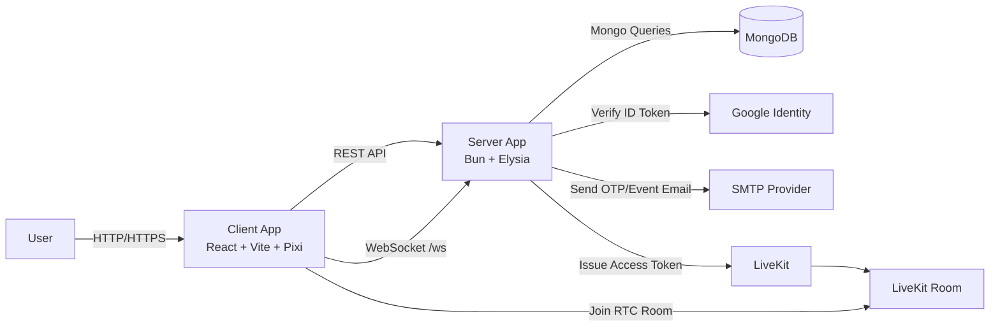
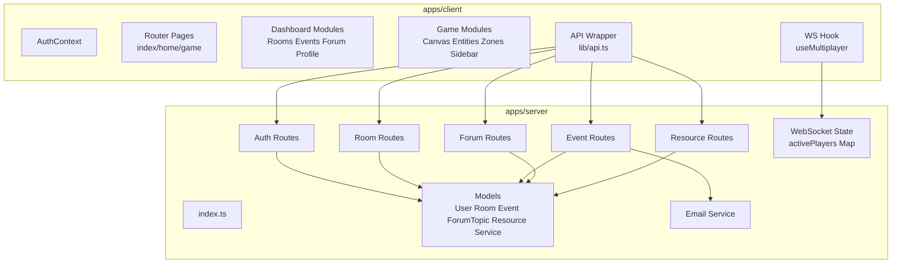
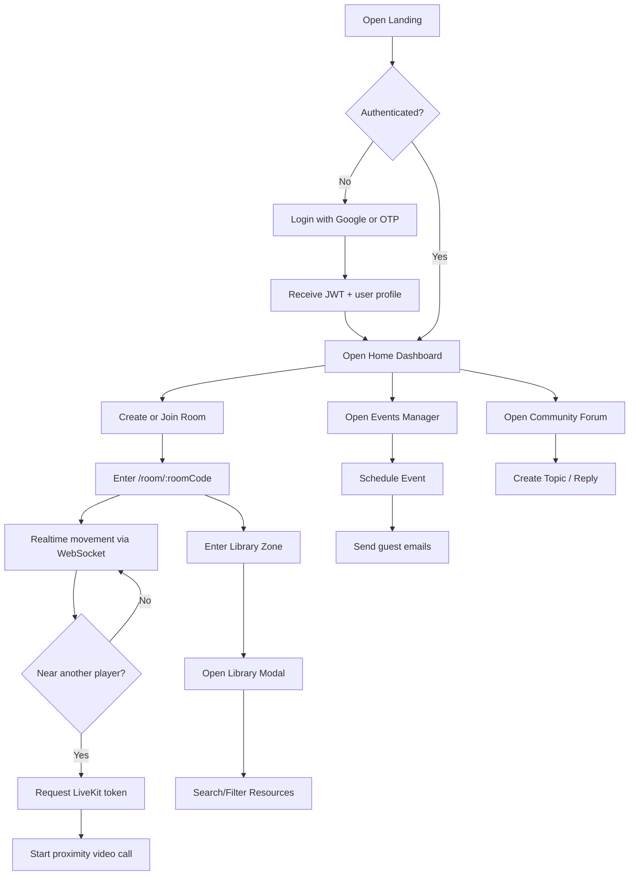
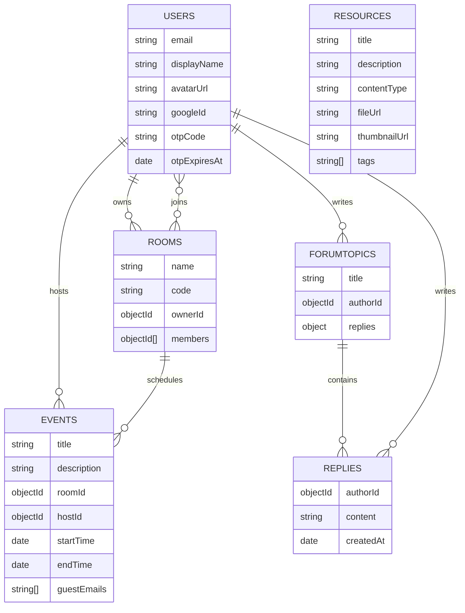

# Software Requirements Specification (SRS)

Project: The Gathering

Version: 2.0

Date: 2026-04-23

## I. Introduction

### 1. Purpose

This document specifies the system requirements for The Gathering, a virtual co-working platform combining:

- SaaS dashboard (rooms, events, forum, profile), and
- 2D realtime space (PixiJS + WebSocket + LiveKit proximity call).

This document serves to synchronize the development team, QA, and stakeholders regarding the scope, functionality, constraints, and quality criteria of the system.

### 2. Scope

The Gathering provides:

- User authentication (Google One Tap, Email OTP),
- Virtual meeting/workspace management,
- Event management and invitation email delivery,
- Community forum,
- Digital library,
- Multiplayer 2D office/classroom with realtime communication.

### 3. Definitions

- Room: A virtual workspace joined via a `code`.
- Event: A scheduled meeting linked to a room.
- Topic: A forum post with replies.
- Library Zone: An area on the map that triggers the Digital Library.
- Proximity Call: A video call activated when two players are near each other.

## II. Overall Description

### 1. Product Perspective

The system is a monorepo consisting of 2 applications:

- `apps/client`: React SPA + game canvas
- `apps/server`: Elysia REST API + WebSocket + DB integration

### 2. User Classes

- Guest: Views the landing page, performs login.
- Authenticated User: Uses the dashboard and game.
- Room Owner: Has additional room management permissions (rename/delete/kick).
- Event Host: Creates/deletes their own events.

### 3. Operating Environment

- Client: Browser (Chrome/Edge), communicates via HTTP + WS.
- Server: Bun runtime, ElysiaJS.
- DB: MongoDB (local/Atlas).
- Third-party: Google Identity, Gmail SMTP, LiveKit.

### 4. System Context Diagram (Mermaid)

### 5. Container/Component View (Mermaid)

## III. Functional Requirements

The full list of requirements is available in `docs/FunctionalRequirement.md`.

Summary of functional groups:

- Authentication: Google One Tap, OTP request/verify, JWT session.
- User Profile: Update display name/avatar.
- Room Management: Create/join/list/rename/delete room, member list, kick member.
- 2D Multiplayer: Render tilemap, player movement, WS sync, display online state.
- Event Management: Create event, view event, delete event, send invitation emails.
- Forum: Create topic, reply to topic, delete topic (author).
- Digital Library: Search/filter resources by text/type/tag.
- In-game Utilities: Room sidebar icons (People/Chat/Calendar/Forum/Settings), immersive fullscreen views, Light/Dark theme toggle.
- Persistence: Player positions saved to MongoDB upon disconnection.

### 1. Use Flow (Mermaid)

## IV. External Interface Requirements

### 1. API Interface

Detailed API documentation is in `docs/api_schema_2026.md`.

Main endpoint groups:

- `/api/auth/*`
- `/api/rooms/*`
- `/api/events/*`
- `/api/forum/*`
- `/api/resources/*`
- `/api/livekit/token`

### 2. WebSocket Interface

Endpoint: `/ws?room=<roomCode>`

Message types:

- Client -> Server: `move`
- Server -> Client: `initial_state`, `player_moved`, `player_left`

### 3. Data Interface (MongoDB)

Main collections: `users`, `rooms`, `events`, `forumtopics`, `resources`, `services`.

ERD (logical view):

## V. Non-Functional Requirements

The full list of requirements is available in `docs/NonFunctionalRequirement.md`.

Summary:

- Security: JWT-protected routes, env secrets, input validation.
- Performance: API p95 target under 500ms (average load), low realtime latency.
- Reliability: Structured error handling, no crash when email service fails.
- Maintainability: Domain-driven modules, TypeScript + ESLint.
- Scalability: Current WS state is in-memory; needs a shared state upgrade path.
- Documentation: Synchronized updates between SRS, implementation, and api_schema.

## VI. Constraints and Assumptions

### 1. Constraints

- Runtime and package manager: Bun.
- Client runs on a web browser (no native mobile app in the current codebase).
- Realtime player positions are persisted; other ephemeral states (emotes) are reset.

### 2. Assumptions

- MongoDB and environment variables are correctly configured.
- Google, SMTP, and LiveKit credentials are valid for testing the full flow.

## VII. Out of Scope (Current Release)

- Overall admin dashboard and role management.
- Full service directory business flow (only the model exists).
- Multi-instance distributed realtime state.

## VIII. Acceptance Criteria (High-Level)

- Successful login via Google or OTP and access to the dashboard.
- User can create/join a room and enter the 2D space using the room code.
- Multiple users in the same room can see each other and sync positions in realtime.
- Event created successfully, host can view/delete event, invitation emails sent (if SMTP is correct).
- Forum topic created/replied/deleted according to author permissions.
- Library modal searches/filters resources according to correct parameters.

## IX. Document References

- `docs/FunctionalRequirement.md`
- `docs/NonFunctionalRequirement.md`
- `docs/implement.md`
- `docs/api_schema_2026.md`
- `docs/tech_stack.md`
