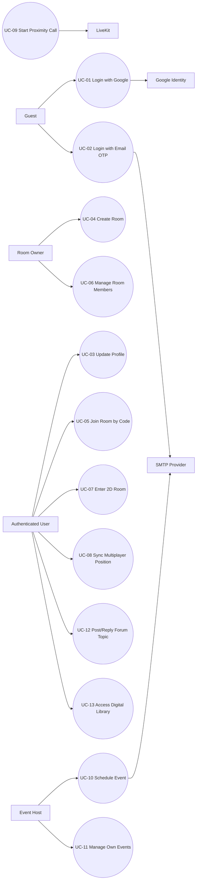

# Use Case Specification (SRS Table Format) - The Gathering

Version: 3.0

Last updated: 2026-04-23

## 1. Purpose

This document specifies use cases using the standard SRS table format to facilitate academic review and easier documentation management.

## 2. Actors

- Guest: Unauthenticated user.
- Authenticated User: User who has successfully logged in.
- Room Owner: The owner of a specific room.
- Event Host: The creator of an event.
- Google Identity: Authentication service for verifying Google tokens.
- SMTP Provider: Email service for sending OTPs and event invitations.
- LiveKit: Real-time video/audio communication service.

## 3. Use Case Overview

| Use Case ID | Use Case Name | Primary Actor | Priority |
|---|---|---|---|
| UC-01 | Login with Google | Guest | Must |
| UC-02 | Login with Email OTP | Guest | Must |
| UC-03 | Update Profile | Authenticated User | Must |
| UC-04 | Create Room | Authenticated User | Must |
| UC-05 | Join Room by Code | Authenticated User | Must |
| UC-06 | Manage Room Members | Room Owner | Must |
| UC-07 | Enter 2D Room | Authenticated User | Must |
| UC-08 | Sync Multiplayer Position | Authenticated User | Must |
| UC-09 | Start Proximity Call | Authenticated User | Must |
| UC-10 | Schedule Event | Event Host | Must |
| UC-11 | Manage Own Events | Event Host | Must |
| UC-12 | Post/Reply Forum Topic | Authenticated User | Must |
| UC-13 | Access Digital Library | Authenticated User | Must |
| UC-14 | Toggle Light/Dark Theme | Authenticated User | Must |
| UC-15 | Open Fullscreen Chat/Calendar | Authenticated User | Should |

## 4. Use Case Diagram

## 5. Detailed Use Cases (SRS Tables)

### UC-01 - Login with Google

| Field | Description |
|---|---|
| Use Case ID | UC-01 |
| Use Case Name | Login with Google |
| Primary Actor | Guest |
| Supporting Actors | Google Identity |
| Preconditions | User is on the landing page; stable internet connection; Google script loaded successfully. |
| Trigger | User clicks the Google Login button. |
| Basic Flow | 1. User selects Google login. 2. Client receives Google credential. 3. Client calls `POST /api/auth/google`. 4. Server verifies the token with Google Identity. 5. Server upserts the user and generates a JWT. 6. Client saves the `token` and `user` in local storage. 7. Client navigates to `/home`. |
| Alternative Flow | A1. User cancels the Google popup -> stays on landing page, not logged in. A2. User has a valid session -> skips login, enters `/home` directly. |
| Exception Flow | E1. Invalid Google token -> API returns `401`, client displays error message. E2. Network error/API timeout -> client displays notification and allows retry. |
| Postconditions | User successfully logged in with a JWT session. |

### UC-02 - Login with Email OTP

| Field | Description |
|---|---|
| Use Case ID | UC-02 |
| Use Case Name | Login with Email OTP |
| Primary Actor | Guest |
| Supporting Actors | SMTP Provider |
| Preconditions | User provides a valid email; SMTP service is correctly configured. |
| Trigger | User enters email and requests OTP. |
| Basic Flow | 1. User enters email. 2. Client calls `POST /api/auth/otp/request`. 3. Server generates a 6-digit OTP, sets 5-minute expiry, and saves to DB. 4. Server sends OTP via email. 5. User enters OTP. 6. Client calls `POST /api/auth/otp/verify`. 7. Server verifies OTP and returns JWT + user data. 8. Client saves session and redirects to `/home`. |
| Alternative Flow | A1. User enters a different email before verifying OTP. A2. User switches to Google login instead of OTP. |
| Exception Flow | E1. Invalid email format -> client prevents submission. E2. Incorrect/expired OTP -> API returns error, user re-enters OTP. E3. Email delivery failure -> API returns error, user retries OTP request. |
| Postconditions | User successfully logged in via OTP, session created. |

### UC-03 - Update Profile

| Field | Description |
|---|---|
| Use Case ID | UC-03 |
| Use Case Name | Update Profile |
| Primary Actor | Authenticated User |
| Preconditions | User is logged in with a valid JWT. |
| Trigger | User opens the profile tab and clicks Save Changes. |
| Basic Flow | 1. User opens the profile page. 2. User modifies `displayName` and/or `avatarUrl`. 3. Client calls `PUT /api/auth/profile` with JWT. 4. Server updates user in DB. 5. Client updates AuthContext and local storage. 6. UI displays a success notification. |
| Alternative Flow | A1. User only updates one field (`displayName` or `avatarUrl`). |
| Exception Flow | E1. Invalid JWT -> unauthorized. E2. Invalid input -> update fails, error message displayed. |
| Postconditions | New profile information is used across the dashboard and game rooms. |

### UC-04 - Create Room

| Field | Description |
|---|---|
| Use Case ID | UC-04 |
| Use Case Name | Create Room |
| Primary Actor | Authenticated User |
| Preconditions | User is successfully logged in. |
| Trigger | User clicks Create/Start Instant on the dashboard. |
| Basic Flow | 1. User enters a room name (optional). 2. Client generates a room code and calls `POST /api/rooms`. 3. Server creates the room, sets owner = user, and initial members = [owner]. 4. Client refreshes the room list. 5. Client redirects user to `/room/:code`. |
| Alternative Flow | A1. User does not enter a room name -> system uses a default name. |
| Exception Flow | E1. Duplicate room code or invalid data -> API returns error, user retries. E2. Database connection error -> room creation fails. |
| Postconditions | A new room exists and the user becomes the Room Owner. |

### UC-05 - Join Room by Code

| Field | Description |
|---|---|
| Use Case ID | UC-05 |
| Use Case Name | Join Room by Code |
| Primary Actor | Authenticated User |
| Preconditions | User is logged in and has a valid room code. |
| Trigger | User enters code and clicks Join, or accesses `/room/:roomCode` directly. |
| Basic Flow | 1. Client navigates to the room route based on the code. 2. Client calls `POST /api/rooms/join/:code`. 3. Server finds the room by code. 4. If the user is not already a member, server adds them to `members`. 5. User enters the game room successfully. |
| Alternative Flow | A1. User is already a member -> skip addition step, enter room normally. |
| Exception Flow | E1. Room code does not exist -> API returns `404`. E2. Invalid token -> API returns `401`. |
| Postconditions | User becomes a member of the room (if they weren't already). |

### UC-06 - Manage Room Members

| Field | Description |
|---|---|
| Use Case ID | UC-06 |
| Use Case Name | Manage Room Members |
| Primary Actor | Room Owner |
| Preconditions | User is the owner of the room. |
| Trigger | Owner opens the Room Management Modal. |
| Basic Flow | 1. Owner opens the room management modal. 2. Client calls `GET /api/rooms/:id/members` to fetch the member list. 3. Owner renames the room -> `PATCH /api/rooms/:id`. 4. Owner kicks a member -> `POST /api/rooms/:id/kick`. 5. Client reloads the member list after changes. |
| Alternative Flow | A1. Owner views the list without making any updates. |
| Exception Flow | E1. Non-owner tries to update/kick -> API returns `403`. E2. Room does not exist -> `404`. |
| Postconditions | Room configuration and member list are updated according to the owner's actions. |

### UC-07 - Enter 2D Room

| Field | Description |
|---|---|
| Use Case ID | UC-07 |
| Use Case Name | Enter 2D Room |
| Primary Actor | Authenticated User |
| Preconditions | User logged in; room code valid; map assets exist. |
| Trigger | User navigates to route `/room/:roomCode`. |
| Basic Flow | 1. Client loads map JSON (office/classroom). 2. Client renders PixiJS stage, layers, and entities. 3. User chooses a character if not previously selected. 4. RoomSidebar displays participants/forum/events. 5. User begins moving in the 2D world. |
| Alternative Flow | A1. User leaves the room using the leave button -> redirects to `/home`. |
| Exception Flow | E1. Error loading map/assets -> displays fallback loading/error state. E2. Token expired -> redirects to login page. |
| Postconditions | User is active and interacting within the game room. |

### UC-08 - Sync Multiplayer Position

| Field | Description |
|---|---|
| Use Case ID | UC-08 |
| Use Case Name | Sync Multiplayer Position |
| Primary Actor | Authenticated User |
| Supporting Actors | WebSocket Server |
| Preconditions | User is in a room; WS connection successful. |
| Trigger | User moves or changes state (sitting/standing). |
| Basic Flow | 1. Client opens connection `WS /ws?room=<code>`. 2. Server sends `initial_state`. 3. Client sends `move` payload at 20Hz throttle. 4. Server updates `activePlayers` in-memory. 5. Server broadcasts `player_moved` to the room. 6. Clients render new player positions. 7. When a user disconnects, server broadcasts `player_left`. |
| Alternative Flow | A1. User remains idle; no new move messages are sent. |
| Exception Flow | E1. WS connection lost -> sync interrupted until reconnection. E2. Server restart -> in-memory state reset. |
| Post-conditions | All users see each other's avatars at the correct coordinates; the system saves the last known position to MongoDB upon disconnect. |

### UC-09 - Start Proximity Call

| Field | Description |
|---|---|
| Use Case ID | UC-09 |
| Use Case Name | Start Proximity Call |
| Primary Actor | Authenticated User |
| Supporting Actors | LiveKit |
| Preconditions | Other players nearby based on proximity logic; LiveKit environment configured. |
| Trigger | System detects players within proximity range. |
| Basic Flow | 1. Client identifies the nearest target player. 2. Client calls `GET /api/livekit/token?room=...&username=...`. 3. Server generates and returns LiveKit JWT token. 4. Client opens LiveKit modal and joins calling room. 5. Users exchange real-time voice/video. |
| Alternative Flow | A1. User moves away from proximity range -> disconnects call and closes modal. |
| Exception Flow | E1. Unable to fetch token -> call does not start. E2. LiveKit server unavailable -> join fails. |
| Postconditions | User joins the call room when proximity conditions are met. |

### UC-10 - Schedule Event

| Field | Description |
|---|---|
| Use Case ID | UC-10 |
| Use Case Name | Schedule Event |
| Primary Actor | Event Host |
| Supporting Actors | SMTP Provider |
| Preconditions | User logged in; has event creation permissions. |
| Trigger | Host clicks Save in the Schedule Event Modal. |
| Basic Flow | 1. Host enters event details (title, description, start/end). 2. Host selects existing room or creates new one (`roomId=new`). 3. Host enters guest email list. 4. Client calls `POST /api/events`. 5. Server creates event (and new room if required). 6. Server sends invitation emails to the guest list. 7. Client displays success notification and refreshes list. |
| Alternative Flow | A1. Host omits guest emails -> event created without sending invitations. A2. Host creates event from room list or room sidebar. |
| Exception Flow | E1. End time <= start time -> client prevents submission. E2. SMTP error -> API returns error regarding email/event creation. |
| Postconditions | Event saved to DB and visible in Events Manager. |

### UC-11 - Manage Own Events

| Field | Description |
|---|---|
| Use Case ID | UC-11 |
| Use Case Name | Manage Own Events |
| Primary Actor | Event Host |
| Preconditions | User is successfully logged in. |
| Trigger | User opens the Events tab. |
| Basic Flow | 1. Client calls `GET /api/events`. 2. System displays upcoming/past events. 3. User opens event details from the card. 4. If user is the host, they can delete it (`DELETE /api/events/:id`). 5. List reloads after deletion. |
| Alternative Flow | A1. User views events without making any changes. |
| Exception Flow | E1. Non-host tries to delete event -> `403`. E2. Event was already deleted -> `404`. |
| Postconditions | User's event list is accurately updated. |

### UC-12 - Post/Reply Forum Topic

| Field | Description |
|---|---|
| Use Case ID | UC-12 |
| Use Case Name | Post/Reply Forum Topic |
| Primary Actor | Authenticated User |
| Preconditions | User logged in with a valid JWT. |
| Trigger | User submits a new topic or reply. |
| Basic Flow | 1. Client fetches topic list (`GET /api/forum/topics`). 2. User creates a topic (`POST /api/forum/topics`). 3. User replies to a topic (`POST /api/forum/topics/:id/replies`). 4. Author can delete their own topic (`DELETE /api/forum/topics/:id`). 5. Feed reloads with fresh data. |
| Alternative Flow | A1. User reads forum without posting or replying. |
| Exception Flow | E1. Missing token -> unauthorized for post/reply/delete actions. E2. Deleting topic as non-author -> forbidden. |
| Postconditions | Topic and replies are saved and displayed in the forum feed. |

### UC-13 - Access Digital Library

| Field | Description |
|---|---|
| Use Case ID | UC-13 |
| Use Case Name | Access Digital Library |
| Primary Actor | Authenticated User |
| Preconditions | User is in a game room; enters the `library` zone. |
| Trigger | User interacts with the library zone (E key). |
| Basic Flow | 1. System opens the Library Modal. 2. Client calls `GET /api/resources` with filters `search/type/tag`. 3. Server returns filtered resources. 4. Client displays cards and resource details. 5. User searches for desired documents. |
| Alternative Flow | A1. User clears filters to return to the full list. |
| Exception Flow | E1. No matching resources found -> displays empty state. E2. API error -> displays data fetch fail notification. |
| Postconditions | User accesses the library and can view resource content. |

## 6. Traceability

- Functional requirements mapping: `docs/FunctionalRequirement.md`.
- Architecture and interfaces: `docs/SRS.md`, `docs/diagram.md`, `docs/api_schema_2026.md`.
