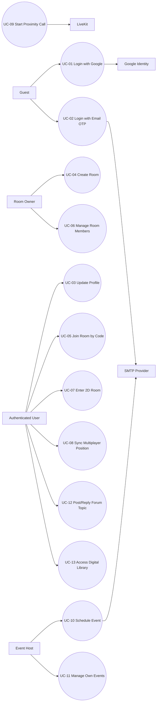

# Use Case Specification (SRS Table Format) - The Gathering

Version: 3.0

Last updated: 2026-04-23

## 1. Purpose

Tai lieu nay dac ta use case theo format bang chuan SRS de phuc vu nop hoc phan va review de dang hon.

## 2. Actors

- Guest: nguoi chua dang nhap.
- Authenticated User: nguoi da dang nhap.
- Room Owner: chu so huu room.
- Event Host: nguoi tao event.
- Google Identity: dich vu xac thuc Google token.
- SMTP Provider: dich vu gui email OTP va event invitation.
- LiveKit: dich vu video call token/room.

## 3. Use Case Overview

| Use Case ID | Use Case Name | Primary Actor | Priority |
|---|---|---|---|
| UC-01 | Login with Google | Guest | Must |
| UC-02 | Login with Email OTP | Guest | Must |
| UC-03 | Update Profile | Authenticated User | Must |
| UC-04 | Create Room | Authenticated User | Must |
| UC-05 | Join Room by Code | Authenticated User | Must |
| UC-06 | Manage Room Members | Room Owner | Must |
| UC-07 | Enter 2D Room | Authenticated User | Must |
| UC-08 | Sync Multiplayer Position | Authenticated User | Must |
| UC-09 | Start Proximity Call | Authenticated User | Must |
| UC-10 | Schedule Event | Event Host | Must |
| UC-11 | Manage Own Events | Event Host | Must |
| UC-12 | Post/Reply Forum Topic | Authenticated User | Must |
| UC-13 | Access Digital Library | Authenticated User | Must |

## 4. Use Case Diagram

## 5. Detailed Use Cases (SRS Tables)

### UC-01 - Login with Google

| Field | Description |
|---|---|
| Use Case ID | UC-01 |
| Use Case Name | Login with Google |
| Primary Actor | Guest |
| Supporting Actors | Google Identity |
| Preconditions | User dang o landing page; internet on dinh; Google script load thanh cong. |
| Trigger | User nhan nut login Google. |
| Basic Flow | 1. User chon login Google. 2. Client nhan Google credential. 3. Client goi `POST /api/auth/google`. 4. Server verify token voi Google Identity. 5. Server upsert user, tao JWT. 6. Client luu `token` va `user` vao local storage. 7. Client dieu huong sang `/home`. |
| Alternative Flow | A1. User huy popup Google -> luu tai landing page, khong login. A2. User da co session hop le -> bo qua login, vao thang `/home`. |
| Exception Flow | E1. Google token invalid -> API tra `401`, client hien thong bao loi. E2. Loi mang/API timeout -> client hien thong bao va cho phep thu lai. |
| Postconditions | User da dang nhap thanh cong va co session JWT. |

### UC-02 - Login with Email OTP

| Field | Description |
|---|---|
| Use Case ID | UC-02 |
| Use Case Name | Login with Email OTP |
| Primary Actor | Guest |
| Supporting Actors | SMTP Provider |
| Preconditions | User co email hop le; SMTP service cau hinh dung. |
| Trigger | User nhap email va chon request OTP. |
| Basic Flow | 1. User nhap email. 2. Client goi `POST /api/auth/otp/request`. 3. Server tao OTP 6 chu so, set expiry 5 phut, luu DB. 4. Server gui OTP qua email. 5. User nhap OTP. 6. Client goi `POST /api/auth/otp/verify`. 7. Server verify OTP, tra JWT + user. 8. Client luu session va chuyen `/home`. |
| Alternative Flow | A1. User nhap lai email khac truoc khi verify OTP. A2. User quay lai login Google thay vi OTP. |
| Exception Flow | E1. Email khong hop le -> client chan submit. E2. OTP sai/het han -> API tra loi, user nhap lai OTP. E3. Gui email that bai -> API tra loi, user thu lai request OTP. |
| Postconditions | User dang nhap thanh cong bang OTP, session duoc tao. |

### UC-03 - Update Profile

| Field | Description |
|---|---|
| Use Case ID | UC-03 |
| Use Case Name | Update Profile |
| Primary Actor | Authenticated User |
| Preconditions | User da dang nhap, co JWT hop le. |
| Trigger | User mo tab profile va nhan Save Changes. |
| Basic Flow | 1. User mo trang profile. 2. User sua `displayName` va/hoac `avatarUrl`. 3. Client goi `PUT /api/auth/profile` kem JWT. 4. Server cap nhat user trong DB. 5. Client cap nhat AuthContext va local storage. 6. UI hien thong bao cap nhat thanh cong. |
| Alternative Flow | A1. User chi cap nhat 1 truong (`displayName` hoac `avatarUrl`). |
| Exception Flow | E1. JWT khong hop le -> unauthorized. E2. Input invalid -> cap nhat that bai, hien thong bao loi. |
| Postconditions | Thong tin profile moi duoc su dung tren dashboard va game room. |

### UC-04 - Create Room

| Field | Description |
|---|---|
| Use Case ID | UC-04 |
| Use Case Name | Create Room |
| Primary Actor | Authenticated User |
| Preconditions | User da dang nhap hop le. |
| Trigger | User nhan Create/Start Instant tren dashboard. |
| Basic Flow | 1. User nhap room name (co the bo trong). 2. Client tao room code va goi `POST /api/rooms`. 3. Server tao room, set owner = user, members ban dau = [owner]. 4. Client refresh room list. 5. Client dieu huong vao `/room/:code`. |
| Alternative Flow | A1. User khong nhap ten room -> he thong dung ten mac dinh. |
| Exception Flow | E1. Room code trung hoac du lieu khong hop le -> API tra loi, user tao lai. E2. Loi ket noi DB -> tao room that bai. |
| Postconditions | Room moi ton tai va user tro thanh Room Owner. |

### UC-05 - Join Room by Code

| Field | Description |
|---|---|
| Use Case ID | UC-05 |
| Use Case Name | Join Room by Code |
| Primary Actor | Authenticated User |
| Preconditions | User da dang nhap; co room code. |
| Trigger | User nhap code va nhan Join, hoac truy cap `/room/:roomCode`. |
| Basic Flow | 1. Client dieu huong vao route room theo code. 2. Client goi `POST /api/rooms/join/:code`. 3. Server tim room theo code. 4. Neu chua la member thi add user vao `members`. 5. User vao game room thanh cong. |
| Alternative Flow | A1. User da la member -> bo qua buoc add, vao phong binh thuong. |
| Exception Flow | E1. Room code khong ton tai -> API tra `404`. E2. Token khong hop le -> API tra `401`. |
| Postconditions | User tro thanh member room (neu truoc do chua la member). |

### UC-06 - Manage Room Members

| Field | Description |
|---|---|
| Use Case ID | UC-06 |
| Use Case Name | Manage Room Members |
| Primary Actor | Room Owner |
| Preconditions | User la owner cua room. |
| Trigger | Owner mo Room Manage Modal. |
| Basic Flow | 1. Owner mo modal quan ly room. 2. Client goi `GET /api/rooms/:id/members` de lay member list. 3. Owner sua ten room -> `PATCH /api/rooms/:id`. 4. Owner co the kick member -> `POST /api/rooms/:id/kick`. 5. Client tai lai danh sach members sau khi thay doi. |
| Alternative Flow | A1. Owner chi xem danh sach ma khong cap nhat gi. |
| Exception Flow | E1. User khong phai owner thao tac update/kick -> API tra `403`. E2. Room khong ton tai -> `404`. |
| Postconditions | Cau hinh room va danh sach members duoc cap nhat theo quyen owner. |

### UC-07 - Enter 2D Room

| Field | Description |
|---|---|
| Use Case ID | UC-07 |
| Use Case Name | Enter 2D Room |
| Primary Actor | Authenticated User |
| Preconditions | User da login; room code hop le; map assets ton tai. |
| Trigger | User vao route `/room/:roomCode`. |
| Basic Flow | 1. Client tai map JSON (office/classroom). 2. Client render stage PixiJS + layers + entities. 3. User chon nhan vat neu chua chon. 4. RoomSidebar hien participants/forum/events. 5. User bat dau di chuyen trong world 2D. |
| Alternative Flow | A1. User roi room bang nut leave -> quay ve `/home`. |
| Exception Flow | E1. Loi tai map/asset -> hien fallback loading/error. E2. Token het han -> redirect ve trang dang nhap. |
| Postconditions | User dang hien dien va tuong tac trong game room. |

### UC-08 - Sync Multiplayer Position

| Field | Description |
|---|---|
| Use Case ID | UC-08 |
| Use Case Name | Sync Multiplayer Position |
| Primary Actor | Authenticated User |
| Supporting Actors | WebSocket Server |
| Preconditions | User dang trong room; WS ket noi thanh cong. |
| Trigger | User di chuyen hoac thay doi trang thai (ngoi/dung). |
| Basic Flow | 1. Client mo ket noi `WS /ws?room=<code>`. 2. Server gui `initial_state`. 3. Client gui `move` payload theo throttle 20Hz. 4. Server cap nhat `activePlayers` in-memory. 5. Server broadcast `player_moved` cho room. 6. Cac client render vi tri player moi. 7. Khi mot user disconnect, server phat `player_left`. |
| Alternative Flow | A1. User dung yen, khong co message move moi gui len. |
| Exception Flow | E1. Mat ket noi WS -> sync gian doan cho den khi reconnect. E2. Server restart -> in-memory state reset. |
| Postconditions | Tat ca user trong cung room thay duoc vi tri/trang thai cua nhau. |

### UC-09 - Start Proximity Call

| Field | Description |
|---|---|
| Use Case ID | UC-09 |
| Use Case Name | Start Proximity Call |
| Primary Actor | Authenticated User |
| Supporting Actors | LiveKit |
| Preconditions | Co player o gan theo logic proximity; LiveKit env dung. |
| Trigger | He thong phat hien co player trong khoang cach call. |
| Basic Flow | 1. Client xac dinh target player gan nhat. 2. Client goi `GET /api/livekit/token?room=...&username=...`. 3. Server tao LiveKit JWT va tra token. 4. Client mo LiveKit modal va join room call. 5. User trao doi voice/video realtime. |
| Alternative Flow | A1. User di xa khoi vung proximity -> ngat call va dong modal. |
| Exception Flow | E1. Khong lay duoc token -> call khong bat dau. E2. LiveKit server unavailable -> join that bai. |
| Postconditions | User tham gia phong call khi du dieu kien proximity. |

### UC-10 - Schedule Event

| Field | Description |
|---|---|
| Use Case ID | UC-10 |
| Use Case Name | Schedule Event |
| Primary Actor | Event Host |
| Supporting Actors | SMTP Provider |
| Preconditions | User da login; co quyen tao event. |
| Trigger | Host nhan Luu trong Schedule Event Modal. |
| Basic Flow | 1. Host nhap thong tin event (title, description, start/end). 2. Host chon room co san hoac tao room moi (`roomId=new`). 3. Host nhap danh sach guest emails. 4. Client goi `POST /api/events`. 5. Server tao event (va tao room moi neu can). 6. Server gui email moi den guest list. 7. Client hien thong bao thanh cong va refresh danh sach. |
| Alternative Flow | A1. Host khong nhap guest emails -> tao event khong gui mail. A2. Host tao event tu room list hoac trong room sidebar. |
| Exception Flow | E1. Thoi gian ket thuc <= bat dau -> client chan submit. E2. SMTP loi -> API tra loi gui email/event. |
| Postconditions | Event duoc luu DB va hien trong Events Manager. |

### UC-11 - Manage Own Events

| Field | Description |
|---|---|
| Use Case ID | UC-11 |
| Use Case Name | Manage Own Events |
| Primary Actor | Event Host |
| Preconditions | User da dang nhap. |
| Trigger | User mo tab Events. |
| Basic Flow | 1. Client goi `GET /api/events`. 2. He thong hien event sap toi/da qua. 3. User mo chi tiet event tu card. 4. Neu la host thi co quyen xoa (`DELETE /api/events/:id`). 5. Danh sach duoc tai lai sau khi xoa. |
| Alternative Flow | A1. User chi xem event ma khong thay doi du lieu. |
| Exception Flow | E1. User khong phai host ma xoa event -> `403`. E2. Event da bi xoa truoc do -> `404`. |
| Postconditions | Event list cua user duoc cap nhat chinh xac. |

### UC-12 - Post/Reply Forum Topic

| Field | Description |
|---|---|
| Use Case ID | UC-12 |
| Use Case Name | Post/Reply Forum Topic |
| Primary Actor | Authenticated User |
| Preconditions | User da login va co JWT hop le. |
| Trigger | User gui topic moi hoac reply moi. |
| Basic Flow | 1. Client lay danh sach topics (`GET /api/forum/topics`). 2. User tao topic (`POST /api/forum/topics`). 3. User tra loi topic (`POST /api/forum/topics/:id/replies`). 4. Author co quyen xoa topic (`DELETE /api/forum/topics/:id`). 5. Feed duoc tai lai voi du lieu moi. |
| Alternative Flow | A1. User chi doc forum ma khong post/reply. |
| Exception Flow | E1. Khong co token -> unauthorized cho action post/reply/delete. E2. Xoa topic khong dung author -> forbidden. |
| Postconditions | Topic va replies duoc luu va hien thi trong feed forum. |

### UC-13 - Access Digital Library

| Field | Description |
|---|---|
| Use Case ID | UC-13 |
| Use Case Name | Access Digital Library |
| Primary Actor | Authenticated User |
| Preconditions | User dang trong game room; vao dung `library` zone. |
| Trigger | User tuong tac voi zone library (phim E). |
| Basic Flow | 1. He thong mo Library Modal. 2. Client goi `GET /api/resources` co bo loc `search/type/tag`. 3. Server tra resources da loc. 4. Client hien danh sach card va resource detail. 5. User tim tai lieu mong muon. |
| Alternative Flow | A1. User clear bo loc de quay ve danh sach tong. |
| Exception Flow | E1. Khong co resources phu hop -> hien empty state. E2. API loi -> hien thong bao tai du lieu that bai. |
| Postconditions | User truy cap thu vien va xem duoc noi dung resources. |

## 6. Traceability

- Functional requirements mapping: `docs/FunctionalRequirement.md`.
- Architecture and interfaces: `docs/SRS.md`, `docs/diagram.md`, `docs/api_schema_2026.md`.
