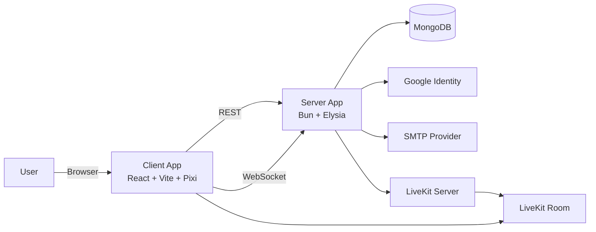
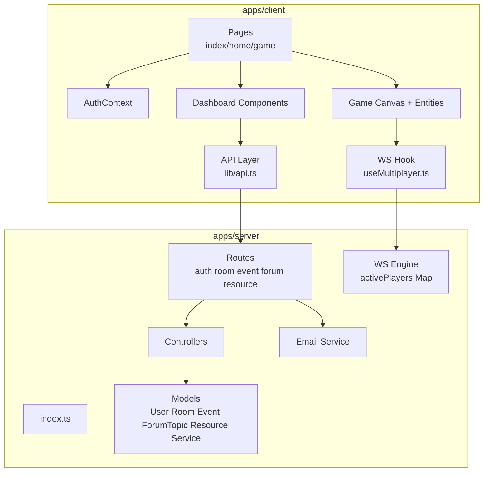
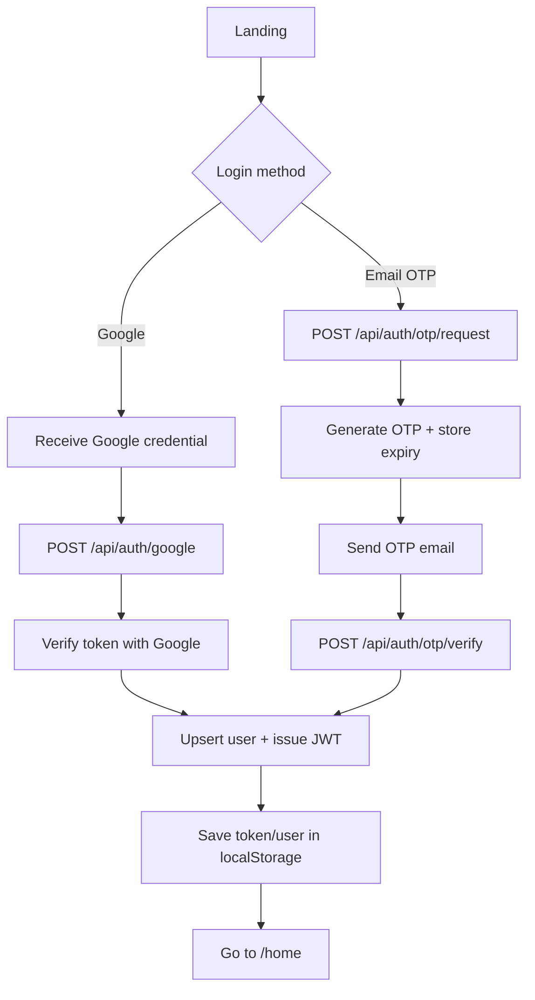
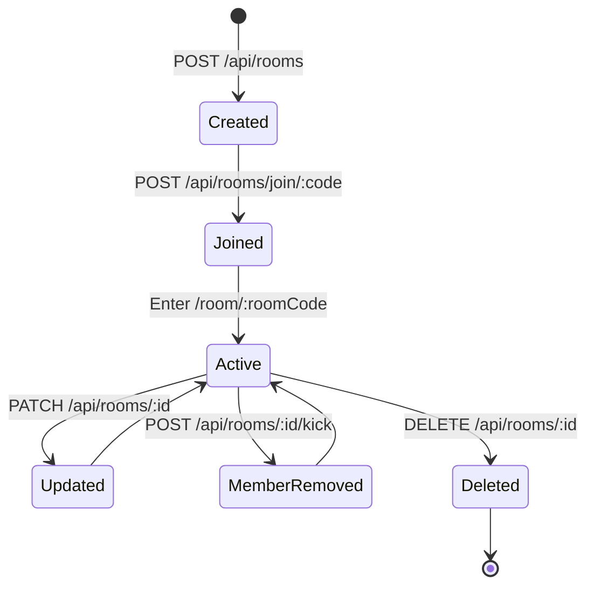
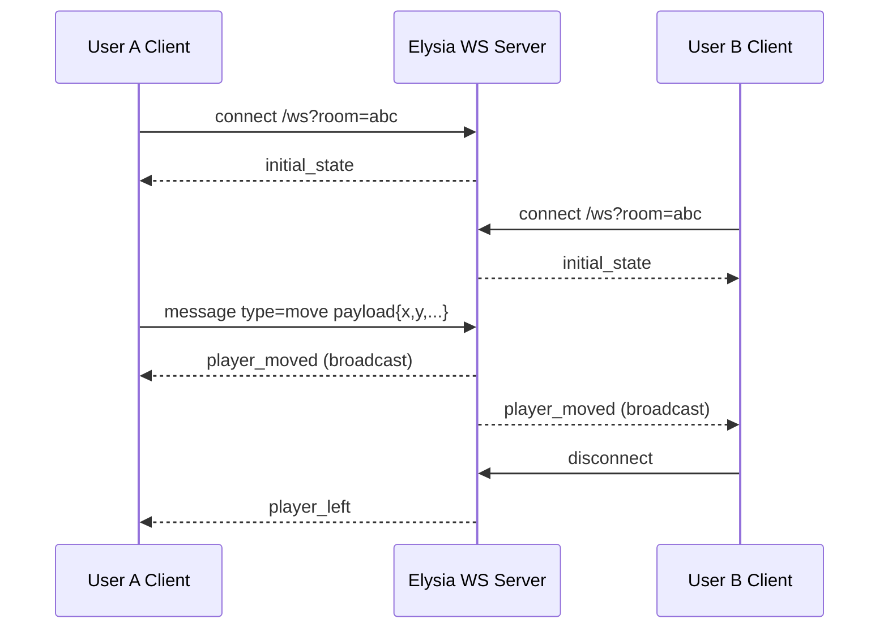
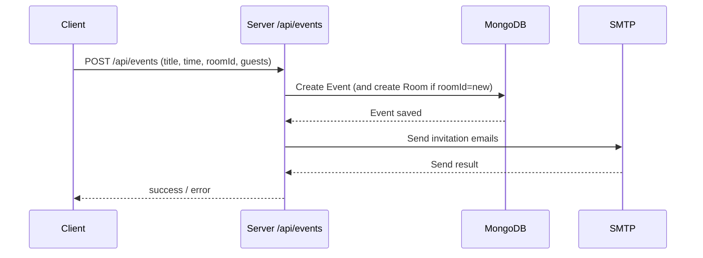
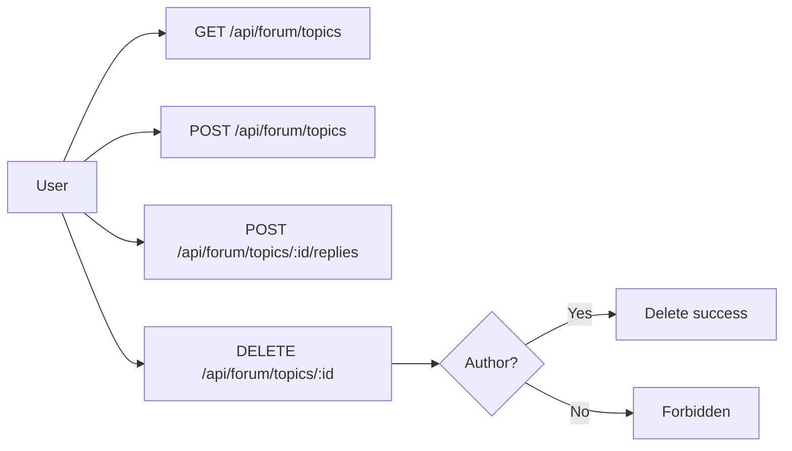
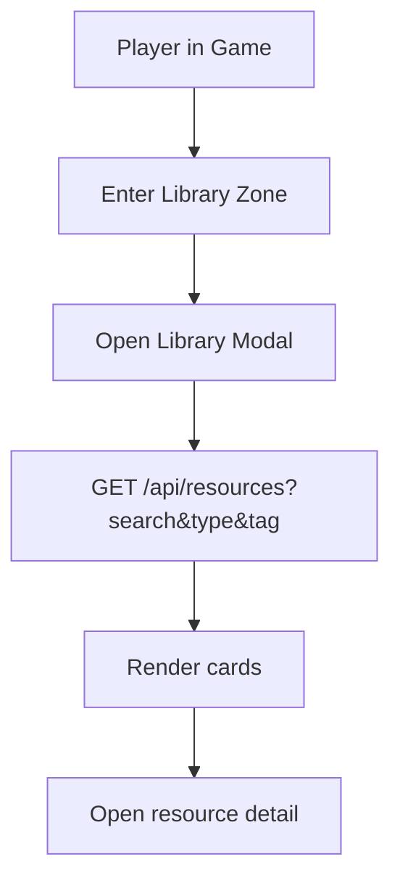
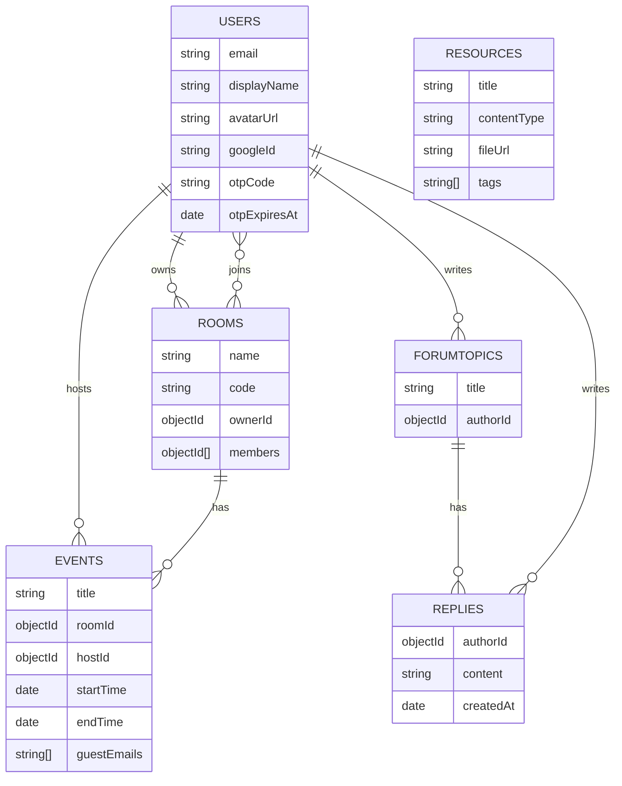

# System Diagrams - The Gathering

Last updated: 2026-04-23

## 1. System Context

## 2. Container Diagram

## 3. Auth Flow (Google + OTP)

## 4. Room Lifecycle

## 5. Multiplayer WebSocket Sequence

## 6. Event Scheduling Sequence

## 7. Forum Flow

## 8. Digital Library Flow

## 9. Data Model (Logical ERD)

