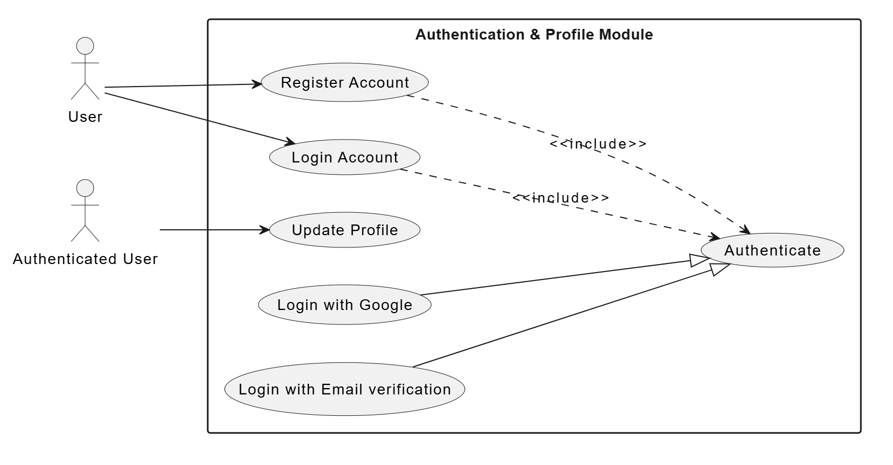
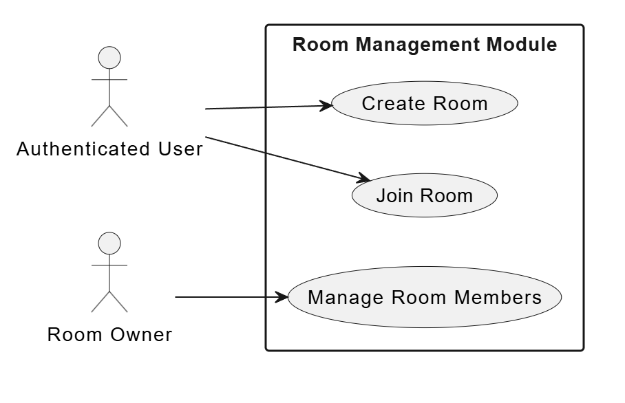
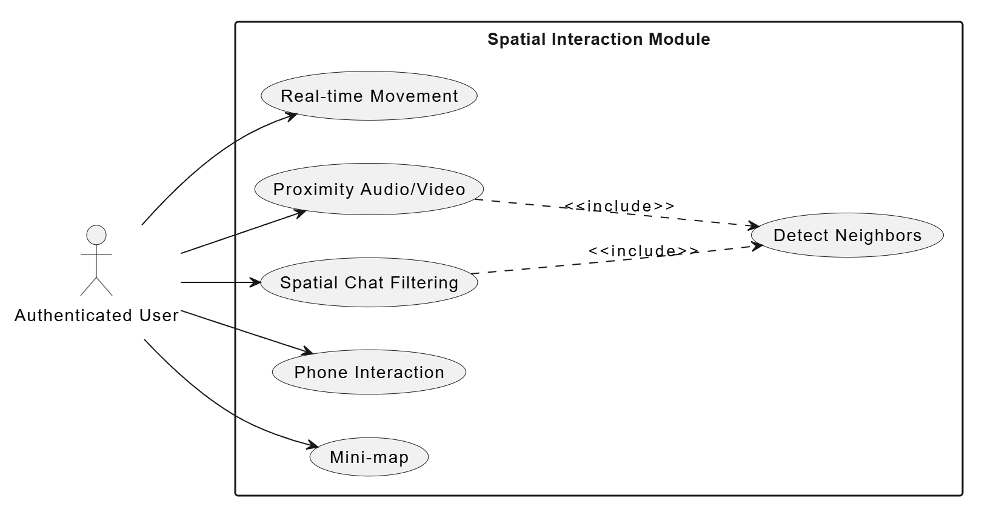
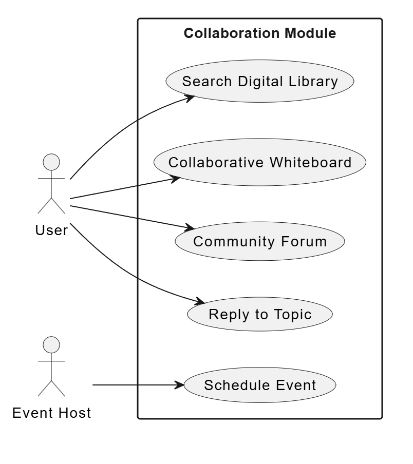
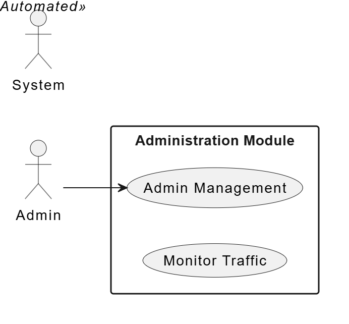
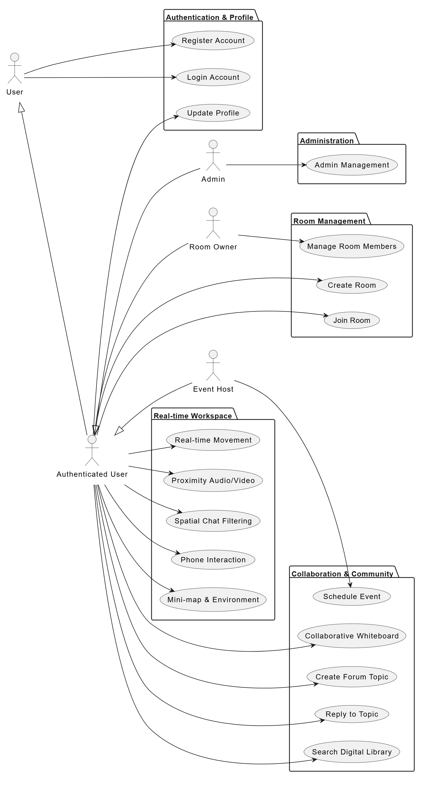

SOFTWARE REQUIREMENTS SPECIFICATION (SRS)
Introduction
Purpose
This Software Requirements Specification (SRS) defines the functional and non-functional requirements for The Gathering platform. It serves as the authoritative technical agreement between the development team, the product owner, and the supervising faculty. All design decisions documented in Chapter 4, test cases in Chapter 5, and acceptance criteria used during the Final Defense are traceable to requirements defined in this document.

This document is intended for the following audiences: the development team (as the specification they implement against), the project supervisor (as the basis for progress evaluation), the testing team (as the source of acceptance criteria), and the client (as confirmation that the system scope matches business objectives).

Scope
The Gathering is a browser-based virtual co-working platform combining a 2D metaverse environment with community features including event management, a digital resource library, and a discussion forum. The MVP release targets a private beta cohort of 30 to 50 users and is delivered as a Bun Workspaces monorepo comprising a React frontend (apps/client) and a Bun/Elysia backend (apps/server).

This SRS covers all functionality planned for the MVP release. Features explicitly deferred to post-MVP - including the Service Directory, mobile browser support, and subscription billing - are documented in the out-of-scope section and excluded from all requirements herein.

Definitions and Abbreviations
Term Definition
Avatar The 2D sprite representing a user on the metaverse map
Co-presence The awareness of other users working simultaneously in the same virtual space
Proximity audio Audio connection that activates automatically based on avatar spatial distance
Zone/Room A dynamically created workspace with a unique access code for specific teams
SFU Selective Forwarding Unit - server architecture used by LiveKit for WebRTC media routing
JWT JSON Web Token - stateless authentication credential
OTP One-Time Password - used for email verification
WASD Keyboard movement keys: W (up), A (left), S (down), D (right)
MVP Minimum Viable Product
SRS Software Requirements Specification
FR Functional Requirement
NFR Non-Functional Requirement
EIR External Interface Requirement
References
IEEE Std 830-1998: Recommended Practice for Software Requirements Specifications

The Gathering Technical Summary (PDF) - project brief provided by client

AI Project Context file (ai_project_context.md) - codebase conventions document

Business Analysis Document - Chapter 2 of this report

LiveKit documentation: https://docs.livekit.io

Pixi.js v7 documentation: https://pixijs.com/guides

Overall description
System Context
The Gathering System encompasses all components developed and controlled by the project team. It operates as a three-tier web application integrating with several external services.

Frontend (apps/client): A React-based single-page application (SPA) built with Vite, utilizing PixiJS for 2D rendering and Tailwind CSS for the UI.
Backend (apps/server): A Bun-based server using the ElysiaJS framework, managing RESTful APIs and WebSocket connections for multiplayer sync, and database integration via Mongoose.
Database: A MongoDB instance (hosted on MongoDB Atlas free tier) that stores user profiles, room data, event schedules, forum posts, and resources.
External entities interacting with the system include Google Identity Service (OAuth), SMTP Service (Gmail for OTP and Invitations), and LiveKit Server (for WebRTC media streams).

```plantuml
@startuml
left to right direction
skinparam packageStyle rectangle
skinparam componentStyle rectangle

actor "User" as user

rectangle "The Gathering" {
    usecase "Multiplayer 2D Platform" as gathering
}

rectangle "External Services" {
    usecase "Google Identity
(OAuth 2.0)" as google
    usecase "Gmail SMTP
(OTP/Invites)" as smtp
    usecase "LiveKit Server
(WebRTC)" as livekit
}

user --> gathering : "Uses platform via
HTTPS/WebSocket"
user ..> livekit : "Media Stream
(WebRTC)"

gathering --> google : "Validates tokens
(HTTPS)"
gathering --> smtp : "Sends emails
(SMTP)"
gathering --> livekit : "Requests tokens
(HTTPS)"
@enduml
```
Figure 1. System context diagram

User Classes and Characteristics
User Class Primary Usage Pattern
User Registration and login via Google or Email verification.
Authenticated User Can join rooms via codes, participate in the 2D workspace, post in forums, and view resources.
Room Owner Can manage room settings, including renaming or deleting rooms and moderating room members.
Event Host Can schedule and manage events, sending automated email invitations to participants.
Admin Has full platform oversight, including user management, room monitoring, and forum moderation.
3.2.3 Operating Environment

Component Specification
Client browser Chrome or Firefox, current stable or one prior major version
Client hardware 64-bit dual-core CPU; 4 GB RAM; WebGL 2.0-capable GPU
Client network Minimum 5 Mbps upload and download
Server runtime Bun runtime on Linux
Database MongoDB Atlas cloud cluster
Media server LiveKit Server - Singapore region
Assumptions and Constraints
Assumptions:

Users access the platform from desktop or laptop devices using modern evergreen browsers (Chrome, Edge, Firefox) with WebGL support.
Users have a stable internet connection capable of supporting WebRTC audio and video.
Constraints:

Infrastructure Budget: Database storage is restricted to MongoDB Atlas free tier limits (~512MB). Document uploads and data history must be carefully managed.
Selective Persistence: Critical real-time data (player positions, whiteboard) are persisted in MongoDB via 30s snapshots to balance DB write load with user convenience.
Tight Timeline: The system must prioritize core SaaS and multiplayer features over advanced game mechanics for the MVP delivery.
Specific requirements
Functional Requirements
Requirements are organized by feature module. Each requirement includes a priority (1 = Must do, 2 = Should do, 3 = Nice to have, 4 = Future release) and complexity.

Authentication & Profile (AUTH)



Figure 2. Authentication and Profile usecase diagram

ID Requirement Priority
FR-AUTH-01 Register Account: The system shall allow new users to create memberships via Google or Email verification. 1
FR-AUTH-02 Login Account: The system shall allow existing members to verify identity via JWT and access the dashboard. 1
FR-AUTH-03 Update Profile: The system shall allow members to personalize their display name and visual avatar representation. 2
User Stories:

As a freelancer, I want to create an account with my Google credentials so that I can sign in without managing a separate password.

\_As a remote worker, I want to update my avatar so that my team can visually recognize me in the 2D space.\_2D Metaverse Map (MAP)

Room & Membership Management (ROOM)



Figure 3. Room and Membership Management usecase diagram

ID Requirement Priority
FR-ROOM-01 Create Room: The system shall allow users to establish a new virtual workspace with a unique shareable access code. 1
FR-ROOM-02 Join Room: The system shall allow users to enter an existing workspace by providing a valid invitation code. 1
FR-ROOM-03 Manage Room Members: The system shall allow Room Owners to moderate occupancy (e.g., kicking users) and update configurations. 1
User Stories:

As a team leader, I want to create a private room and share the code so that only my team can access our workspace.

Real-time Interaction & Spatial Media (SPACE)



Figure 4. Real-time Interaction and Spatial Media usecase diagram

ID Requirement Priority
FR-SPACE-01 Real-time Movement: The system shall allow users to navigate their character in the 2D map, including interactions like sitting on furniture. 1
FR-SPACE-02 Proximity Audio/Video: The system shall trigger WebRTC LiveKit media connections automatically based on character proximity. 1
FR-SPACE-03 Phone Interaction: The system shall display a visual animation when a user interacts with their virtual phone to signal focus. 1
FR-SPACE-04 Mini-map & Environment: The system shall provide a spatial overview of the office layout and team distribution. 2
FR-SPACE-05 Spatial Chat Filtering: The system shall ensure local chat messages are visible only to nearby participants. 1
User Stories:

As a community member, I want audio to activate automatically when I walk near someone so that conversations feel natural.

3.3.4 Collaboration & Community Features (COL)



Figure 5. Collaboration and Community Features usecase diagram

ID Requirement Priority
FR-COL-01 Schedule Event: The system shall allow Event Hosts to organize meetings and automatically send email invitations via Nodemailer. 2
FR-COL-02 Collaborative Whiteboard: The system shall synchronize Excalidraw whiteboard elements across all users in a room in real-time. 1
FR-COL-03 Create Forum Topic: The system shall allow users to initiate new knowledge-sharing discussions. 2
FR-COL-04 Reply to Topic: The system shall allow users to contribute to existing community discussions. 2
FR-COL-05 Search Digital Library: The system shall allow users to locate shared team resources by title or tags. 2
User Stories:

As an event host, I want to schedule a workshop and have the system automatically email my guests so they don't miss it.

3.3.5 Administrative & System Control (ADM)



Figure 6. Administrative & System Control usecase diagram

ID Requirement Priority
FR-ADM-01 Admin Management Dashboard: The system shall provide an interface for Admins to oversee the platform, moderate users, and manage rooms. 1
User Stories:

As a freelancer, I want to search the library for contract templates so that I can find relevant resources without leaving the platform.

Non-Functional Requirements
Performance
ID Requirement
NFR-PERF-01 The game canvas shall maintain a frame rate of 60 FPS on standard hardware.
NFR-PERF-02 Avatar position updates shall broadcast to all users in a room with a delay of less than 100ms.
NFR-PERF-03 REST API endpoints shall respond within 500ms at the 95th percentile under normal conditions.
NFR-PERF-04 The backend server must start up in less than 2 seconds, including database connection.
Security
ID Requirement
NFR-SEC-01 All private API endpoints shall require a valid JWT Bearer Token in the Authorization header.
NFR-SEC-02 The LiveKit API key and secret shall be stored exclusively as server-side environment variables.
NFR-SEC-03 The server shall implement a CORS policy allowing requests only from the configured frontend URL.
NFR-SEC-04 The system shall enforce rate-limiting on all public API endpoints to prevent abuse.
Availability and Scalability
ID Requirement
NFR-AVL-01 The system shall support at least 20 concurrent users per virtual room without significant movement jitter.
NFR-AVL-02 The WebSocket client shall handle automatic reconnection with exponential backoff if the connection is lost.
NFR-AVL-03 The frontend shall provide visual feedback during WebSocket reconnection attempts (e.g., blurring avatar).
Usability
ID Requirement
NFR-USA-01 The UI shall employ a modern "Glassmorphism" aesthetic with semi-transparent backgrounds and background blur.
NFR-USA-02 The UI shall be responsive, adjusting the dashboard layout for different screen sizes (desktop/tablet).
NFR-USA-03 The frontend shall display a sidebar in the game view for quick access to forum, participants, and events.
External Interface Requirements
User Interface
The user interface comprises two rendering contexts operating simultaneously during map sessions. The React DOM tree renders all conventional UI: navigation, modals, event listings, forum, and library panels. The Pixi.js WebGL canvas renders the 2D map, avatar sprites, and tile layers. State shared between both contexts is managed via React Context API (AuthContext, MapContext).

The visual design follows a dark-themed aesthetic with Tailwind CSS v4 utility classes. Tailwind configuration is defined via CSS @theme {} in index.css - no tailwind.config.js file is used.

Backend API Interface
The backend exposes a RESTful JSON API. All endpoints are prefixed /api/v1. Protected endpoints require Authorization: Bearer <token>. Standard HTTP status codes are used: 200 for success, 400 for validation errors, 401 for unauthorized, 403 for forbidden, 404 for not found, 409 for conflict, and 500 for server errors.

#### 3.5.3. WebSocket Interface
The system utilizes **ElysiaJS's** native `.ws()` endpoint for real-time avatar position synchronization.
*   **Endpoint:** `wss://[host]/ws?room=[zone]`
*   **Payload Format:** JSON structure as follows:

```json
{
  "type": "move",
  "payload": {
    "userId": "string",
    "x": "number",
    "y": "number",
    "direction": "up | down | left | right",
    "isSitting": "boolean",
    "isPhoneOut": "boolean",
    "character": "string",
    "displayName": "string",
    "avatarUrl": "string"
  }
}
```

Messages are broadcast at a target frequency of **20Hz**. The client throttles outgoing movement packets locally and the backend broadcasts them to all connected clients in the same room. Tọa độ và các trạng thái thời gian thực (`isSitting`, `isPhoneOut`) được đồng bộ liên tục để kích hoạt animation ở client mà không ghi đè vào Database nhằm tối ưu hiệu suất.

#### 3.5.4. LiveKit Interface
The backend generates **LiveKit Access Tokens** via the `livekit-server-sdk`. These tokens encapsulate user identity, the target room name, and specific permissions (e.g., `canPublish`, `canSubscribe`). The frontend connects to the LiveKit Server using the `livekit-client` SDK, leveraging `@livekit/components-react` for integrated media controls.

#### 3.5.5. Google OAuth Interface
The platform implements **Google One Tap OAuth2** using the `google-auth-library`. The backend validates the identity token received from Google, extracts user metadata (Email, Name, Profile Picture), and issues a platform-specific **JWT**. OAuth refresh token management is excluded from the MVP scope.

#### 3.5.6. Email Interface
Automated system emails are dispatched using **Nodemailer** through an SMTP provider. Three primary email workflows are implemented:
1.  **Account Verification:** Delivery of OTP codes for email validation.
2.  **Event Confirmation:** Booking confirmations for organized workshops or meetings.
3.  **Event Reminders:** Automated notifications sent 24 hours and 1 hour prior to event commencement.
All templates feature a consistent brand identity and direct action links for seamless user navigation.

Use Case Diagram Summary



Figure 7. Usecase Diagram summary

Use Case Primary Actor Includes / Extends
AUTH-01 Register Account User
AUTH-02 Login Account User
AUTH-03 Update Profile Authenticated User
ROOM-01 Create Room Authenticated User
ROOM-02 Join Room Authenticated User
ROOM-03 Manage Room Members Room Owner
SPACE-01 Real-time Movement Authenticated User
SPACE-02 Proximity Audio/Video Authenticated User
SPACE-03 Phone Interaction Authenticated User
SPACE-04 Mini-map & Environment Authenticated User
SPACE-05 Spatial Chat Filtering Authenticated User
COL-01 Schedule Event Event Host
COL-02 Collaborative Whiteboard Authenticated User
COL-03 Create Forum Topic Authenticated User
COL-04 Reply to Topic Authenticated User
COL-05 Search Digital Library Authenticated User
ADM-01 Admin Management Dashboard Admin
Requirements Traceability Matrix (RTM)
The RTM links each functional requirement to its originating business objective, the design section where it is addressed, and the test case that validates it.

Requirement ID Business Objective Design Reference Test Reference
FR-AUTH-01 to 03 BO-01, BO-03 Chapter 4 Section 4.3 Chapter 5 Section 5.3, 5.4
FR-ROOM-01 to 03 BO-03, BO-06 Chapter 4 Section 4.4 Chapter 5 Section 5.3, 5.5
FR-SPACE-01 to 05 BO-03, BO-06 Chapter 4 Section 4.5 Chapter 5 Section 5.3, 5.6
FR-COL-01 to 05 BO-01, BO-07 Chapter 4 Section 4.6 Chapter 5 Section 5.4, 5.5
FR-ADM-01 BO-09 Chapter 4 Section 4.3 Chapter 5 Section 5.5
NFR-PERF-01 to 04 BO-05 Chapter 4 Section 4.10 Chapter 5 Section 5.6
NFR-SEC-01 to 04 BO-08 Chapter 4 Section 4.3 Chapter 5 Section 5.4
