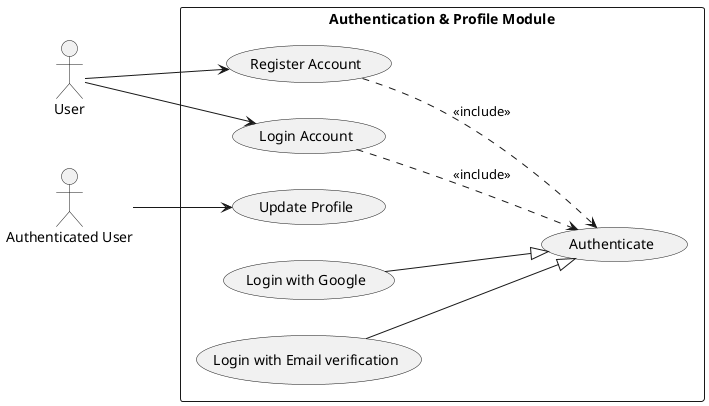
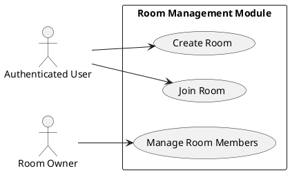
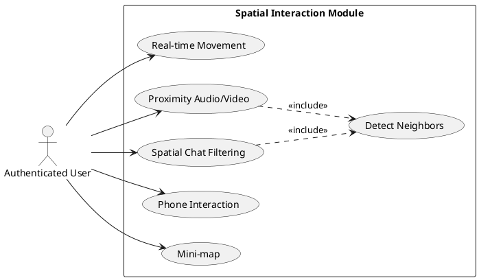
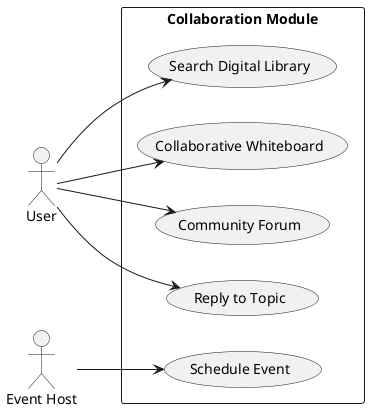
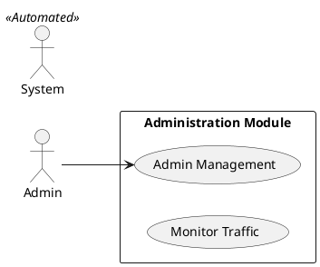
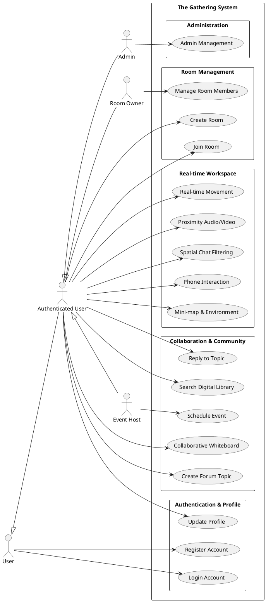

# SOFTWARE REQUIREMENTS SPECIFICATION (SRS)

## Introduction

### Purpose

This Software Requirements Specification (SRS) defines the functional and non-functional requirements for The Gathering platform. It serves as the authoritative technical agreement between the development team, the product owner, and the supervising faculty. All design decisions documented in Chapter 4, test cases in Chapter 5, and acceptance criteria used during the Final Defense are traceable to requirements defined in this document.

This document is intended for the following audiences: the development team (as the specification they implement against), the project supervisor (as the basis for progress evaluation), the testing team (as the source of acceptance criteria), and the client (as confirmation that the system scope matches business objectives).

### Scope

The Gathering is a browser-based virtual co-working platform that combines a SaaS-style productivity dashboard with an immersive 2D multiplayer environment. Responding to the needs of remote workers and students, users can collaborate in real-time within a shared digital space. It provides user authentication via Google and OTP, virtual room management, event scheduling with email notifications, a community forum, and a digital library for resource sharing. In addition, it features a multiplayer 2D office space using PixiJS where users can move, interact with specific zones, and engage in proximity-controlled video conferencing via LiveKit.

The MVP release targets a private beta cohort of 30 to 50 users and is delivered as a Bun Workspaces monorepo comprising a React frontend (apps/client) and a Bun/Elysia backend (apps/server). Features explicitly deferred to post-MVP - including the Service Directory, mobile browser support, and subscription billing - are excluded from all requirements herein.

### Definitions and Abbreviations

| **Term**        | **Definition**                                                                           |
| --------------- | ---------------------------------------------------------------------------------------- |
| Avatar          | The 2D sprite representing a user on the metaverse map                                   |
| Co-presence     | The awareness of other users working simultaneously in the same virtual space            |
| Proximity audio | Audio connection that activates automatically based on avatar spatial distance           |
| Zone/Room       | A dynamically created workspace with a unique access code for specific teams             |
| SFU             | Selective Forwarding Unit - server architecture used by LiveKit for WebRTC media routing |
| JWT             | JSON Web Token - stateless authentication credential                                     |
| OTP             | One-Time Password - used for email verification                                          |
| WASD            | Keyboard movement keys: W (up), A (left), S (down), D (right)                            |
| MVP             | Minimum Viable Product                                                                   |
| SRS             | Software Requirements Specification                                                      |
| FR              | Functional Requirement                                                                   |
| NFR             | Non-Functional Requirement                                                               |

### References

IEEE Std 830-1998: Recommended Practice for Software Requirements Specifications
The Gathering Technical Summary (PDF) - project brief provided by client
AI Project Context file (ai_project_context.md) - codebase conventions document
LiveKit documentation: https://docs.livekit.io
Pixi.js v7 documentation: https://pixijs.com/guides

## Overall description

### System Context

The Gathering System encompasses all components developed and controlled by the project team. It operates as a three-tier web application integrating with several external services.
- **Frontend (apps/client)**: A React-based single-page application (SPA) built with Vite, utilizing PixiJS for 2D rendering and Tailwind CSS for the UI.
- **Backend (apps/server)**: A Bun-based server using the ElysiaJS framework, managing RESTful APIs and WebSocket connections for multiplayer sync, and database integration via Mongoose.
- **Database**: A MongoDB instance (hosted on MongoDB Atlas free tier) that stores user profiles, room data, event schedules, forum posts, and resources.

External entities interacting with the system include Google Identity Service (OAuth), SMTP Service (Gmail for OTP and Invitations), and LiveKit Server (for WebRTC media streams).

```plantuml
@startuml
!include https://raw.githubusercontent.com/plantuml-stdlib/C4-PlantUML/master/C4_Context.puml

Person(user, "User", "Remote worker or student using the platform.")
System(gathering, "The Gathering System", "Multiplayer 2D co-working platform.")
System_Ext(google, "Google Identity Service", "OAuth 2.0 provider for authentication.")
System_Ext(smtp, "SMTP Service (Gmail)", "Handles email delivery (OTP, Invitations).")
System_Ext(livekit, "LiveKit Server", "Facilitates WebRTC video/audio streams.")

Rel(user, gathering, "Uses/Interacts with", "HTTPS/WS")
Rel(gathering, google, "Validates tokens", "HTTPS")
Rel(gathering, smtp, "Sends email payloads", "SMTP")
Rel(gathering, livekit, "Requests access tokens", "HTTPS")
Rel_U(user, livekit, "Establishes media stream", "WebRTC")
@enduml
```

### User Classes and Characteristics

| **User Class**       | **Primary Usage Pattern**                                                                       |
| -------------------- | ----------------------------------------------------------------------------------------------- |
| User                 | Registration and login via Google or Email verification.                                        |
| Authenticated User   | Can join rooms via codes, participate in the 2D workspace, post in forums, and view resources.  |
| Room Owner           | Can manage room settings, including renaming or deleting rooms and moderating room members.     |
| Event Host           | Can schedule and manage events, sending automated email invitations to participants.            |
| Admin                | Has full platform oversight, including user management, room monitoring, and forum moderation.  |

### Assumptions and Constraints

**Assumptions**:
- Users access the platform from desktop or laptop devices using modern evergreen browsers (Chrome, Edge, Firefox) with WebGL support.
- Users have a stable internet connection capable of supporting WebRTC audio and video.

**Constraints**:
- **Infrastructure Budget**: Database storage is restricted to MongoDB Atlas free tier limits (~512MB). Document uploads and data history must be carefully managed.
- **Selective Persistence**: Critical real-time data (player positions, whiteboard) are persisted in MongoDB via 30s snapshots to balance DB write load with user convenience.
- **Tight Timeline**: The system must prioritize core SaaS and multiplayer features over advanced game mechanics for the MVP delivery.

## Specific requirements

### Functional Requirements

Requirements are organized by feature module. Each requirement includes a priority (1 = Must do, 2 = Should do, 3 = Nice to have, 4 = Future release) and complexity.

### 1. Authentication & Profile (AUTH)



| **ID**      | **Requirement**                                                                               | **Priority** |
| ----------- | --------------------------------------------------------------------------------------------- | ------------ |
| FR-AUTH-01  | **Register Account**: The system shall allow new users to create memberships via Google or Email verification. | 1            |
| FR-AUTH-02  | **Login Account**: The system shall allow existing members to verify identity via JWT and access the dashboard. | 1            |
| FR-AUTH-03  | **Update Profile**: The system shall allow members to personalize their display name and visual avatar representation. | 2            |

**User Stories:**
_As a freelancer, I want to create an account with my Google credentials so that I can sign in without managing a separate password._
_As a remote worker, I want to update my avatar so that my team can visually recognize me in the 2D space._

### 2. Room & Membership Management (ROOM)



| **ID**      | **Requirement**                                                                               | **Priority** |
| ----------- | --------------------------------------------------------------------------------------------- | ------------ |
| FR-ROOM-01  | **Create Room**: The system shall allow users to establish a new virtual workspace with a unique shareable access code. | 1            |
| FR-ROOM-02  | **Join Room**: The system shall allow users to enter an existing workspace by providing a valid invitation code. | 1            |
| FR-ROOM-03  | **Manage Room Members**: The system shall allow Room Owners to moderate occupancy (e.g., kicking users) and update configurations. | 1            |

**User Stories:**
_As a team leader, I want to create a private room and share the code so that only my team can access our workspace._

### 3. Real-time Interaction & Spatial Media (SPACE)



| **ID**      | **Requirement**                                                                               | **Priority** |
| ----------- | --------------------------------------------------------------------------------------------- | ------------ |
| FR-SPACE-01 | **Real-time Movement**: The system shall allow users to navigate their character in the 2D map, including interactions like sitting on furniture. | 1            |
| FR-SPACE-02 | **Proximity Audio/Video**: The system shall trigger WebRTC LiveKit media connections automatically based on character proximity. | 1            |
| FR-SPACE-03 | **Phone Interaction**: The system shall display a visual animation when a user interacts with their virtual phone to signal focus. | 1            |
| FR-SPACE-04 | **Mini-map & Environment**: The system shall provide a spatial overview of the office layout and team distribution. | 2            |
| FR-SPACE-05 | **Spatial Chat Filtering**: The system shall ensure local chat messages are visible only to nearby participants. | 1            |

**User Stories:**
_As a community member, I want audio to activate automatically when I walk near someone so that conversations feel natural._

### 4. Collaboration & Community Features (COL)



| **ID**      | **Requirement**                                                                               | **Priority** |
| ----------- | --------------------------------------------------------------------------------------------- | ------------ |
| FR-COL-01   | **Schedule Event**: The system shall allow Event Hosts to organize meetings and automatically send email invitations via Nodemailer. | 2            |
| FR-COL-02   | **Collaborative Whiteboard**: The system shall synchronize Excalidraw whiteboard elements across all users in a room in real-time. | 1            |
| FR-COL-03   | **Create Forum Topic**: The system shall allow users to initiate new knowledge-sharing discussions. | 2            |
| FR-COL-04   | **Reply to Topic**: The system shall allow users to contribute to existing community discussions. | 2            |
| FR-COL-05   | **Search Digital Library**: The system shall allow users to locate shared team resources by title or tags. | 2            |

**User Stories:**
_As an event host, I want to schedule a workshop and have the system automatically email my guests so they don't miss it._

### 5. Administrative & System Control (ADM)



| **ID**      | **Requirement**                                                                               | **Priority** |
| ----------- | --------------------------------------------------------------------------------------------- | ------------ |
| FR-ADM-01   | **Admin Management Dashboard**: The system shall provide an interface for Admins to oversee the platform, moderate users, and manage rooms. | 1            |


## Non-Functional Requirements

### Performance
| **ID**      | **Requirement**                                                                                                                                   |
| ----------- | ------------------------------------------------------------------------------------------------------------------------------------------------- |
| NFR-PERF-01 | The game canvas shall maintain a frame rate of 60 FPS on standard hardware.                                                                       |
| NFR-PERF-02 | Avatar position updates shall broadcast to all users in a room with a delay of less than 100ms.                                                   |
| NFR-PERF-03 | REST API endpoints shall respond within 500ms at the 95th percentile under normal conditions.                                                     |
| NFR-PERF-04 | The backend server must start up in less than 2 seconds, including database connection.                                                           |

### Security
| **ID**     | **Requirement**                                                                                 |
| ---------- | ----------------------------------------------------------------------------------------------- |
| NFR-SEC-01 | All private API endpoints shall require a valid JWT Bearer Token in the Authorization header.   |
| NFR-SEC-02 | The LiveKit API key and secret shall be stored exclusively as server-side environment variables. |
| NFR-SEC-03 | The server shall implement a CORS policy allowing requests only from the configured frontend URL. |
| NFR-SEC-04 | The system shall enforce rate-limiting on all public API endpoints to prevent abuse.            |

### Availability & Scalability
| **ID**     | **Requirement**                                                                                                             |
| ---------- | --------------------------------------------------------------------------------------------------------------------------- |
| NFR-AVL-01 | The system shall support at least 20 concurrent users per virtual room without significant movement jitter.                 |
| NFR-AVL-02 | The WebSocket client shall handle automatic reconnection with exponential backoff if the connection is lost.                  |
| NFR-AVL-03 | The frontend shall provide visual feedback during WebSocket reconnection attempts (e.g., blurring avatar).                    |

### Usability
| **ID**     | **Requirement**                                                                                                 |
| ---------- | --------------------------------------------------------------------------------------------------------------- |
| NFR-USA-01 | The UI shall employ a modern "Glassmorphism" aesthetic with semi-transparent backgrounds and background blur.   |
| NFR-USA-02 | The UI shall be responsive, adjusting the dashboard layout for different screen sizes (desktop/tablet).         |
| NFR-USA-03 | The frontend shall display a sidebar in the game view for quick access to forum, participants, and events.      |


## External Interface Requirements

### User Interface
The user interface utilizes a modern "Glassmorphism" UI style implemented with Tailwind CSS to provide a premium, immersive SaaS experience. The React DOM tree renders all conventional UI (dashboards, modals, sidebars), while the Pixi.js WebGL canvas renders the 2D map and avatar sprites. 

### Backend API Interface
The backend, built with Bun and Elysia, exposes a RESTful JSON API. All endpoints are prefixed properly and protected endpoints require a JWT token. The frontend uses a centralized `apiFetch` wrapper for communication.

### WebSocket Interface
The server handles WebSocket connections on `/ws`, managing a room-based pub/sub system for real-time position updates and whiteboard synchronization.

### LiveKit Interface
The system integrates with LiveKit-server-sdk to issue JWT access tokens on demand for video sessions, enabling proximity calling with Acoustic Echo Cancellation (AEC).


## Use Case Diagram Summary



| **Use Case ID** | **Use Case Name**                  | **Primary Actor** |
| --------------- | ---------------------------------- | ----------------- |
| AUTH-01         | Register Account                   | User              |
| AUTH-02         | Login Account                      | User              |
| AUTH-03         | Update Profile                     | Authenticated User|
| ROOM-01         | Create Room                        | Authenticated User|
| ROOM-02         | Join Room                          | Authenticated User|
| ROOM-03         | Manage Room Members                | Room Owner        |
| SPACE-01        | Real-time Movement                 | Authenticated User|
| SPACE-02        | Proximity Audio/Video              | Authenticated User|
| SPACE-03        | Phone Interaction                  | Authenticated User|
| SPACE-04        | Mini-map & Environment             | Authenticated User|
| SPACE-05        | Spatial Chat Filtering             | Authenticated User|
| COL-01          | Schedule Event                     | Event Host        |
| COL-02          | Collaborative Whiteboard           | Authenticated User|
| COL-03          | Create Forum Topic                 | Authenticated User|
| COL-04          | Reply to Topic                     | Authenticated User|
| COL-05          | Search Digital Library             | Authenticated User|
| ADM-01          | Admin Management Dashboard         | Admin             |


## Requirements Traceability Matrix (RTM)

The RTM links each functional requirement to its design and test reference.

| **Requirement ID** | **Business Objective** | **Design Reference**   | **Test Reference**         |
| ------------------ | ---------------------- | ---------------------- | -------------------------- |
| FR-AUTH-01 to 03   | BO-01, BO-03           | Chapter 4 Section 4.3  | Chapter 5 Section 5.3, 5.4 |
| FR-ROOM-01 to 03   | BO-03, BO-06           | Chapter 4 Section 4.4  | Chapter 5 Section 5.3, 5.5 |
| FR-SPACE-01 to 05  | BO-03, BO-06           | Chapter 4 Section 4.5  | Chapter 5 Section 5.3, 5.6 |
| FR-COL-01 to 05    | BO-01, BO-07           | Chapter 4 Section 4.6  | Chapter 5 Section 5.4, 5.5 |
| FR-ADM-01          | BO-09                  | Chapter 4 Section 4.3  | Chapter 5 Section 5.5      |
| NFR-PERF-01 to 04  | BO-05                  | Chapter 4 Section 4.10 | Chapter 5 Section 5.6      |
| NFR-SEC-01 to 04   | BO-08                  | Chapter 4 Section 4.3  | Chapter 5 Section 5.4      |
