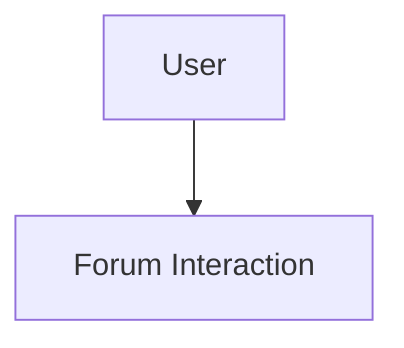
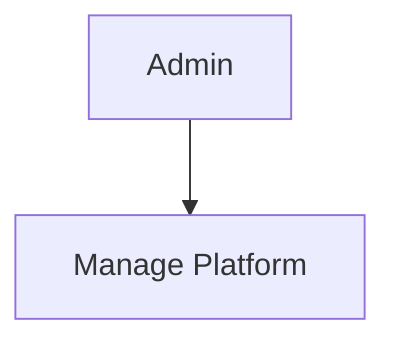

# **I. INTRODUCTION**

## **1\. Purpose**

The purpose of this project is to provide a virtual co-working platform named **The Gathering** that combines a SaaS-style productivity dashboard with an immersive 2D multiplayer environment. Responding to the needs of remote workers and students, users can collaborate in real-time within a shared digital space. Allowing users to manage virtual offices, schedule events, participate in community forums, and communicate via proximity-based video calls.

This document is used as a commitment between the development team and stakeholders about the output product and the rules of the development process.  
The expected audiences of this document are:
- Mentors and Evaluators of the K26 cohort.
- The Development Team (Group 3).

## **2\. Scope**

This project aims to bridge the gap between static management tools and immersive communication. It provides user authentication via Google and OTP, virtual room management, event scheduling with email notifications, a community forum, and a digital library for resource sharing. In addition, it features a multiplayer 2D office space using PixiJS where users can move, interact with specific zones, and engage in proximity-controlled video conferencing via LiveKit.

## **3\. Definition**

The Gathering system serves three main groups of users: Authenticated Users, Room Owners, and Event Hosts.
- **Authenticated Users**: Can join rooms via codes, participate in the 2D workspace, post in forums, and view resources.
- **Room Owners**: Can manage room settings, including renaming or deleting rooms and managing membership (kicking users).
- **Admins**: Have full platform oversight, including user management, room monitoring, and forum moderation.
- **Event Hosts**: Can create and manage scheduled meetings, sending automated invitations to guest emails.

\- **Customer (Authenticated User)**:
• Users can create accounts via Google or Email OTP to log in.
• They can view dashboard information, join rooms, and interact with the forum and library.
• Participate in real-time 2D movement and proximity video calls.

\- **Room Owner**:
- Manage room configurations and access.
- Moderate room members.

\- **Event Host**:
- Schedule and manage events.
- Send invitation emails to participants.

# **II. SYSTEM CONTEXT DIAGRAM**

## **1\. Overview**
The System Context Diagram for **The Gathering** project provides a high-level, visual representation of the platform and its interactions with external entities. Designed as a web-based collaborative environment, The Gathering aims to optimize remote teamwork by integrating a React-based frontend with a high-performance Bun/Elysia backend and third-party communication services.

## **2\. System Boundary**

The Gathering System encompasses all components developed and controlled by the project team:

- **Frontend (apps/client)**: A React-based single-page application (SPA) built with Vite, utilizing PixiJS for 2D rendering and Tailwind CSS for the UI. It handles user interactions, game canvas logic, and real-time state visualization.
- **Backend (apps/server)**: A Bun-based server using the ElysiaJS framework. it manages RESTful APIs for business logic, WebSocket connections for multiplayer sync, and database integration via Mongoose.
- **Database**: A MongoDB instance (hosted on MongoDB Atlas) that stores user profiles, room data, event schedules, forum posts, and resource metadata.

## **3\. External Entities**

The diagram identifies four external entities that interact with The Gathering System:

- **User**: remote workers or students who interact with the dashboard and 2D space to collaborate.
- **Google Identity Service**: A third-party OAuth 2.0 provider used for secure "One Tap" authentication.
- **SMTP Service (Gmail)**: Used for sending OTP codes and event invitations.
- **LiveKit Server**: An external real-time communication platform used to facilitate proximity-based audio/video calls.

## **4\. Interactions**

Each external entity interacts with The Gathering System through bidirectional flows:

- **User**:
  - **Interaction & Control**: Commands sent from User to the system, such as room creation, movement in 2D space, or forum posting.
  - **Real-time Feedback**: Data received by User, including positions of other players, event notifications, and chat messages.
- **Google Identity**:
  - **Auth Request**: The system sends identity tokens to Google for verification.
  - **Profile Data**: Google returns verified user information (email, name, avatar).
- **SMTP Provider**:
  - **Mail Delivery**: The system sends mail payloads (OTP/Invitations) to the provider.
  - **Status**: Confirmation of email transmission.
- **LiveKit**:
  - **Token Request**: The system requests access tokens for specific video rooms.
  - **Media Stream**: The client establishes a direct WebRTC connection for video/audio.

# **III. BUSINESS REQUIREMENT**

## **1\. Business goals**

Business goals articulate the high-level objectives that The Gathering aims to achieve, reflecting its purpose of transforming remote collaboration into a more human-centric experience.

### _1.1 Enhance Remote Presence_

- **Objective**: Provide a sense of "co-presence" by allowing users to see each other's avatars in a shared 2D space.
- **Rationale**: Static tools like Slack or Trello lack the visual feeling of being "in the office." The Gathering addresses this by using PixiJS and WebSockets to sync movements.
- **Detail**: Success is measured by the ability of the system to sync up to 20 users per room with a latency of less than 200ms.

### _1.2 Deliver an Integrated Workflow_

- **Objective**: Combine management tools (Events, Forum, Library) with communication tools (Video Calls) in a single platform.
- **Rationale**: Reducing context switching between different apps improves productivity.
- **Detail**: The MVP will feature at least 4 integrated modules (Rooms, Events, Forum, Library) accessible from a unified dashboard.

### _1.3 Ensure Accessibility and Low Cost_

- **Objective**: Build the system using high-performance but cost-effective tools (Bun, Elysia, MongoDB Atlas free tier).
- **Rationale**: As a student project for K26, the system must be deployable with minimal infrastructure costs.
- **Detail**: Use Bun's native speed to reduce server resource requirements, fitting within free-tier cloud constraints.

### _1.4 Establish Scalability for Virtual Communities_

- **Objective**: Design a modular architecture that can support multiple rooms and hundreds of concurrent users.
- **Rationale**: The platform should be able to scale from a single team to an entire organization or classroom.
- **Detail**: The backend architecture uses domain-driven routing to ensure that adding new features (like a Marketplace or Whiteboard) does not disrupt existing ones.

## **2\. Business constraints**

Business constraints define the limitations that shape The Gathering's development, ensuring goals are achievable within the team's resources and timeline.

### _2.1 Infrastructure Budget_

**Constraint**: Development and initial hosting must rely on free-tier services (e.g., MongoDB Atlas, LiveKit Cloud free tier).

**Impact**: Limits the number of concurrent video participants and total database storage (~512MB), requiring efficient data management.

**Detail**: The team will use open-source alternatives and free tiers of SaaS providers to stay within a $0 budget.

### _2.2 Tight Academic Timeline_

- **Constraint**: The final prototype must be delivered by the end of the K26 semester (May 2025).
- **Impact**: Prioritizes core multiplayer and SaaS features over advanced game mechanics or complex analytics.
- **Detail**: Development is structured into 4-week phases, focusing first on the engine, then on features, and finally on polish.

### _2.3 Team Composition (Group 3)_

- **Constraint**: Four members with defined roles in a monorepo environment.
- **Impact**: Requires a strict Git workflow and monorepo structure to avoid merge conflicts and ensure code quality.
- **Detail**: 
  - **Pham Nguyen Thien Loc**: Project Manager / Coordinator.
  - **Banh Van Tran Phat**: Lead Developer / Backend.
  - **Le Tan Dat**: Developer / Frontend.
  - **Le Thoi Duy**: Developer / Game Engine.

### _2.4 Technology Stack Dependency_

- **Constraint**: The system is built using the Bun runtime and ElysiaJS, which are cutting-edge but have smaller communities compared to Node.js/Express.
- **Impact**: Requires the team to be self-reliant in debugging framework-specific issues.
- **Detail**: The choice of Bun/Elysia ensures superior performance and a modern developer experience, aligning with the "BEMN" (Bun, Elysia, MongoDB, Next/React) stack.

## **3\. Business criteria**

Success criteria provide measurable outcomes to evaluate whether The Gathering meets its business objectives.

### _3.1 Functional Platform Delivery_

- **Criterion**: Deploy a fully functional web application supporting multiplayer interaction and dashboard management.
- **Measure**: Users can log in, create a room, move their avatar, and see others moving in real-time.
- **Detail**: Validation involves a live demo where at least 4 team members interact in the same virtual room simultaneously.

### _3.2 Performance and Latency_

- **Criterion**: Achieve smooth character movement and fast API responses.
- **Measure**: Average API response time < 500ms and WebSocket broadcast latency < 100ms.
- **Detail**: Tested using browser dev tools and server-side logging during peak simulated usage.

### _3.3 User Acceptance_

- **Criterion**: Positive feedback from testers regarding the "fun" and "utility" of the 2D space.
- **Measure**: A survey of fellow K26 students with at least 75% positive rating on usability.
- **Detail**: Conducted post-demo through a feedback form.

# **IV. USER REQUIREMENT**

## **1\. Functional Requirements list**

| **ID** | **Name**                   | **Description**                                                                                        | **Priority** | **Levels of complexity** |
| ------ | -------------------------- | ------------------------------------------------------------------------------------------------------ | ------------ | ------------------------ |
| UC_01  | Register/Login (Google)    | The system allows users to sign up or log in using their Google account (One Tap).                     | 1            | 3                        |
| UC_02  | Register/Login (OTP)       | The system allows users to log in via a one-time password sent to their email.                         | 1            | 4                        |
| UC_03  | Update User Profile        | The system allows users to change their display name and avatar.                                       | 2            | 3                        |
| UC_04  | Create Room                | The system allows users to create a new virtual workspace with a unique code.                          | 1            | 3                        |
| UC_05  | Join Room                  | The system allows users to enter a room by providing a room code.                                      | 1            | 3                        |
| UC_06  | Manage Room (Dashboard)    | Users can manage rooms they own or joined via a dedicated "My Rooms" dashboard with role-based filtering. | 1            | 3                        |
| UC_07  | Real-time Movement         | Users can move their character in a 2D map using WASD/Arrow keys.                                      | 1            | 2                        |
| UC_08  | Sync Positions             | The system synchronizes positions, sitting states, and phone visibility via WebSockets.                | 1            | 1                        |
| UC_09  | Proximity Audio/Video      | Automatic media connection triggered when players are within 100 units distance.                        | 1            | 1                        |
| UC_10  | Schedule Event             | The system allows users to create events with start/end times linked to a room.                        | 2            | 3                        |
| UC_11  | Send Event Invitations     | The system sends invitation emails to a list of guests when an event is created.                       | 2            | 3                        |
| UC_12  | Create Forum Topic         | Users can post new topics in the community forum.                                                      | 2            | 3                        |
| UC_13  | Reply to Topic             | Users can comment on existing forum topics.                                                            | 2            | 3                        |
| UC_14  | Search Digital Library     | Users can search for resources (documents/links) by title, type, or tags.                              | 2            | 3                        |
| UC_15  | Phone Interaction (Q key)  | Users can toggle a mobile phone animation (Pull out/Keep/Put away) to signal chat status.              | 1            | 4                        |
| UC_16  | Toggle Theme (Persistence) | Users can switch between Light and Dark mode with choice saved to local storage.                       | 1            | 4                        |
| UC_17  | Fullscreen Overlays        | Immersive fullscreen views for Chat and Calendar modules.                                              | 2            | 3                        |
| UC_18  | Collaborative Whiteboard   | Real-time drawing and brainstorming with state persistence in MongoDB.                                 | 1            | 2                        |
| UC_19  | Admin Management Dashboard | Specialized UI for managing users, rooms, and forum content.                                           | 1            | 2                        |
| UC_20  | Mini-map & Environment     | Spatial awareness via mini-map and dynamic map backgrounds.                                             | 2            | 3                        |
| UC_21  | Periodic State Snapshots   | Automated persistence of player data every 30s to ensure reliability.                                  | 1            | 3                        |
| UC_22  | API Rate Limiting          | Security layer to prevent abuse of API endpoints and WebSocket connections.                            | 1            | 4                        |
| UC_23  | Spatial Chat Filtering     | Chat messages are only visible to players within a 250px radius of the sender.                         | 1            | 2                        |
| UC_24  | Directional Seat Snapping  | Players snap to chairs with correct orientation (Up/Down/Left/Right) based on map configuration.        | 1            | 2                        |
| UC_25  | Glassmorphic UI Design     | High-end aesthetic for the bottom control bar and overlays using glassmorphism effects.                  | 2            | 3                        |
| UC_26  | Web Audio Spatial Engine   | Custom Web Audio API implementation with exponential decay and stereo panning for proximity audio.      | 1            | 2                        |

Table 2: Functional Requirement List

| **Level** | **Description** |
| --------- | --------------- |
| 1         | Must do         |
| 2         | Should do       |
| 3         | Nice to have    |
| 4         | Future release  |

Table 3: Priority Table

| **Level** | **Description**   |
| --------- | ----------------- |
| 1         | Extremely complex |
| 2         | Very complex      |
| 3         | Normal            |
| 4         | Easy              |
| 5         | Extremely easy    |

Table 4: Complexity table

## **2\. Use Cases Diagram**

### **_2.1. Notations_**
(Standard UML notation for Actors, Use Cases, and Boundaries)

### **_2.2. System Overview_**
The system is divided into two main domains: the Dashboard (CRUD operations) and the Game Space (Real-time operations).

```mermaid
graph TD
    %% Actors
    User((User))
    Owner((Room Owner))
    Host((Event Host))
    Admin((Admin))
    System((System))

    subgraph "The Gathering System"
        UC1([UC-01/02 Login])
        UC3([UC-03 Update Profile])
        UC4([UC-04 Create Room])
        UC5([UC-05 Join Room])
        UC6([UC-06 Manage Members])
        UC7([UC-07 Enter 2D Room])
        UC8([UC-08 Sync Position])
        UC9([UC-09 Proximity Call])
        UC10([UC-10/11 Events])
        UC12([UC-12/13 Forum])
        UC14([UC-14 Digital Library])
        UC15([UC-19 Phone Animation])
        UC16([UC-14 Toggle Theme])
        UC17([UC-15 Fullscreen UI])
        UC18([UC-16 Whiteboard])
        UC19([UC-17 Admin Panel])
        UC20([UC-20 Mini-map])
        UC21([UC-21 State Snapshot])
        UC22([UC-22 Rate Limit])
        UC23([UC-20 Spatial Chat])
        UC24([UC-21 Seat Snapping])
        UC25([UC-25 Glassmorphic UI])
        UC26([UC-26 Spatial Audio])
    end

    User --- UC1
    User --- UC3
    User --- UC5
    User --- UC7
    User --- UC8
    User --- UC9
    User --- UC12
    User --- UC14
    User --- UC15
    User --- UC16
    User --- UC17
    User --- UC18
    User --- UC20
    User --- UC23
    User --- UC24
    User --- UC25
    User --- UC26

    User <|-- Owner
    Owner --- UC4
    Owner --- UC6
    
    User <|-- Host
    Host --- UC10

    User <|-- Admin
    Admin --- UC19

    System --- UC21
    System --- UC22
```

### **_2.3 Use case Authentication_**

#### 2.3.1. Use Case Detail
Authentication is the entry point for all system features. It allows users to securely access their dashboard and virtual rooms using Google One Tap or Email OTP.

```mermaid
usecaseDiagram
    actor "User" as User
    
    package "Authentication Module" {
        usecase "Register Account" as UC_Reg
        usecase "Login Account" as UC_Log
        usecase "Google Authentication" as UC_G
        usecase "OTP Authentication" as UC_OTP
    }
    
    User --> UC_Reg
    User --> UC_Log
    UC_Reg ..> UC_G : <<include>>
    UC_Reg ..> UC_OTP : <<include>>
    UC_Log ..> UC_G : <<include>>
    UC_Log ..> UC_OTP : <<include>>
```
A diagram of a user authentication

#### 2.3.2. Use Case Description

##### _a) Use case Register account_

```mermaid
usecaseDiagram
    actor "User" as User
    usecase "Register account" as UC
    User --> UC
```

| **_Use Case ID:_**       | **UC_01_A**                                                                                                                                                                                                                                                                                                                                                                                                                                                   |
| ------------------------ | ----------------------------------------------------------------------------------------------------------------------------------------------------------------------------------------------------------------------------------------------------------------------------------------------------------------------------------------------------------------------------------------------------------------------------- |
| **_Use Case Name:_**     | Register account                                                                                                                                                                                                                                                                                                                                                                                                              |
| **_Brief Description:_** | A new user creates an account in the system for the first time using Google or Email OTP.                                                                                                                                                                                                                                                                                                                                      |
| **_Actor:_**             | User                                                                                                                                                                                                                                                                                                                                                                                                                          |
| **_Pre-conditions:_**    | The user does not have an existing account in The Gathering.                                                                                                                                                                                                                                                                                                                                                                   |
| **_Post-conditions:_**   | A new user profile is created in MongoDB, and the user is logged in with a JWT.                                                                                                                                                                                                                                                                                                                                               |
| **_Main Success Flow:_** | 1\. User chooses Google Login or OTP Login.<br><br>2\. System verifies credentials with external provider (Google) or internal service (OTP).<br><br>3\. System detects that the email does not exist in the database.<br><br>4\. System creates a new user record with default profile data.<br><br>5\. System issues a JWT and redirects user to `/home`.                                                                    |
| **_Exception Flows:_**   | **E1: Verification Failed**<br><br>If the external token or OTP is invalid, the account is not created and an error message is shown.                                                                                                                                                                                                                                                                                         |

Table 5: Use case Description - Register account

##### _b) Use case Login account_

```mermaid
usecaseDiagram
    actor "User" as User
    usecase "Login account" as UC
    User --> UC
```

| **_Use Case ID:_**       | **UC_01_B**                                                                                                                                                                                                                                                                                                                                                                                                                                                   |
| ------------------------ | ----------------------------------------------------------------------------------------------------------------------------------------------------------------------------------------------------------------------------------------------------------------------------------------------------------------------------------------------------------------------------------------------------------------------------- |
| **_Use Case Name:_**     | Login account                                                                                                                                                                                                                                                                                                                                                                                                                 |
| **_Brief Description:_** | An existing user authenticates to access their saved rooms and data.                                                                                                                                                                                                                                                                                                                                                          |
| **_Actor:_**             | User                                                                                                                                                                                                                                                                                                                                                                                                                          |
| **_Pre-conditions:_**    | The user already has an account associated with their email.                                                                                                                                                                                                                                                                                                                                                                   |
| **_Post-conditions:_**   | User session is established; JWT is stored in local storage.                                                                                                                                                                                                                                                                                                                                                                   |
| **_Main Success Flow:_** | 1\. User provides credentials via Google One Tap or Email OTP.<br><br>2\. System verifies the token/OTP.<br><br>3\. System finds the existing user record in MongoDB.<br><br>4\. System updates the last login timestamp (if applicable).<br><br>5\. System returns user profile and JWT; Frontend redirects to dashboard.                                                                                                     |
| **_Exception Flows:_**   | **E1: Account Banned**<br><br>If the user account status is set to "banned" by an admin, the login fails even with valid credentials.                                                                                                                                                                                                                                                                                         |

Table 6: Use case Description - Login account

##### _c) Use case Join Room_

```mermaid
usecaseDiagram
    actor "User" as User
    usecase "Join Room" as UC
    User --> UC
```

<div class="joplin-table-wrapper"><table><tbody><tr><th><p><strong><em>Use Case ID:</em></strong></p></th><th><p><strong>UC_05</strong></p></th></tr><tr><td><p><strong><em>Use Case Name:</em></strong></p></td><td><p>Join Room</p></td></tr><tr><td><p><strong><em>Brief Description:</em></strong></p></td><td><p>The user enters a room code to access a specific 2D workspace.</p></td></tr><tr><td><p><strong><em>Actor:</em></strong></p></td><td><p>Authenticated User</p></td></tr><tr><td><p><strong><em>Pre-conditions:</em></strong></p></td><td><p>1. The user is logged in.</p><p>2. The user has a valid 6-character room code.</p></td></tr><tr><td><p><strong><em>Post-conditions:</em></strong></p></td><td><p>The user is added to the room membership and redirected to the game canvas.</p></td></tr><tr><td><p><strong><em>Main Success Flow:</em></strong></p></td><td><ol><li>The user enters the room code in the "Join Room" field.</li><li>The user clicks "Join".</li><li>The frontend calls <code>POST /api/rooms/join/:code</code>.</li><li>The backend validates the code and adds the user to the <code>members</code> list.</li><li>The backend returns success.</li><li>The frontend redirects the user to <code>/room/:roomCode</code>.</li></ol></td></tr><tr><td><p><strong><em>Alternative Flows:</em></strong></p></td><td><p>None</p></td></tr><tr><td><p><strong><em>Exception Flows:</em></strong></p></td><td><p><strong>E1: Invalid Code</strong></p><p>In step 4, if the code does not exist, the system displays "Room not found".</p><p><strong>E2: Already a Member</strong></p><p>If the user is already a member, the system simply redirects them without adding them again.</p></td></tr></tbody></table></div>

Table 7: Use case Description - Join Room

### **_2.4. Use case Multiplayer Interaction_**

#### 2.4.1. Use Case Detail
This covers movement and proximity logic.

##### _a) Real-time Position Sync_

```mermaid
usecaseDiagram
    actor "User" as User
    usecase "Sync Positions" as UC
    User --> UC
```

| **_Use Case ID:_**       | **UC_08**                                                                                                                                                                                                                                                                                                                                                                                                                                                                                                                                                                                  |
| ------------------------ | ------------------------------------------------------------------------------------------------------------------------------------------------------------------------------------------------------------------------------------------------------------------------------------------------------------------------------------------------------------------------------------------------------------------------------------------------------------------------------------------------------------------------------------------------------------------------------------------ |
| **_Use Case Name:_**     | Sync Positions                                                                                                                                                                                                                                                                                                                                                                                                                                                                                                                                                                             |
| **_Brief Description:_** | The system broadcasts player positions to all participants in the same room.                                                                                                                                                                                                                                                                                                                                                                                                                                                                                                               |
| **_Actor:_**             | Authenticated User                                                                                                                                                                                                                                                                                                                                                                                                                                                                                                                                                                         |
| **_Pre-conditions:_**    | 1\. The user is inside a room.<br><br>2\. WebSocket connection is established.                                                                                                                                                                                                                                                                                                                                                                                                                                                                                                             |
| **_Post-conditions:_**   | All users see each other's avatars at the correct coordinates.                                                                                                                                                                                                                                                                                                                                                                                                                                                                                                                             |
| **_Main Success Flow:_** | 1\. The user moves their character using keys.<br><br>2\. The frontend emits a `move` event via WebSocket with `x, y` coordinates.<br><br>3\. The backend receives the message and updates the in-memory `activePlayers` map for that room.<br><br>4\. The backend broadcasts the `player_moved` event to all other clients in the same room.<br><br>5\. Other clients update the remote player entity on their PixiJS canvas.                                                                                                                                                             |
| **_Alternative Flows:_** | **A1: Sitting Mode**<br><br>In Step 1, if the user presses 'E' near a chair, the `isSitting` flag is sent, changing the avatar animation for everyone.                                                                                                                                                                                                                                                                                                                                                                                                                                    |
| **_Exception Flows:_**   | **E1: Disconnection**<br><br>If the WebSocket closes, the backend detects the drop and broadcasts a `player_left` event to others.                                                                                                                                                                                                                                                                                                                                                                                                                                                         |

Table 8: Use case Description - Sync Positions

##### _b) Use case Update Profile_

```mermaid
usecaseDiagram
    actor "User" as User
    usecase "Update Profile" as UC
    User --> UC
```

| **_Use Case ID:_**       | **UC_03**                                                                                                                                                                                                                                                                                                                                                                                                                                                   |
| ------------------------ | ----------------------------------------------------------------------------------------------------------------------------------------------------------------------------------------------------------------------------------------------------------------------------------------------------------------------------------------------------------------------------------------------------------------------------- |
| **_Use Case Name:_**     | Update Profile                                                                                                                                                                                                                                                                                                                                                                                                                |
| **_Brief Description:_** | The user changes their display name or avatar URL.                                                                                                                                                                                                                                                                                                                                                                            |
| **_Actor:_**             | User                                                                                                                                                                                                                                                                                                                                                                                                                          |
| **_Pre-conditions:_**    | User is logged in.                                                                                                                                                                                                                                                                                                                                                                                                            |
| **_Post-conditions:_**   | User data is updated in MongoDB and reflected in the UI.                                                                                                                                                                                                                                                                                                                                                                      |
| **_Main Success Flow:_** | 1\. User opens Profile modal.<br><br>2\. User edits fields.<br><br>3\. User clicks "Save".<br><br>4\. Frontend calls `PUT /api/auth/profile`.<br><br>5\. Backend updates record and returns success.                                                                                                                                                                                                                          |

Table 9: Use case Description - Update Profile

##### _c) Use case Create Room_

```mermaid
usecaseDiagram
    actor "User" as User
    usecase "Create Room" as UC
    User --> UC
```

| **_Use Case ID:_**       | **UC_04**                                                                                                                                                                                                                                                                                                                                                                                                                                                   |
| ------------------------ | ----------------------------------------------------------------------------------------------------------------------------------------------------------------------------------------------------------------------------------------------------------------------------------------------------------------------------------------------------------------------------------------------------------------------------- |
| **_Use Case Name:_**     | Create Room                                                                                                                                                                                                                                                                                                                                                                                                                   |
| **_Brief Description:_** | The user creates a new virtual workspace.                                                                                                                                                                                                                                                                                                                                                                                     |
| **_Actor:_**             | User                                                                                                                                                                                                                                                                                                                                                                                                                          |
| **_Pre-conditions:_**    | User is logged in.                                                                                                                                                                                                                                                                                                                                                                                                            |
| **_Post-conditions:_**   | A new room is created; user is the owner.                                                                                                                                                                                                                                                                                                                                                                                     |
| **_Main Success Flow:_** | 1\. User clicks "Create Room".<br><br>2\. User selects map type (Office/Cafe).<br><br>3\. Frontend calls `POST /api/rooms`.<br><br>4\. Backend generates unique code and saves room.<br><br>5\. User is redirected to the new room.                                                                                                                                                                                           |

Table 10: Use case Description - Create Room

##### _d) Use case Collaborative Whiteboard_

```mermaid
usecaseDiagram
    actor "User" as User
    usecase "Use Whiteboard" as UC
    User --> UC
```

| **_Use Case ID:_**       | **UC_18**                                                                                                                                                                                                                                                                                                                                                                                                                                                   |
| ------------------------ | ----------------------------------------------------------------------------------------------------------------------------------------------------------------------------------------------------------------------------------------------------------------------------------------------------------------------------------------------------------------------------------------------------------------------------- |
| **_Use Case Name:_**     | Collaborative Whiteboard                                                                                                                                                                                                                                                                                                                                                                                                      |
| **_Brief Description:_** | Multiple users draw on a shared canvas in real-time.                                                                                                                                                                                                                                                                                                                                                                          |
| **_Actor:_**             | User                                                                                                                                                                                                                                                                                                                                                                                                                          |
| **_Pre-conditions:_**    | User is in the whiteboard zone (E key).                                                                                                                                                                                                                                                                                                                                                                                       |
| **_Post-conditions:_**   | Drawing state is synced and saved.                                                                                                                                                                                                                                                                                                                                                                                            |
| **_Main Success Flow:_** | 1\. User opens whiteboard.<br><br>2\. User draws elements.<br><br>3\. Frontend sends updates via WebSocket.<br><br>4\. Backend broadcasts to others.<br><br>5\. Backend saves state to MongoDB.                                                                                                                                                                                                                                |

Table 11: Use case Description - Whiteboard Interaction

### **_2.5. Advanced Features (v2.4)_**

##### _a) Use case Directional Seat Snapping_

```mermaid
usecaseDiagram
    actor "User" as User
    usecase "Seat Snapping" as UC
    User --> UC
```

| **_Use Case ID:_**       | **UC_24**                                                                                                                                                                                                                                                                                                                                                                                                                                                   |
| ------------------------ | ----------------------------------------------------------------------------------------------------------------------------------------------------------------------------------------------------------------------------------------------------------------------------------------------------------------------------------------------------------------------------------------------------------------------------- |
| **_Use Case Name:_**     | Directional Seat Snapping                                                                                                                                                                                                                                                                                                                                                                                                     |
| **_Brief Description:_** | Player snaps to a chair with correct orientation.                                                                                                                                                                                                                                                                                                                                                                             |
| **_Actor:_**             | User                                                                                                                                                                                                                                                                                                                                                                                                                          |
| **_Pre-conditions:_**    | User is near a chair entity.                                                                                                                                                                                                                                                                                                                                                                                                  |
| **_Main Success Flow:_** | 1\. User presses 'E'.<br><br>2\. System identifies chair orientation from map config.<br><br>3\. Character snaps to (x, y) and sets direction.<br><br>4\. State is broadcasted to others.                                                                                                                                                                                                                                     |

Table 12: Use case Description - Seat Snapping

##### _b) Use case Proximity Audio/Video Call_

```mermaid
usecaseDiagram
    actor "User" as User
    usecase "Proximity Call" as UC
    User --> UC
```

| **_Use Case ID:_**       | **UC_09**                                                                                                                                                                                                                                                                                                                                                                                                                                                   |
| ------------------------ | ----------------------------------------------------------------------------------------------------------------------------------------------------------------------------------------------------------------------------------------------------------------------------------------------------------------------------------------------------------------------------------------------------------------------------- |
| **_Use Case Name:_**     | Proximity Call                                                                                                                                                                                                                                                                                                                                                                                                                |
| **_Brief Description:_** | Automatic video/audio connection when players are near each other.                                                                                                                                                                                                                                                                                                                                                            |
| **_Actor:_**             | User                                                                                                                                                                                                                                                                                                                                                                                                                          |
| **_Pre-conditions:_**    | Players are within 100 units distance.                                                                                                                                                                                                                                                                                                                                                                                        |
| **_Main Success Flow:_** | 1\. System detects distance < 100.<br><br>2\. Frontend requests LiveKit token.<br><br>3\. User joins LiveKit room.<br><br>4\. Video overlay appears above avatar.                                                                                                                                                                                                                                                             |

Table 13: Use case Description - Proximity Call

##### _c) Use case Community Forum_



| **_Use Case ID:_**       | **UC_12/13**                                                                                                                                                                                                                                                                                                                                                                                                                                                  |
| ------------------------ | ----------------------------------------------------------------------------------------------------------------------------------------------------------------------------------------------------------------------------------------------------------------------------------------------------------------------------------------------------------------------------------------------------------------------------- |
| **_Use Case Name:_**     | Community Forum                                                                                                                                                                                                                                                                                                                                                                                                               |
| **_Brief Description:_** | User creates topics or replies to discussions.                                                                                                                                                                                                                                                                                                                                                                                |
| **_Actor:_**             | User                                                                                                                                                                                                                                                                                                                                                                                                                          |
| **_Main Success Flow:_** | 1\. User opens Forum.<br><br>2\. User clicks "New Topic" or "Reply".<br><br>3\. Frontend calls `POST /api/forum`.<br><br>4\. Backend saves and refreshes feed.                                                                                                                                                                                                                                                                |

Table 14: Use case Description - Community Forum

##### _d) Use case Admin Panel_



| **_Use Case ID:_**       | **UC_19**                                                                                                                                                                                                                                                                                                                                                                                                                                                   |
| ------------------------ | ----------------------------------------------------------------------------------------------------------------------------------------------------------------------------------------------------------------------------------------------------------------------------------------------------------------------------------------------------------------------------------------------------------------------------- |
| **_Use Case Name:_**     | Admin Management                                                                                                                                                                                                                                                                                                                                                                                                              |
| **_Main Success Flow:_** | 1\. Admin logs in.<br><br>2\. Admin accesses `/admin`.<br><br>3\. Admin views stats or moderates content.<br><br>4\. Backend validates `isAdmin` flag for all requests.                                                                                                                                                                                                                                                      |

Table 15: Use case Description - Admin Panel

##### _e) Use case Schedule Event (UC_10/11)_

| **_Use Case ID:_**       | **UC_10/11**                                                                                                                                                                                                                                                                                                                                                                                                                                                  |
| ------------------------ | ----------------------------------------------------------------------------------------------------------------------------------------------------------------------------------------------------------------------------------------------------------------------------------------------------------------------------------------------------------------------------------------------------------------------------- |
| **_Use Case Name:_**     | Schedule & Manage Events                                                                                                                                                                                                                                                                                                                                                                                                      |
| **_Brief Description:_** | User schedules an event and sends automated invitations via email.                                                                                                                                                                                                                                                                                                                                                             |
| **_Actor:_**             | Event Host                                                                                                                                                                                                                                                                                                                                                                                                                    |
| **_Main Success Flow:_** | 1\. Host fills event form (Time, Room, Guests).<br><br>2\. System saves event and sends SMTP invitations.<br><br>3\. Event appears in the dashboard calendar for all guests.                                                                                                                                                                                                                                                  |

Table 16: Use case Description - Schedule Event

##### _f) Use case Digital Library & Resources (UC_14)_

| **_Use Case ID:_**       | **UC_14**                                                                                                                                                                                                                                                                                                                                                                                                                                                   |
| ------------------------ | ----------------------------------------------------------------------------------------------------------------------------------------------------------------------------------------------------------------------------------------------------------------------------------------------------------------------------------------------------------------------------------------------------------------------------- |
| **_Use Case Name:_**     | Digital Library Access                                                                                                                                                                                                                                                                                                                                                                                                        |
| **_Brief Description:_** | User searches and accesses documents within the 2D workspace.                                                                                                                                                                                                                                                                                                                                                                  |
| **_Actor:_**             | User                                                                                                                                                                                                                                                                                                                                                                                                                          |
| **_Main Success Flow:_** | 1\. User approaches library zone.<br><br>2\. System opens resource explorer.<br><br>3\. User filters by type (PDF/Link/Video) and opens resource.                                                                                                                                                                                                                                                                             |

Table 17: Use case Description - Digital Library

##### _g) Use case Spatial Media Experience (UC_23/26)_

| **_Use Case ID:_**       | **UC_23/26**                                                                                                                                                                                                                                                                                                                                                                                                                                                  |
| ------------------------ | ----------------------------------------------------------------------------------------------------------------------------------------------------------------------------------------------------------------------------------------------------------------------------------------------------------------------------------------------------------------------------------------------------------------------------- |
| **_Use Case Name:_**     | Spatial Video & Audio                                                                                                                                                                                                                                                                                                                                                                                                         |
| **_Brief Description:_** | Real-time media that adjusts based on player proximity and position.                                                                                                                                                                                                                                                                                                                                                          |
| **_Actor:_**             | User                                                                                                                                                                                                                                                                                                                                                                                                                          |
| **_Main Success Flow:_** | 1\. Users move close to each other.<br><br>2\. System renders video overlay above avatars.<br><br>3\. Web Audio Engine calculates stereo panning and volume decay based on distance.                                                                                                                                                                                                                                            |

Table 18: Use case Description - Spatial Media

##### _h) Use case System Integrity (UC_21/22)_

| **_Use Case ID:_**       | **UC_21/22**                                                                                                                                                                                                                                                                                                                                                                                                                                                  |
| ------------------------ | ----------------------------------------------------------------------------------------------------------------------------------------------------------------------------------------------------------------------------------------------------------------------------------------------------------------------------------------------------------------------------------------------------------------------------- |
| **_Use Case Name:_**     | State Snapshots & Rate Limiting                                                                                                                                                                                                                                                                                                                                                                                               |
| **_Brief Description:_** | Background tasks to ensure data persistence and server security.                                                                                                                                                                                                                                                                                                                                                               |
| **_Actor:_**             | System                                                                                                                                                                                                                                                                                                                                                                                                                        |
| **_Main Success Flow:_** | 1\. System performs 30s snapshots of in-memory movement data to MongoDB.<br><br>2\. Rate-limit middleware monitors and blocks abusive IP addresses.                                                                                                                                                                                                                                                                            |

Table 19: Use case Description - System Integrity

# **V. SYSTEM & SOFTWARE REQUIREMENT**

## **1\. Functional System Requirement**

Functional requirements specify the core capabilities of The Gathering, ensuring it meets collaboration and immersive needs.

| ID                        | Descriptions                                                                                                                                                                     | Rationale                                                                                       | Verifiability                                                                                                                                       | Detail                                                                                                         |
| ------------------------- | -------------------------------------------------------------------------------------------------------------------------------------------------------------------------------- | ----------------------------------------------------------------------------------------------- | --------------------------------------------------------------------------------------------------------------------------------------------------- | -------------------------------------------------------------------------------------------------------------- |
| SR-F1: Auth Verification  | The system must verify Google ID tokens on the backend before issuing a session JWT.                                                                                             | Ensures secure access and prevents unauthorized user creation.                                  | Test by sending an invalid token to the endpoint and verifying a 401 response.                                                                     | Uses `@elysiajs/jwt` and Google Auth Library.                                                                  |
| SR-F2: Room Persistence   | The system shall store room metadata and membership in MongoDB.                                                                                                                  | Enabling users to return to their workspaces later.                                             | Create a room, restart the server, and verify the room still exists in the list.                                                                    | Stores Name, Code, OwnerId, and Members array.                                                                 |
| SR-F3: WS Broadcast       | The system shall broadcast position updates to all users in a room with a delay of less than 100ms.                                                                              | Ensuring a smooth "game-like" experience.                                                       | Use `bun test` or manual timing to measure message round-trip time.                                                                                | Uses Elysia's native WebSocket support.                                                                        |
| SR-F4: Email Service      | The system shall send HTML-formatted invitation emails for scheduled events.                                                                                                     | notifying external participants about meetings.                                                 | Create an event with a test email and verify receipt of the invitation.                                                                             | Uses Nodemailer with Gmail SMTP.                                                                               |
| SR-F5: Proximity Logic    | The frontend shall calculate the distance between avatars and trigger a LiveKit token request when the distance < 100 units.                                                     | Enabling spontaneous video communication.                                                       | Move two characters together and verify the LiveKit interface appears.                                               | Distance calculation: `Math.sqrt(dx*dx + dy*dy)`.                                                              |
| SR-F6: Whiteboard Sync    | The system must synchronize Excalidraw whiteboard elements across all users in a room in real-time.                                              | Enabling collaborative brainstorming.                                                           | Draw on one client and verify the drawing appears on another client in the same room.                               | Uses WebSocket `whiteboard_update` event.                                                                      |
| SR-F7: Admin Control      | The system must allow admin users to manage all user accounts, rooms, and forum topics.                                                           | Ensuring platform moderation and oversight.                                                     | Login as admin and delete a test user/room.                                                                         | REST APIs under `/api/admin/*`.                                                                                |                                                     | Enabling spontaneous video communication.                                                       | Move two characters together and verify the LiveKit interface appears.                                                                              | Distance calculation: `Math.sqrt(dx*dx + dy*dy)`.                                                              |

Table 26: Functional System Requirement

## **2\. Non-Functional System Requirements**

Non-functional requirements specify the quality attributes of The Gathering.

| ID                             | Descriptions                                                                                                                                              | Rationale                                                        | Verifiability                                                                               | Detail                                                                       |
| ------------------------------ | --------------------------------------------------------------------------------------------------------------------------------------------------------- | ---------------------------------------------------------------- | ------------------------------------------------------------------------------------------- | ---------------------------------------------------------------------------- |
| SR-NF1: Responsiveness         | The system shall respond to REST API requests in under 500ms (p95) under normal conditions.                                                               | Ensures a snappy user experience in the dashboard.               | Measure response times using Chrome Network tab during testing.                             | Optimized by Bun's fast I/O.                                                 |
| SR-NF2: Real-time Concurrency | The system shall support at least 20 concurrent users per virtual room without significant movement jitter.                                               | Crucial for classroom or small team collaboration.               | Simulate 20 WS clients and observe broadcast frequency.                                     | WebSocket state is handled in-memory for speed.                              |
| SR-NF3: Security (Data)        | All private endpoints (Rooms, Profile, Events) must require a valid Bearer Token in the Authorization header.                                             | Protects user privacy and room security.                         | Attempt to access `/api/rooms` without a token and verify 401 error.                        | Verified via `isAuth` middleware.                                            |
| SR-NF4: Maintainability       | The codebase must follow a modular structure with separate controllers and routes for each domain.                                                        | Facilitates future expansion by the K26 team.                    | Review file structure: `controllers/`, `routes/`, `models/`.                                | Adheres to Domain-Driven Design principles.                                  |

Table 27: Non-Functional System Requirements

## **3\. System Constraints**

| ID                          | Descriptions                                                                                                                           | Rationale                                               | Impact                                                                         | Verifiability                                                             |
| --------------------------- | -------------------------------------------------------------------------------------------------------------------------------------- | ------------------------------------------------------- | ------------------------------------------------------------------------------ | ------------------------------------------------------------------------- |
| SR-C1: Network dependency   | The system requires a stable internet connection for WebSocket and WebRTC (LiveKit).                                                   | Real-time features cannot function offline.             | Users with unstable Wi-Fi may experience avatar "teleporting".                 | Test by throttling network and observing behavior.                        |
| SR-C2: Browser Compatibility| The system is designed for modern evergreen browsers (Chrome, Edge, Firefox).                                                          | Relies on advanced WebGL (PixiJS) and WebRTC features.  | May not work on legacy browsers or some restricted corporate networks.          | Test on latest versions of target browsers.                               |
| SR-C3: Selective Persistence | Critical real-time data (player positions, whiteboard) are persisted in MongoDB via 30s snapshots.        | Balances DB write load with user convenience and system reliability.           | Restart server and observe player spawn position and whiteboard state.           | Uses periodic snapshot loop in `server/src/index.ts`.                     | other ephemeral states (emotes) reset on restart.        | Balances DB write load with user convenience.           | Users reappear at their last known coordinates upon reconnection.             | Restart server and observe player spawn position.                         |
| SR-C4: Storage Limits       | Document uploads in the library are restricted by the free-tier database limits (~512MB total).                                         | Cost-effectiveness constraint.                           | Limits the size and number of resources shared.                                | Monitor MongoDB Atlas storage dashboard.                                  |

Table 28: System Constraints

## **4\. Backend Software Requirements**

The backend, built with Bun and Elysia, handles logic, auth, and state.

| Requirement Types              | ID                                                                                                                                                                                                                     | Descriptions                                                                                                                                                                                                              | Rationale                                                                                     | Verifiability                                                                      |
| ------------------------------ | ---------------------------------------------------------------------------------------------------------------------------------------------------------------------------------------------------------------------- | ------------------------------------------------------------------------------------------------------------------------------------------------------------------------------------------------------------------------- | --------------------------------------------------------------------------------------------- | ---------------------------------------------------------------------------------- |
| Functional<br><br>Requirements | **SWR1**                                                                                                                                                                                                               | The server shall handle WebSocket connections on `/ws`, managing a room-based pub/sub system for position updates.                                                                                                        | Core of the multiplayer experience.                                                           | Connect two clients to the same room and verify position sync.                     |
| **SWR2**                       | The server shall integrate with `LiveKit-server-sdk` to issue JWT access tokens for video sessions on demand.                                                                                                          | Facilitates secure video conferencing.                                                                                                                                                                                    | Verify token generation via the `/api/livekit/token` endpoint.                                |
| **SWR3**                       | The server shall use Mongoose to manage schemas for Users, Rooms, Events, ForumTopics, Resources, and Whiteboards.                                        | Ensures data consistency and easy querying.                                                   | Review `models/` directory for schema definitions.                                            |
| **SWR16**                      | The server shall implement a 30-second snapshot loop to persist player states and whiteboard changes to MongoDB.                                          | Mitigation for lack of Redis, ensuring data reliability.                                      | Observe DB updates every 30s during active sessions.                                          |
| **SWR17**                      | The server shall enforce rate-limiting on all public API endpoints using `elysia-rate-limit`.                                                             | Protects against brute-force and DDoS attacks.                                                | Send 100+ requests in 1 minute and verify 429 response.                                       |                                                                                                                  | Ensures data consistency and easy querying.                                                                                                                                                                               | Review `models/` directory for schema definitions.                                            |
| Non-Functional Requirements    | **SWR4**                                                                                                                                                                                                               | The server must startup in less than 2 seconds, including database connection.                                                                                                                                            | Enables rapid deployment and scaling.                                                         | Measure time from `bun start` to "Listening on port...".                           |
| **SWR5**                       | The server shall implement a CORS policy allowing requests only from the configured `CLIENT_URL`.                                                                                                                      | Prevents Cross-Origin attacks.                                                                                                                                                                                            | Test API from an unauthorized domain and verify rejection.                                   |
| Interface Requirements         | **SWR6**                                                                                                                                                                                                               | The API shall use JSON for all data exchanges, following standard HTTP status codes (200, 201, 400, 401, 404, 500).                                                                                                       | Ensures compatibility with React frontend.                                                    | Review API responses in Postman or DevTools.                                      |

Table 29: Backend Software Requirements

## **5\. Frontend Software Requirements**

The frontend provides the user interface and the 2D game canvas.

| Requirement Types              | ID                                                                                                                                                                                       | Descriptions                                                                                                                                                                                     | Rationale                                                       | Verifiability                                                                      |
| ------------------------------ | ---------------------------------------------------------------------------------------------------------------------------------------------------------------------------------------- | ------------------------------------------------------------------------------------------------------------------------------------------------------------------------------------------------ | --------------------------------------------------------------- | ---------------------------------------------------------------------------------- |
| Functional<br><br>Requirements | **SWR7**                                                                                                                                                                                 | The frontend shall render a 2D tilemap using PixiJS, handling sprite animations for player movement (walking, sitting).                                                                          | Visual core of the virtual space.                               | Observe avatar animations during movement and interaction.                         |
| **SWR8**                       | The frontend shall use `AuthContext` to manage global login state and persist the JWT in `localStorage`.                                                                                 | Maintains session across page refreshes.                                                                                                                                                         | Refresh the page and verify the user remains logged in.         |
| **SWR9**                       | The frontend shall display a sidebar in the game view for quick access to the room forum, participants list, and event schedule.                                                         | Improves usability by keeping tools accessible within the game.                                                                                                                                  | Open the sidebar tabs and verify content loading.                |
| Non-Functional Requirements    | **SWR10**                                                                                                                                                                                | The game canvas shall maintain a frame rate of 60 FPS on standard hardware.                                                                                                                      | Ensures a smooth visual experience without lag.                 | Use Chrome's FPS meter during gameplay.                                            |
| **SWR11**                      | The UI shall be responsive, adjusting the dashboard layout for different screen sizes (desktop/tablet).                                                                                  | Ensures accessibility on various devices.                                                                                                                                                         | Resize the browser window and observe layout changes.           |
| Interface Requirements         | **SWR12**                                                                                                                                                                                | The frontend shall communicate with the backend using a centralized `apiFetch` wrapper that automatically attaches the Authorization header.                                                 | Simplifies API interaction and ensures secure requests.         | Review `lib/api.ts` code.                                                         |

Table 30: Frontend Software Requirements

## **6\. Real-time Communication Requirements**

| Requirement Types              | ID                                                                                                                                                                                       | Descriptions                                                                                                                                                                                     | Rationale                                                       | Verifiability                                                                      |
| ------------------------------ | ---------------------------------------------------------------------------------------------------------------------------------------------------------------------------------------- | ------------------------------------------------------------------------------------------------------------------------------------------------------------------------------------------------ | --------------------------------------------------------------- | ---------------------------------------------------------------------------------- |
| Functional<br><br>Requirements | **SWR13**                                                                                                                                                                                | The client shall connect to the LiveKit cloud when the proximity threshold is met, subscribing to the neighbor's video/audio track.                                                              | Enables proximity calling.                                      | Verify "Joining Video Room" notification when approaching another player.          |
| **SWR14**                      | The WebSocket hook shall handle automatic reconnection with exponential backoff if the connection is lost.                                                                               | Ensures stability in unstable network conditions.                                                                                                                                                | Manually disconnect Wi-Fi and observe reconnection attempts.    |
| Non-Functional Requirements    | **SWR15**                                                                                                                                                                                | The proximity call system shall use AEC (Acoustic Echo Cancellation) and noise suppression provided by the LiveKit SDK.                                                                          | Ensures high audio quality for professional meetings.           | Subjective test of audio clarity in a noisy environment.                           |

Table 31: Real-time Communication Software Requirements