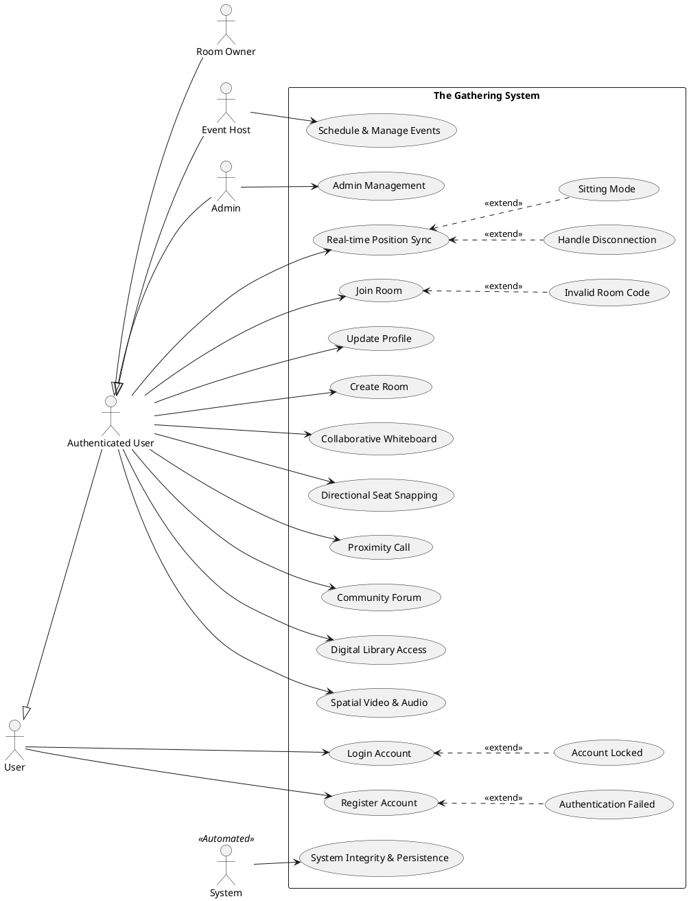
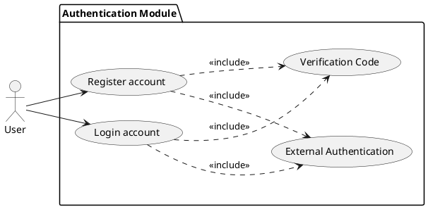

# **I. INTRODUCTION**

## **1\. Purpose**

The purpose of this project is to provide a virtual co-working platform named **The Gathering** that combines a SaaS-style productivity dashboard with an immersive 2D multiplayer environment. Responding to the needs of remote workers and students, users can collaborate in real-time within a shared digital space. Allowing users to manage virtual offices, schedule events, participate in community forums, and communicate via proximity-based video calls.

## **2\. Scope**

This project aims to bridge the gap between static management tools and immersive communication. It provides user authentication via Google and OTP, virtual room management, event scheduling with email notifications, a community forum, and a digital library for resource sharing. In addition, it features a multiplayer 2D office space using PixiJS where users can move, interact with specific zones, and engage in proximity-controlled video conferencing via LiveKit.

## **3\. Definition**

The Gathering system serves three main groups of users: Authenticated Users, Room Owners, and Event Hosts.
- **Authenticated Users**: Can join rooms via codes, participate in the 2D workspace, post in forums, and view resources.
- **Room Owners**: Can manage room settings, including renaming or deleting rooms and managing membership (kicking users).
- **Admins**: Have full platform oversight, including user management, room monitoring, and forum moderation.
- **Event Hosts**: Can create and manage scheduled meetings, sending automated invitations to guest emails.

\- **Customer (Authenticated User)**:
• Users can create accounts via Google or Email OTP to log in.
• They can view dashboard information, join rooms, and interact with the forum and library.
• Participate in real-time 2D movement and proximity video calls.

\- **Room Owner**:
- Manage room configurations and access.
- Moderate room members.

\- **Event Host**:
- Schedule and manage events.
- Send invitation emails to participants.

# **II. SYSTEM CONTEXT DIAGRAM**

## **1\. Overview**
The System Context Diagram for **The Gathering** project provides a high-level, visual representation of the platform and its interactions with external entities. Designed as a web-based collaborative environment, The Gathering aims to optimize remote teamwork by integrating a React-based frontend with a high-performance Bun/Elysia backend and third-party communication services.

## **2\. System Boundary**

The Gathering System encompasses all components developed and controlled by the project team:

- **Frontend (apps/client)**: A React-based single-page application (SPA) built with Vite, utilizing PixiJS for 2D rendering and Tailwind CSS for the UI. It handles user interactions, game canvas logic, and real-time state visualization.
- **Backend (apps/server)**: A Bun-based server using the ElysiaJS framework. it manages RESTful APIs for business logic, WebSocket connections for multiplayer sync, and database integration via Mongoose.
- **Database**: A MongoDB instance (hosted on MongoDB Atlas) that stores user profiles, room data, event schedules, forum posts, and resource metadata.

## **3\. External Entities**

The diagram identifies four external entities that interact with The Gathering System:

- **User**: remote workers or students who interact with the dashboard and 2D space to collaborate.
- **Google Identity Service**: A third-party OAuth 2.0 provider used for secure "One Tap" authentication.
- **SMTP Service (Gmail)**: Used for sending OTP codes and event invitations.
- **LiveKit Server**: An external real-time communication platform used to facilitate proximity-based audio/video calls.

## **4\. Interactions**

Each external entity interacts with The Gathering System through bidirectional flows:

- **User**:
  - **Interaction & Control**: Commands sent from User to the system, such as room creation, movement in 2D space, or forum posting.
  - **Real-time Feedback**: Data received by User, including positions of other players, event notifications, and chat messages.
- **Google Identity**:
  - **Auth Request**: The system sends identity tokens to Google for verification.
  - **Profile Data**: Google returns verified user information (email, name, avatar).
- **SMTP Provider**:
  - **Mail Delivery**: The system sends mail payloads (OTP/Invitations) to the provider.
  - **Status**: Confirmation of email transmission.
- **LiveKit**:
  - **Token Request**: The system requests access tokens for specific video rooms.
  - **Media Stream**: The client establishes a direct WebRTC connection for video/audio.

# **III. BUSINESS REQUIREMENT**

## **1\. Business goals**

Business goals articulate the high-level objectives that The Gathering aims to achieve, reflecting its purpose of transforming remote collaboration into a more human-centric experience.

### _1.1 Enhance Remote Presence_

- **Objective**: Provide a sense of "co-presence" by allowing users to see each other's avatars in a shared 2D space.
- **Rationale**: Static tools like Slack or Trello lack the visual feeling of being "in the office." The Gathering addresses this by using PixiJS and WebSockets to sync movements.
- **Detail**: Success is measured by the ability of the system to sync up to 20 users per room with a latency of less than 200ms.

### _1.2 Deliver an Integrated Workflow_

- **Objective**: Combine management tools (Events, Forum, Library) with communication tools (Video Calls) in a single platform.
- **Rationale**: Reducing context switching between different apps improves productivity.
- **Detail**: The MVP will feature at least 4 integrated modules (Rooms, Events, Forum, Library) accessible from a unified dashboard.

### _1.3 Ensure Accessibility and Low Cost_

- **Objective**: Build the system using high-performance but cost-effective tools (Bun, Elysia, MongoDB Atlas free tier).
- **Rationale**: As a student project for K26, the system must be deployable with minimal infrastructure costs.
- **Detail**: Use Bun's native speed to reduce server resource requirements, fitting within free-tier cloud constraints.

### _1.4 Establish Scalability for Virtual Communities_

- **Objective**: Design a modular architecture that can support multiple rooms and hundreds of concurrent users.
- **Rationale**: The platform should be able to scale from a single team to an entire organization or classroom.
- **Detail**: The backend architecture uses domain-driven routing to ensure that adding new features (like a Marketplace or Whiteboard) does not disrupt existing ones.

## **2\. Business constraints**

Business constraints define the limitations that shape The Gathering's development, ensuring goals are achievable within the team's resources and timeline.

### _2.1 Infrastructure Budget_

**Constraint**: Development and initial hosting must rely on free-tier services (e.g., MongoDB Atlas, LiveKit Cloud free tier).

**Impact**: Limits the number of concurrent video participants and total database storage (~512MB), requiring efficient data management.

**Detail**: The team will use open-source alternatives and free tiers of SaaS providers to stay within a $0 budget.

### _2.2 Tight Academic Timeline_

- **Constraint**: The final prototype must be delivered by the end of the K26 semester (May 2025).
- **Impact**: Prioritizes core multiplayer and SaaS features over advanced game mechanics or complex analytics.
- **Detail**: Development is structured into 4-week phases, focusing first on the engine, then on features, and finally on polish.

### _2.3 Team Composition (Group 3)_

- **Constraint**: Four members with defined roles in a monorepo environment.
- **Impact**: Requires a strict Git workflow and monorepo structure to avoid merge conflicts and ensure code quality.
- **Detail**: 
  - **Pham Nguyen Thien Loc**: Project Manager / Coordinator.
  - **Banh Van Tran Phat**: Lead Developer / Backend.
  - **Le Tan Dat**: Developer / Frontend.
  - **Le Thoi Duy**: Developer / Game Engine.

### _2.4 Technology Stack Dependency_

- **Constraint**: The system is built using the Bun runtime and ElysiaJS, which are cutting-edge but have smaller communities compared to Node.js/Express.
- **Impact**: Requires the team to be self-reliant in debugging framework-specific issues.
- **Detail**: The choice of Bun/Elysia ensures superior performance and a modern developer experience, aligning with the "BEMN" (Bun, Elysia, MongoDB, Next/React) stack.

## **3\. Business criteria**

Success criteria provide measurable outcomes to evaluate whether The Gathering meets its business objectives.

### _3.1 Functional Platform Delivery_

- **Criterion**: Deploy a fully functional web application supporting multiplayer interaction and dashboard management.
- **Measure**: Users can log in, create a room, move their avatar, and see others moving in real-time.
- **Detail**: Validation involves a live demo where at least 4 team members interact in the same virtual room simultaneously.

### _3.2 Performance and Latency_

- **Criterion**: Achieve smooth character movement and fast API responses.
- **Measure**: Average API response time < 500ms and WebSocket broadcast latency < 100ms.
- **Detail**: Tested using browser dev tools and server-side logging during peak simulated usage.

### _3.3 User Acceptance_

- **Criterion**: Positive feedback from testers regarding the "fun" and "utility" of the 2D space.
- **Measure**: A survey of fellow K26 students with at least 75% positive rating on usability.
- **Detail**: Conducted post-demo through a feedback form.

# **IV. USER REQUIREMENT**

## **1\. Functional Requirements list**

| **ID** | **Name**                   | **Description**                                                                                        | **Priority** | **Levels of complexity** |
| ------ | -------------------------- | ------------------------------------------------------------------------------------------------------ | ------------ | ------------------------ |
| UC_01  | Register/Login (Google)    | The system allows users to sign up or log in using their Google account (One Tap).                     | 1            | 3                        |
| UC_02  | Register/Login (OTP)       | The system allows users to log in via a one-time password sent to their email.                         | 1            | 4                        |
| UC_03  | Update User Profile        | The system allows users to change their display name and avatar.                                       | 2            | 3                        |
| UC_04  | Create Room                | The system allows users to create a new virtual workspace with a unique code.                          | 1            | 3                        |
| UC_05  | Join Room                  | The system allows users to enter a room by providing a room code.                                      | 1            | 3                        |
| UC_06  | Manage Room (Dashboard)    | Users can manage rooms they own or joined via a dedicated "My Rooms" dashboard with role-based filtering. | 1            | 3                        |
| UC_07  | Real-time Movement         | Users can move their character in a 2D map using WASD/Arrow keys.                                      | 1            | 2                        |
| UC_08  | Sync Positions             | The system synchronizes positions, sitting states, and phone visibility via WebSockets.                | 1            | 1                        |
| UC_09  | Proximity Audio/Video      | Automatic media connection triggered when players are within 100 units distance.                        | 1            | 1                        |
| UC_10  | Schedule Event             | The system allows users to create events with start/end times linked to a room.                        | 2            | 3                        |
| UC_11  | Send Event Invitations     | The system sends invitation emails to a list of guests when an event is created.                       | 2            | 3                        |
| UC_12  | Create Forum Topic         | Users can post new topics in the community forum.                                                      | 2            | 3                        |
| UC_13  | Reply to Topic             | Users can comment on existing forum topics.                                                            | 2            | 3                        |
| UC_14  | Search Digital Library     | Users can search for resources (documents/links) by title, type, or tags.                              | 2            | 3                        |
| UC_15  | Phone Interaction (Q key)  | Users can toggle a mobile phone animation (Pull out/Keep/Put away) to signal chat status.              | 1            | 4                        |
| UC_16  | Toggle Theme (Persistence) | Users can switch between Light and Dark mode with choice saved to local storage.                       | 1            | 4                        |
| UC_17  | Fullscreen Overlays        | Immersive fullscreen views for Chat and Calendar modules.                                              | 2            | 3                        |
| UC_18  | Collaborative Whiteboard   | Real-time drawing and brainstorming with state persistence in MongoDB.                                 | 1            | 2                        |
| UC_19  | Admin Management Dashboard | Specialized UI for managing users, rooms, and forum content.                                           | 1            | 2                        |
| UC_20  | Mini-map & Environment     | Spatial awareness via mini-map and dynamic map backgrounds.                                             | 2            | 3                        |
| UC_21  | Periodic State Snapshots   | Automated persistence of player data every 30s to ensure reliability.                                  | 1            | 3                        |
| UC_22  | API Rate Limiting          | Security layer to prevent abuse of API endpoints and WebSocket connections.                            | 1            | 4                        |
| UC_23  | Spatial Chat Filtering     | Chat messages are only visible to players within a 250px radius of the sender.                         | 1            | 2                        |
| UC_24  | Directional Seat Snapping  | Players snap to chairs with correct orientation (Up/Down/Left/Right) based on map configuration.        | 1            | 2                        |
| UC_25  | Glassmorphic UI Design     | High-end aesthetic for the bottom control bar and overlays using glassmorphism effects.                  | 2            | 3                        |
| UC_26  | Web Audio Spatial Engine   | Custom Web Audio API implementation with exponential decay and stereo panning for proximity audio.      | 1            | 2                        |

Table 2: Functional Requirement List

| **Level** | **Description** |
| --------- | --------------- |
| 1         | Must do         |
| 2         | Should do       |
| 3         | Nice to have    |
| 4         | Future release  |

Table 3: Priority Table

| **Level** | **Description**   |
| --------- | ----------------- |
| 1         | Extremely complex |
| 2         | Very complex      |
| 3         | Normal            |
| 4         | Easy              |
| 5         | Extremely easy    |

Table 4: Complexity table

## **2\. Use Cases Diagram**

### **_2.1. Notations_**
(Standard UML notation for Actors, Use Cases, and Boundaries)

### **_2.2. System Overview_**
The system is divided into two main domains: the Dashboard (CRUD operations) and the Game Space (Real-time operations).

### **_2.3 Use case Authentication_**

#### 2.3.1. Use Case Detail
Authentication is the entry point for all system features. It allows users to securely access their dashboard and virtual rooms using Google One Tap or Email OTP.

A diagram of a user authentication

#### 2.3.2. Use Case Description

##### _a) Use case Register account_

**Use Case ID:** UC_01_A

**Use Case Name:** Register account

**Brief Description:** The actor performs account registration to gain access to the system's features using Google Authentication or Email OTP.

**Actor:** User

**Pre-conditions:** The system must be operational and capable of processing account registration requests. The user must not have an existing account.

**Post-conditions:** The actor has successfully created an account, and the data is stored in the system's database. The user is issued a session token.

**Main Success Flow:**
1. The actor selects "Sign Up" on the system's landing page.
2. The system displays the registration options: "Continue with Google" or "Email OTP".
3. The actor chooses "Email OTP" and enters their email address.
4. The actor confirms "Send Code".
5. The system sends a verification code to the actor's email.
6. The system displays the verification code input screen.
7. The actor enters the verification code received via email.
8. The actor confirms by selecting "Verify & Register".
9. The system validates the code and checks if the email is new.
10. The system creates a new user profile and notifies the actor of success.

**Alternative Flows:**
A1: Google Authentication
1. In step 3, the actor chooses "Continue with Google".
2. The system redirects to the Google OAuth screen.
3. The actor authenticates with their Google account.
4. Google returns a valid identity token.
5. The system proceeds to step 9.

**Exception Flows:**
E1: Incomplete Information
In step 3 of the main flow: If the actor leaves the email field empty, the system displays an error message: "Please enter a valid email address".
E2: Duplicate Email
In step 9 of the main flow: If the system detects that the email already exists, it redirects the user to the Login use case (UC_01_B) or notifies "Account already exists".
E3: Invalid Email Format
In step 3 of the main flow: If the actor enters an invalid email format, the system displays an error message: "Invalid email format".
E4: Verification Code Not Received
In step 7 of the main flow: If the actor does not receive the code, they can select "Resend Code" after a 60-second cooldown.
E5: Incorrect/Expired Verification Code
In step 9 of the main flow: If the actor enters an incorrect or expired code, the system displays an error message: "Invalid verification code" and prompts for re-entry.

Table 5: Use case Description - Register account

##### _b) Use case Login account_

**Use Case ID:** UC_01_B

**Use Case Name:** Login account

**Brief Description:** An existing user authenticates to access their dashboard, rooms, and personal data.

**Actor:** User

**Pre-conditions:** The user already possesses a valid account.

**Post-conditions:** The user session is successfully established and a JWT is stored.

**Main Success Flow:**
1. The actor selects "Login" on the system's landing page.
2. The system displays login options (Google/Email).
3. The actor provides credentials (e.g., enters email for OTP or selects Google).
4. The system verifies the identity information with the authentication provider.
5. The system matches the verified identity with existing records in the database.
6. The system updates the "last login" timestamp.
7. The system grants access and redirects the user to the dashboard.

**Alternative Flows:**
None

**Exception Flows:**
E1: Account Banned
In step 5 of the main flow: If the system identifies the account status as "Banned", it denies access and displays: "Your account has been suspended. Please contact support."
E2: Invalid Credentials
In step 4 of the main flow: If the OTP is incorrect or the Google token is invalid, the system displays: "Authentication failed. Please try again."
E3: Network Error
In step 4 of the main flow: If the system cannot reach the authentication provider, it displays: "Connection error. Please check your internet."

Table 6: Use case Description - Login account

##### _c) Use case Join Room_

**Use Case ID:** UC_05

**Use Case Name:** Join Room

**Brief Description:** The actor enters a unique room code to access a specific virtual workspace.

**Actor:** Authenticated User

**Pre-conditions:** The user is logged in and possesses a valid 6-character room code.

**Post-conditions:** The actor is added to the room membership list and redirected to the game canvas.

**Main Success Flow:**
1. The actor selects "Join Room" on the dashboard.
2. The system displays a code input field.
3. The actor enters the 6-character room code.
4. The actor confirms by clicking "Join".
5. The system validates the existence of the room code.
6. The system checks if the user is already a member; if not, it adds the user to the room's member list.
7. The system redirects the actor to the real-time game interface.

**Alternative Flows:**
A1: Direct Link Access
1. In step 1, the actor clicks a direct URL shared by another member (e.g., `/room/ABCDEF`).
2. The system skips step 2-4 and proceeds to step 5.

**Exception Flows:**
E1: Room Not Found
In step 5 of the main flow: If the code does not exist, the system displays: "Room not found. Please check the code."
E2: Invalid Code Format
In step 3 of the main flow: If the actor enters a code that is not 6 characters, the system disables the "Join" button or displays an error message.
E3: Server Timeout
In step 5 of the main flow: If the database is unresponsive, the system displays: "Request timed out. Please try again later."

Table 7: Use case Description - Join Room

#### 2.4.1. Use Case Detail
This covers movement and proximity logic.

##### _a) Real-time Position Sync_

**Use Case ID:** UC_08

**Use Case Name:** Real-time Position Sync

**Brief Description:** The system synchronizes and broadcasts the 2D coordinates of all participants in a room to maintain a shared world state.

**Actor:** Authenticated User

**Pre-conditions:** The user is inside a virtual room and has an active WebSocket connection.

**Post-conditions:** All users in the room see the actor's avatar at the updated coordinates.

**Main Success Flow:**
1. The actor presses movement keys (Arrow keys or WASD).
2. The system calculates the new character position on the local canvas.
3. The system transmits the updated coordinates (x, y) and direction to the server.
4. The system validates the movement against room boundaries and collisions.
5. The system broadcasts the updated state to all other participants in the room.
6. The system updates the remote character positions on all participants' screens.

**Alternative Flows:**
A1: Interaction State (Sitting)
1. In step 1, the actor moves near a chair and presses the "Interact" key ('E').
2. The system triggers the sitting animation and snaps the character to the chair.
3. The system broadcasts the "isSitting" state in step 5.

**Exception Flows:**
E1: WebSocket Disconnection
In step 3 of the main flow: If the connection is lost, the system attempts to reconnect with exponential backoff and notifies the actor.
E2: Illegal Position (Clipping)
In step 4 of the main flow: If the new coordinates are inside a collision zone, the system resets the character to the last valid position.

Table 8: Use case Description - Sync Positions

##### _b) Use case Update Profile_

**Use Case ID:** UC_03

**Use Case Name:** Update Profile

**Brief Description:** The actor modifies their display name or avatar representation to customize their identity in the workspace.

**Actor:** User

**Pre-conditions:** The user is logged in.

**Post-conditions:** The user's profile is updated in the database and reflected in all active rooms.

**Main Success Flow:**
1. The actor opens the "Profile" modal from the dashboard or game sidebar.
2. The system displays current profile information (name, avatar URL).
3. The actor edits the display name or provides a new avatar URL.
4. The actor clicks "Save Changes".
5. The system validates the input (e.g., length, URL format).
6. The system updates the user record in the database.
7. The system notifies the actor of the successful update.

**Alternative Flows:**
None

**Exception Flows:**
E1: Invalid Input
In step 5 of the main flow: If the display name is too long or empty, the system displays: "Invalid name. Please use 2-30 characters."
E2: Image Load Failure
In step 3 of the main flow: If the provided avatar URL is broken, the system falls back to a default avatar and notifies the actor.

Table 9: Use case Description - Update Profile

##### _c) Use case Create Room_

**Use Case ID:** UC_04

**Use Case Name:** Create Room

**Brief Description:** The actor initializes a new virtual workspace by selecting a map template and naming the room.

**Actor:** User

**Pre-conditions:** The user is successfully logged in.

**Post-conditions:** A new room record is created; the actor is assigned as the Room Owner.

**Main Success Flow:**
1. The actor selects "Create Room" on the dashboard.
2. The system displays map templates (e.g., Office, Cafe, Garden).
3. The actor enters an optional room name and selects a template.
4. The actor clicks "Create".
5. The system generates a unique 6-character room code.
6. The system creates the room record in the database and sets the actor as owner.
7. The system redirects the actor to the newly created game room.

**Alternative Flows:**
A1: Instant Room
1. In step 1, the actor clicks "Start Instant".
2. The system skips step 2-3 and creates a room with default settings.

**Exception Flows:**
E1: Database Error
In step 6 of the main flow: If the database is unreachable, the system displays: "Failed to create room. Please try again."

Table 10: Use case Description - Create Room

##### _d) Use case Collaborative Whiteboard_

**Use Case ID:** UC_18

**Use Case Name:** Collaborative Whiteboard

**Brief Description:** Multiple participants in a room draw and edit a shared canvas simultaneously for brainstorming.

**Actor:** User

**Pre-conditions:** The user is inside a virtual room and located in the designated whiteboard zone.

**Post-conditions:** Drawing updates are synchronized across all participants and saved for the room.

**Main Success Flow:**
1. The actor approaches the whiteboard and presses the "Interact" key ('E').
2. The system displays the collaborative drawing canvas (Excalidraw).
3. The actor draws elements (lines, shapes, text).
4. The system transmits the updated drawing state to the server.
5. The system broadcasts the state to all other participants currently viewing the whiteboard.
6. The system periodically saves the whiteboard state to the database.

**Alternative Flows:**
None

**Exception Flows:**
E1: Conflict Resolution
In step 4 of the main flow: If two users edit the same element simultaneously, the system applies the most recent update based on the server timestamp.
E2: Load Failure
In step 2 of the main flow: If the whiteboard data is corrupted or fails to load, the system displays a blank canvas and notifies the actor.

Table 11: Use case Description - Whiteboard Interaction

### **_2.5. Advanced Features (v2.4)_**

##### _a) Use case Directional Seat Snapping_

**Use Case ID:** UC_24

**Use Case Name:** Directional Seat Snapping

**Brief Description:** The system automatically snaps the character to a seat and aligns their orientation for a natural appearance when interacting with furniture.

**Actor:** User

**Pre-conditions:** The character is standing within the interaction radius of a chair object.

**Post-conditions:** The character sprite is positioned exactly on the seat with the correct sitting animation and direction.

**Main Success Flow:**
1. The actor moves near a chair.
2. The actor presses the "Interact" key ('E').
3. The system identifies the chair's target coordinates and designated orientation (up, down, left, right).
4. The system updates the character's position to the target coordinates.
5. The system sets the character's animation state to "Sitting" and faces them in the chair's designated direction.
6. The system broadcasts the updated state to other participants.

**Alternative Flows:**
None

**Exception Flows:**
E1: Seat Occupied
In step 2 of the main flow: If another user is already sitting on the chair, the system denies the interaction and displays: "This seat is taken."

Table 12: Use case Description - Seat Snapping

##### _b) Use case Proximity Audio/Video Call_

**Use Case ID:** UC_09

**Use Case Name:** Proximity Call

**Brief Description:** The system automatically initiates a video/audio conference when two avatars move close to each other in the virtual space.

**Actor:** User

**Pre-conditions:** Two or more users are in the same room; their cameras/microphones are enabled.

**Post-conditions:** A direct WebRTC media stream is established between the nearby participants.

**Main Success Flow:**
1. The actor moves their avatar towards another user's avatar.
2. The system continuously calculates the distance between all avatars in the room.
3. When the distance falls below the "Proximity Threshold" (e.g., 100 pixels), the system triggers a call initialization.
4. The system requests a connection token from the media server (LiveKit).
5. The system displays a small video overlay for the nearby user.
6. The system establishes a two-way audio/video stream.

**Alternative Flows:**
A1: Group Call
1. In step 1, a third user moves into the proximity radius of the existing pair.
2. The system expands the call to a three-way session.

**Exception Flows:**
E1: Media Permission Denied
In step 4 of the main flow: If the user has blocked camera/mic access, the system displays: "Cannot start call. Please enable camera/mic permissions."
E2: Connection Timeout
In step 6 of the main flow: If the media stream cannot be established within 10 seconds, the system displays a connection error and retries.

Table 13: Use case Description - Proximity Call

##### _c) Use case Community Forum_

**Use Case ID:** UC_12/13

**Use Case Name:** Community Forum

**Brief Description:** The actor participates in asynchronous discussions by posting topics or replies in the room's dedicated forum.

**Actor:** User

**Pre-conditions:** The user is a member of the room and is logged in.

**Post-conditions:** The forum post is saved and visible to all room members.

**Main Success Flow:**
1. The actor opens the "Forum" tab in the room sidebar.
2. The system displays the list of existing discussion topics.
3. The actor clicks "New Topic" and enters a title and content.
4. The actor clicks "Submit".
5. The system validates the content and saves the topic to the database.
6. The system updates the forum list for all active members.

**Alternative Flows:**
A1: Replying to a Topic
1. In step 2, the actor selects an existing topic.
2. The system displays the topic thread.
3. The actor enters a reply in the text area and clicks "Post Reply".
4. The system proceeds to step 5.

**Exception Flows:**
E1: Empty Content
In step 3 of the main flow: If the title or content is empty, the system displays: "Please enter both title and content."

Table 14: Use case Description - Community Forum

##### _d) Use case Admin Panel_

**Use Case ID:** UC_19

**Use Case Name:** Admin Management

**Brief Description:** An administrator manages the platform's resources, including users, rooms, and content moderation.

**Actor:** Admin

**Pre-conditions:** The user is logged in and has the "is_admin" flag set in their profile.

**Post-conditions:** Targeted resources are modified, deleted, or updated as per the admin's action.

**Main Success Flow:**
1. The actor navigates to the `/admin` route.
2. The system verifies admin credentials and displays the management dashboard.
3. The actor selects a category (e.g., "Users" or "Rooms").
4. The system displays a searchable list of resources.
5. The actor selects a resource and performs an action (e.g., "Delete Room" or "Ban User").
6. The system confirms the action with a pop-up.
7. The system executes the command and updates the database.

**Alternative Flows:**
None

**Exception Flows:**
E1: Unauthorized Access
In step 2 of the main flow: If the user is not an admin, the system redirects to the main dashboard and displays: "Access denied."

Table 15: Use case Description - Admin Panel

##### _e) Use case Schedule Event_

**Use Case ID:** UC_10/11

**Use Case Name:** Schedule & Manage Events

**Brief Description:** The actor creates a scheduled meeting or social gathering in a room and invites participants via email notifications.

**Actor:** Event Host (Room Owner or authorized member)

**Pre-conditions:** The user is logged in and has hosting privileges for the specific room.

**Post-conditions:** The event is saved in the room's calendar, and invitation emails are dispatched.

**Main Success Flow:**
1. The actor opens the "Events" tab in the room sidebar and clicks "Create Event".
2. The system displays the event creation form (Title, Description, Date, Time, Participants).
3. The actor fills in the event details and enters participant email addresses.
4. The actor clicks "Schedule Event".
5. The system validates the date/time and saves the event to the database.
6. The system sends HTML invitation emails to all listed participants.
7. The system adds the event to the room's persistent calendar.

**Alternative Flows:**
A1: Cancel Event
1. In step 1, the actor selects an existing event.
2. The actor clicks "Cancel Event".
3. The system removes the event and notifies participants via email.

**Exception Flows:**
E1: Past Date
In step 5 of the main flow: If the actor selects a date in the past, the system displays: "Cannot schedule events in the past."

Table 16: Use case Description - Schedule Event

##### _f) Use case Digital Library Access_

**Use Case ID:** UC_14

**Use Case Name:** Digital Library Access

**Brief Description:** The actor uploads, searches, and downloads shared documents or media files within the room's library zone.

**Actor:** User

**Pre-conditions:** The user is inside a virtual room and located in the designated "Library" zone.

**Post-conditions:** Files are successfully accessed or stored in the room's resource repository.

**Main Success Flow:**
1. The actor approaches the library bookshelves and presses the "Interact" key ('E').
2. The system displays the library interface with a list of uploaded resources.
3. The actor uses the search bar or filters to find a specific file.
4. The actor clicks "Download" or "View" on a resource.
5. The system opens the resource in a new tab or initiates a file download.

**Alternative Flows:**
A1: Uploading a Resource
1. In step 2, the actor clicks "Upload Resource".
2. The actor selects a file (PDF, Image, Doc) from their local machine and clicks "Upload".
3. The system validates the file size and saves it to the storage server.
4. The system updates the library list for all members.

**Exception Flows:**
E1: File Too Large
In step 2 of the Alternative Flow: If the file exceeds 10MB, the system displays: "File size exceeds the 10MB limit."

Table 17: Use case Description - Digital Library

##### _g) Use case Spatial Media Experience_

**Use Case ID:** UC_23/26

**Use Case Name:** Spatial Video & Audio

**Brief Description:** The system dynamically adjusts the volume and stereo panning of participants' voices based on their avatar's relative position and orientation.

**Actor:** User

**Pre-conditions:** The user is in an active proximity call with at least one other participant.

**Post-conditions:** The audio/video experience reflects the spatial geometry of the virtual room.

**Main Success Flow:**
1. The actor moves their avatar around a speaking participant.
2. The system calculates the distance and the relative angle between the two avatars.
3. The system applies a volume roll-off filter (the further away, the quieter the voice).
4. The system applies a stereo panner (if the speaker is to the actor's left, the sound comes from the left speaker/earbud).
5. The system adjusts the opacity of the video overlay based on distance.

**Alternative Flows:**
None

**Exception Flows:**
E1: Audio Engine Failure
In step 3 of the main flow: If the Web Audio API fails to initialize, the system falls back to standard mono audio and notifies the actor.

Table 18: Use case Description - Spatial Media

##### _h) Use case System Integrity & Persistence_

**Use Case ID:** UC_21/22

**Use Case Name:** System Integrity & Persistence

**Brief Description:** The system automatically maintains consistency by saving state snapshots and protecting resources via rate-limiting.

**Actor:** System (Automated)

**Pre-conditions:** The server is running and active user sessions exist.

**Post-conditions:** Room states (whiteboards, positions) are persisted, and malicious traffic is mitigated.

**Main Success Flow:**
1. The system runs a background loop every 30 seconds.
2. The system identifies all "dirty" room states (rooms with recent changes).
3. The system serializes the current state (Whiteboard data, Member coordinates).
4. The system saves the snapshots to the persistent database (MongoDB).
5. Simultaneously, the system monitors API request frequency per IP.
6. The system blocks IPs that exceed the safety threshold (e.g., 100 requests/min).

**Alternative Flows:**
None

**Exception Flows:**
E1: Persistence Failure
In step 4 of the main flow: If the database write fails, the system logs a critical error and attempts a retry in the next loop.

Table 19: Use case Description - System Integrity

# **V. SYSTEM & SOFTWARE REQUIREMENT**

## **1\. Functional System Requirement**

Functional requirements specify the core capabilities of The Gathering, ensuring it meets collaboration and immersive needs.

| ID                        | Descriptions                                                                                                                                                                     | Rationale                                                                                       | Verifiability                                                                                                                                       | Detail                                                                                                         |
| ------------------------- | -------------------------------------------------------------------------------------------------------------------------------------------------------------------------------- | ----------------------------------------------------------------------------------------------- | --------------------------------------------------------------------------------------------------------------------------------------------------- | -------------------------------------------------------------------------------------------------------------- |
| SR-F1: Auth Verification  | The system must verify Google ID tokens on the backend before issuing a session JWT.                                                                                             | Ensures secure access and prevents unauthorized user creation.                                  | Test by sending an invalid token to the endpoint and verifying a 401 response.                                                                     | Uses `@elysiajs/jwt` and Google Auth Library.                                                                  |
| SR-F2: Room Persistence   | The system shall store room metadata and membership in MongoDB.                                                                                                                  | Enabling users to return to their workspaces later.                                             | Create a room, restart the server, and verify the room still exists in the list.                                                                    | Stores Name, Code, OwnerId, and Members array.                                                                 |
| SR-F3: WS Broadcast       | The system shall broadcast position updates to all users in a room with a delay of less than 100ms.                                                                              | Ensuring a smooth "game-like" experience.                                                       | Use `bun test` or manual timing to measure message round-trip time.                                                                                | Uses Elysia's native WebSocket support.                                                                        |
| SR-F4: Email Service      | The system shall send HTML-formatted invitation emails for scheduled events.                                                                                                     | notifying external participants about meetings.                                                 | Create an event with a test email and verify receipt of the invitation.                                                                             | Uses Nodemailer with Gmail SMTP.                                                                               |
| SR-F5: Proximity Logic    | The frontend shall calculate the distance between avatars and trigger a LiveKit token request when the distance < 100 units.                                                     | Enabling spontaneous video communication.                                                       | Move two characters together and verify the LiveKit interface appears.                                               | Distance calculation: `Math.sqrt(dx*dx + dy*dy)`.                                                              |
| SR-F6: Whiteboard Sync    | The system must synchronize Excalidraw whiteboard elements across all users in a room in real-time.                                              | Enabling collaborative brainstorming.                                                           | Draw on one client and verify the drawing appears on another client in the same room.                               | Uses WebSocket `whiteboard_update` event.                                                                      |
| SR-F7: Admin Control      | The system must allow admin users to manage all user accounts, rooms, and forum topics.                                                           | Ensuring platform moderation and oversight.                                                     | Login as admin and delete a test user/room.                                                                         | REST APIs under `/api/admin/*`.                                                                                |                                                     | Enabling spontaneous video communication.                                                       | Move two characters together and verify the LiveKit interface appears.                                                                              | Distance calculation: `Math.sqrt(dx*dx + dy*dy)`.                                                              |

Table 26: Functional System Requirement

## **2\. Non-Functional System Requirements**

Non-functional requirements specify the quality attributes of The Gathering.

| ID                             | Descriptions                                                                                                                                              | Rationale                                                        | Verifiability                                                                               | Detail                                                                       |
| ------------------------------ | --------------------------------------------------------------------------------------------------------------------------------------------------------- | ---------------------------------------------------------------- | ------------------------------------------------------------------------------------------- | ---------------------------------------------------------------------------- |
| SR-NF1: Responsiveness         | The system shall respond to REST API requests in under 500ms (p95) under normal conditions.                                                               | Ensures a snappy user experience in the dashboard.               | Measure response times using Chrome Network tab during testing.                             | Optimized by Bun's fast I/O.                                                 |
| SR-NF2: Real-time Concurrency | The system shall support at least 20 concurrent users per virtual room without significant movement jitter.                                               | Crucial for classroom or small team collaboration.               | Simulate 20 WS clients and observe broadcast frequency.                                     | WebSocket state is handled in-memory for speed.                              |
| SR-NF3: Security (Data)        | All private endpoints (Rooms, Profile, Events) must require a valid Bearer Token in the Authorization header.                                             | Protects user privacy and room security.                         | Attempt to access `/api/rooms` without a token and verify 401 error.                        | Verified via `isAuth` middleware.                                            |
| SR-NF4: Maintainability       | The codebase must follow a modular structure with separate controllers and routes for each domain.                                                        | Facilitates future expansion by the K26 team.                    | Review file structure: `controllers/`, `routes/`, `models/`.                                | Adheres to Domain-Driven Design principles.                                  |

Table 27: Non-Functional System Requirements

## **3\. System Constraints**

| ID                          | Descriptions                                                                                                                           | Rationale                                               | Impact                                                                         | Verifiability                                                             |
| --------------------------- | -------------------------------------------------------------------------------------------------------------------------------------- | ------------------------------------------------------- | ------------------------------------------------------------------------------ | ------------------------------------------------------------------------- |
| SR-C1: Network dependency   | The system requires a stable internet connection for WebSocket and WebRTC (LiveKit).                                                   | Real-time features cannot function offline.             | Users with unstable Wi-Fi may experience avatar "teleporting".                 | Test by throttling network and observing behavior.                        |
| SR-C2: Browser Compatibility| The system is designed for modern evergreen browsers (Chrome, Edge, Firefox).                                                          | Relies on advanced WebGL (PixiJS) and WebRTC features.  | May not work on legacy browsers or some restricted corporate networks.          | Test on latest versions of target browsers.                               |
| SR-C3: Selective Persistence | Critical real-time data (player positions, whiteboard) are persisted in MongoDB via 30s snapshots.        | Balances DB write load with user convenience and system reliability.           | Restart server and observe player spawn position and whiteboard state.           | Uses periodic snapshot loop in `server/src/index.ts`.                     | other ephemeral states (emotes) reset on restart.        | Balances DB write load with user convenience.           | Users reappear at their last known coordinates upon reconnection.             | Restart server and observe player spawn position.                         |
| SR-C4: Storage Limits       | Document uploads in the library are restricted by the free-tier database limits (~512MB total).                                         | Cost-effectiveness constraint.                           | Limits the size and number of resources shared.                                | Monitor MongoDB Atlas storage dashboard.                                  |

Table 28: System Constraints

## **4\. Backend Software Requirements**

The backend, built with Bun and Elysia, handles logic, auth, and state.

| Requirement Types              | ID                                                                                                                                                                                                                     | Descriptions                                                                                                                                                                                                              | Rationale                                                                                     | Verifiability                                                                      |
| ------------------------------ | ---------------------------------------------------------------------------------------------------------------------------------------------------------------------------------------------------------------------- | ------------------------------------------------------------------------------------------------------------------------------------------------------------------------------------------------------------------------- | --------------------------------------------------------------------------------------------- | ---------------------------------------------------------------------------------- |
| Functional  Requirements | **SWR1**                                                                                                                                                                                                               | The server shall handle WebSocket connections on `/ws`, managing a room-based pub/sub system for position updates.                                                                                                        | Core of the multiplayer experience.                                                           | Connect two clients to the same room and verify position sync.                     |
| **SWR2**                       | The server shall integrate with `LiveKit-server-sdk` to issue JWT access tokens for video sessions on demand.                                                                                                          | Facilitates secure video conferencing.                                                                                                                                                                                    | Verify token generation via the `/api/livekit/token` endpoint.                                |
| **SWR3**                       | The server shall use Mongoose to manage schemas for Users, Rooms, Events, ForumTopics, Resources, and Whiteboards.                                        | Ensures data consistency and easy querying.                                                   | Review `models/` directory for schema definitions.                                            |
| **SWR16**                      | The server shall implement a 30-second snapshot loop to persist player states and whiteboard changes to MongoDB.                                          | Mitigation for lack of Redis, ensuring data reliability.                                      | Observe DB updates every 30s during active sessions.                                          |
| **SWR17**                      | The server shall enforce rate-limiting on all public API endpoints using `elysia-rate-limit`.                                                             | Protects against brute-force and DDoS attacks.                                                | Send 100+ requests in 1 minute and verify 429 response.                                       |                                                                                                                  | Ensures data consistency and easy querying.                                                                                                                                                                               | Review `models/` directory for schema definitions.                                            |
| Non-Functional Requirements    | **SWR4**                                                                                                                                                                                                               | The server must startup in less than 2 seconds, including database connection.                                                                                                                                            | Enables rapid deployment and scaling.                                                         | Measure time from `bun start` to "Listening on port...".                           |
| **SWR5**                       | The server shall implement a CORS policy allowing requests only from the configured `CLIENT_URL`.                                                                                                                      | Prevents Cross-Origin attacks.                                                                                                                                                                                            | Test API from an unauthorized domain and verify rejection.                                   |
| Interface Requirements         | **SWR6**                                                                                                                                                                                                               | The API shall use JSON for all data exchanges, following standard HTTP status codes (200, 201, 400, 401, 404, 500).                                                                                                       | Ensures compatibility with React frontend.                                                    | Review API responses in Postman or DevTools.                                      |

Table 29: Backend Software Requirements

## **5\. Frontend Software Requirements**

The frontend provides the user interface and the 2D game canvas.

| Requirement Types              | ID                                                                                                                                                                                       | Descriptions                                                                                                                                                                                     | Rationale                                                       | Verifiability                                                                      |
| ------------------------------ | ---------------------------------------------------------------------------------------------------------------------------------------------------------------------------------------- | ------------------------------------------------------------------------------------------------------------------------------------------------------------------------------------------------ | --------------------------------------------------------------- | ---------------------------------------------------------------------------------- |
| Functional  Requirements | **SWR7**                                                                                                                                                                                 | The frontend shall render a 2D tilemap using PixiJS, handling sprite animations for player movement (walking, sitting).                                                                          | Visual core of the virtual space.                               | Observe avatar animations during movement and interaction.                         |
| **SWR8**                       | The frontend shall use `AuthContext` to manage global login state and persist the JWT in `localStorage`.                                                                                 | Maintains session across page refreshes.                                                                                                                                                         | Refresh the page and verify the user remains logged in.         |
| **SWR9**                       | The frontend shall display a sidebar in the game view for quick access to the room forum, participants list, and event schedule.                                                         | Improves usability by keeping tools accessible within the game.                                                                                                                                  | Open the sidebar tabs and verify content loading.                |
| Non-Functional Requirements    | **SWR10**                                                                                                                                                                                | The game canvas shall maintain a frame rate of 60 FPS on standard hardware.                                                                                                                      | Ensures a smooth visual experience without lag.                 | Use Chrome's FPS meter during gameplay.                                            |
| **SWR11**                      | The UI shall be responsive, adjusting the dashboard layout for different screen sizes (desktop/tablet).                                                                                  | Ensures accessibility on various devices.                                                                                                                                                         | Resize the browser window and observe layout changes.           |
| Interface Requirements         | **SWR12**                                                                                                                                                                                | The frontend shall communicate with the backend using a centralized `apiFetch` wrapper that automatically attaches the Authorization header.                                                 | Simplifies API interaction and ensures secure requests.         | Review `lib/api.ts` code.                                                         |

Table 30: Frontend Software Requirements

## **6\. Real-time Communication Requirements**

| Requirement Types              | ID                                                                                                                                                                                       | Descriptions                                                                                                                                                                                     | Rationale                                                       | Verifiability                                                                      |
| ------------------------------ | ---------------------------------------------------------------------------------------------------------------------------------------------------------------------------------------- | ------------------------------------------------------------------------------------------------------------------------------------------------------------------------------------------------ | --------------------------------------------------------------- | ---------------------------------------------------------------------------------- |
| Functional  Requirements | **SWR13**                                                                                                                                                                                | The client shall connect to the LiveKit cloud when the proximity threshold is met, subscribing to the neighbor's video/audio track.                                                              | Enables proximity calling.                                      | Verify "Joining Video Room" notification when approaching another player.          |
| **SWR14**                      | The WebSocket hook shall handle automatic reconnection with exponential backoff if the connection is lost.                                                                               | Ensures stability in unstable network conditions.                                                                                                                                                | Manually disconnect Wi-Fi and observe reconnection attempts.    |
| Non-Functional Requirements    | **SWR15**                                                                                                                                                                                | The proximity call system shall use AEC (Acoustic Echo Cancellation) and noise suppression provided by the LiveKit SDK.                                                                          | Ensures high audio quality for professional meetings.           | Subjective test of audio clarity in a noisy environment.                           |

Table 31: Real-time Communication Software Requirements