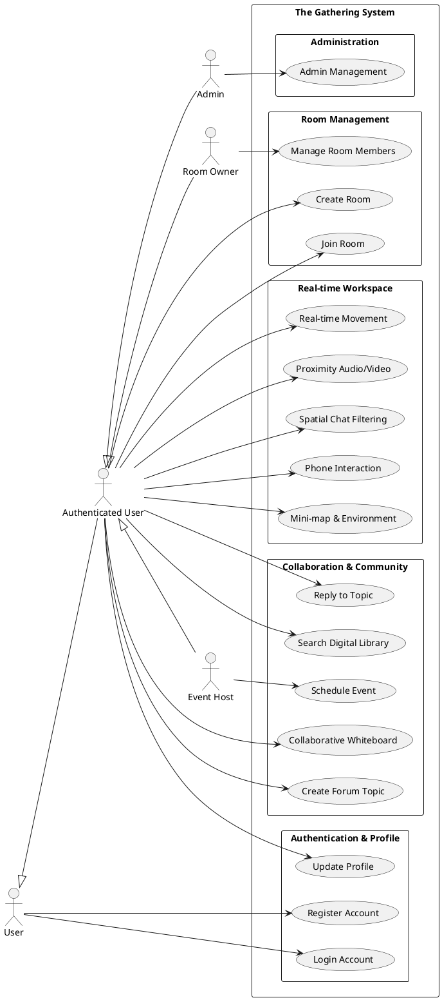
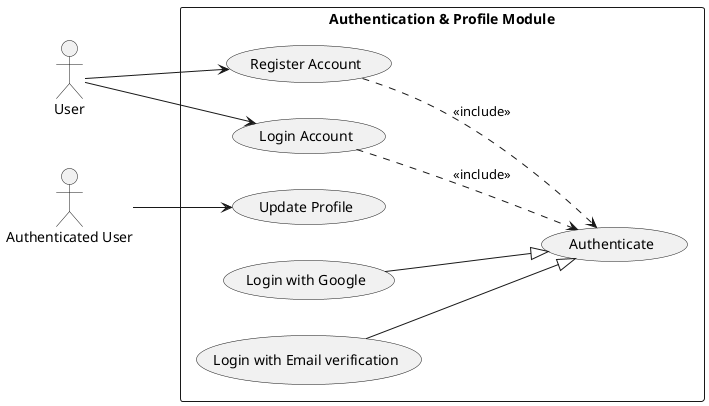
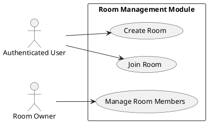
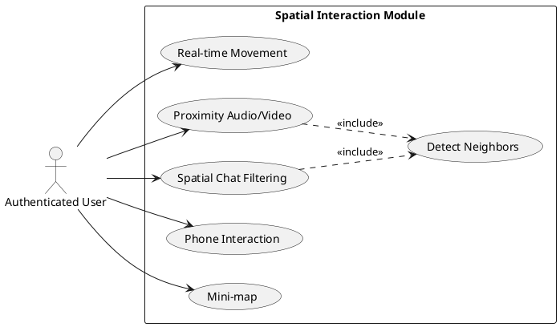
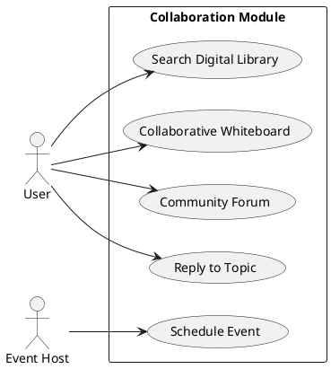
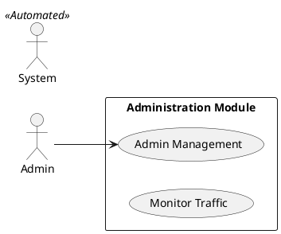

# **I. INTRODUCTION**

## **1\. Purpose**

The purpose of this project is to provide a virtual co-working platform named **The Gathering** that combines a SaaS-style productivity dashboard with an immersive 2D multiplayer environment. Responding to the needs of remote workers and students, users can collaborate in real-time within a shared digital space. Allowing users to manage virtual offices, schedule events, participate in community forums, and communicate via proximity-based video calls.

## **2\. Scope**

This project aims to bridge the gap between static management tools and immersive communication. It provides user authentication via Google and OTP, virtual room management, event scheduling with email notifications, a community forum, and a digital library for resource sharing. In addition, it features a multiplayer 2D office space using PixiJS where users can move, interact with specific zones, and engage in proximity-controlled video conferencing via LiveKit.

The Gathering system serves three main groups of users: Authenticated User, Room Owner, and Event Host.

- **Authenticated User**: Can join rooms via codes, participate in the 2D workspace, post in forums, and view resources. Users can create accounts via Google or Email verification to log in, view dashboard information, and participate in real-time interactions.
- **Room Owner**: Can manage room settings, including renaming or deleting rooms and managing membership (kicking users).
- **Admins**: Have full platform oversight, including user management, room monitoring, and forum moderation.
- **Event Host**: Can create and manage scheduled meetings, sending automated invitations to guest emails.

- **Room Owner**:
- Manage room configurations and access.
- Moderate room members.

- **Event Host**:
- Schedule and manage events.
- Send invitation emails to participants.

---

# **II. SYSTEM CONTEXT DIAGRAM**

## **1\. Overview**

The System Context Diagram for **The Gathering** project provides a high-level, visual representation of the platform and its interactions with external entities. Designed as a web-based collaborative environment, The Gathering aims to optimize remote teamwork by integrating a React-based frontend with a high-performance Bun/Elysia backend and third-party communication services.

```plantuml
@startuml
!include https://raw.githubusercontent.com/plantuml-stdlib/C4-PlantUML/master/C4_Context.puml

Person(user, "User", "Remote worker or student using the platform.")
System(gathering, "The Gathering System", "Multiplayer 2D co-working platform.")
System_Ext(google, "Google Identity Service", "OAuth 2.0 provider for authentication.")
System_Ext(smtp, "SMTP Service (Gmail)", "Handles email delivery (OTP, Invitations).")
System_Ext(livekit, "LiveKit Server", "Facilitates WebRTC video/audio streams.")

Rel(user, gathering, "Uses/Interacts with", "HTTPS/WS")
Rel(gathering, google, "Validates tokens", "HTTPS")
Rel(gathering, smtp, "Sends email payloads", "SMTP")
Rel(gathering, livekit, "Requests access tokens", "HTTPS")
Rel_U(user, livekit, "Establishes media stream", "WebRTC")
@enduml
```

## **2\. System Boundary**

The Gathering System encompasses all components developed and controlled by the project team:

- **Frontend (apps/client)**: A React-based single-page application (SPA) built with Vite, utilizing PixiJS for 2D rendering and Tailwind CSS for the UI. It handles user interactions, game canvas logic, and real-time state visualization.
- **Backend (apps/server)**: A Bun-based server using the ElysiaJS framework. it manages RESTful APIs for business logic, WebSocket connections for multiplayer sync, and database integration via Mongoose.
- **Database**: A MongoDB instance (hosted on MongoDB Atlas) that stores user profiles, room data, event schedules, forum posts, and resource metadata.

## **3\. External Entities**

The diagram identifies four external entities that interact with The Gathering System:

- **User**: remote workers or students who interact with the dashboard and 2D space to collaborate.
- **Google Identity Service**: A third-party OAuth 2.0 provider used for secure "One Tap" authentication.
- **SMTP Service (Gmail)**: Used for sending OTP codes and event invitations.
- **LiveKit Server**: An external real-time communication platform used to facilitate proximity-based audio/video calls.

## **4\. Interactions**

Each external entity interacts with The Gathering System through bidirectional flows:

- **User**:
  - **Interaction & Control**: Commands sent from User to the system, such as room creation, movement in 2D space, or forum posting.
  - **Real-time Feedback**: Data received by User, including positions of other players, event notifications, and chat messages.
- **Google Identity**:
  - **Auth Request**: The system sends identity tokens to Google for verification.
  - **Profile Data**: Google returns verified user information (email, name, avatar).
- **SMTP Provider**:
  - **Mail Delivery**: The system sends mail payloads (OTP/Invitations) to the provider.
  - **Status**: Confirmation of email transmission.
- **LiveKit**:
  - **Token Request**: The system requests access tokens for specific video rooms.
  - **Media Stream**: The client establishes a direct WebRTC connection for video/audio.

| External Entity | Input to System | Output from System |
| :--- | :--- | :--- |
| **User** | Interaction commands, movement, forum posts. | Real-time feedback, positions, chat, notifications. |
| **Google Identity** | Verified profile data (email, name, avatar). | Auth verification requests/tokens. |
| **SMTP Service** | Email delivery status/confirmation. | Mail payloads (OTP codes, Event invitations). |
| **LiveKit Server** | Access tokens for media rooms. | Token requests, session metadata. |

Table 1: External Entities and Interactions

---

# **III. BUSINESS REQUIREMENT**

## **1\. Business goals**

Business goals articulate the high-level objectives that The Gathering aims to achieve, reflecting its purpose of transforming remote collaboration into a more human-centric experience.

### _1.1 Enhance Remote Presence_

- **Objective**: Provide a sense of "co-presence" by allowing users to see each other's avatars in a shared 2D space.
- **Rationale**: Static tools like Slack or Trello lack the visual feeling of being "in the office." The Gathering addresses this by using PixiJS and WebSockets to sync movements.
- **Detail**: Success is measured by the ability of the system to sync up to 20 users per room with a latency of less than 200ms.

### _1.2 Deliver an Integrated Workflow_

- **Objective**: Combine management tools (Events, Forum, Library) with communication tools (Video Calls) in a single platform.
- **Rationale**: Reducing context switching between different apps improves productivity.
- **Detail**: The MVP will feature at least 4 integrated modules (Rooms, Events, Forum, Library) accessible from a unified dashboard.

### _1.3 Ensure Accessibility and Low Cost_

- **Objective**: Build the system using high-performance but cost-effective tools (Bun, Elysia, MongoDB Atlas free tier).
- **Rationale**: As a student project for K26, the system must be deployable with minimal infrastructure costs.
- **Detail**: Use Bun's native speed to reduce server resource requirements, fitting within free-tier cloud constraints.

### _1.4 Establish Scalability for Virtual Communities_

- **Objective**: Design a modular architecture that can support multiple rooms and hundreds of concurrent users.
- **Rationale**: The platform should be able to scale from a single team to an entire organization or classroom.
- **Detail**: The backend architecture uses domain-driven routing to ensure that adding new features (like a Marketplace or Whiteboard) does not disrupt existing ones.

## **2\. Business constraints**

Business constraints define the limitations that shape The Gathering's development, ensuring goals are achievable within the team's resources and timeline.

### _2.1 Infrastructure Budget_

**Constraint**: Development and initial hosting must rely on free-tier services (e.g., MongoDB Atlas, LiveKit Cloud free tier).

**Impact**: Limits the number of concurrent video participants and total database storage (~512MB), requiring efficient data management.

### _2.2 Tight Academic Timeline_

- **Constraint**: The final prototype must be delivered by the end of the K26 semester (May 2026).
- **Impact**: Prioritizes core multiplayer and SaaS features over advanced game mechanics or complex analytics.

### _2.3 Team Composition (Group 3)_

- **Constraint**: Four members with defined roles in a monorepo environment.
- **Impact**: Requires a strict Git workflow and monorepo structure to avoid merge conflicts and ensure code quality.

## **3\. Business criteria**

Success criteria provide measurable outcomes to evaluate whether The Gathering meets its business objectives.

### _3.1 Functional Platform Delivery_

- **Criterion**: Deploy a fully functional web application supporting multiplayer interaction and dashboard management.
- **Measure**: Users can log in, create a room, move their avatar, and see others moving in real-time.

---

# **IV. USER REQUIREMENT**

## **1\. Functional Requirements list**

| **ID**    | **Name**                   | **Description**                                                                                           | **Priority** | **Complexity** |
| --------- | -------------------------- | --------------------------------------------------------------------------------------------------------- | ------------ | -------------- |
| **AUTH-01** | Register Account           | Allow new users to create memberships via Google or Email verification.                                   | 1            | 3              |
| **AUTH-02** | Login Account              | Allow existing members to verify identity and access the dashboard.                                       | 1            | 4              |
| **AUTH-03** | Update Profile             | Allow members to personalize their display name and visual representation.                                | 2            | 3              |
| **ROOM-01** | Create Room                | Establish a new virtual workspace with a unique shareable access code.                                     | 1            | 3              |
| **ROOM-02** | Join Room                  | Enter an existing workspace by providing a valid invitation code.                                         | 1            | 3              |
| **ROOM-03** | Manage Room Members        | Workspace managers can moderate occupancy and update workspace configurations.                            | 1            | 3              |
| **SPACE-01**| Real-time Movement         | Navigate the character in the 2D map, including interactions like sitting on furniture.                   | 1            | 2              |
| **SPACE-02**| Proximity Audio/Video      | Spontaneous verbal/visual collaboration triggered by character proximity.                                 | 1            | 1              |
| **SPACE-03**| Phone Interaction          | Signal status or focus through a visual animation to the team.                                            | 1            | 4              |
| **SPACE-04**| Mini-map & Environment     | Spatial overview of the office layout and team distribution.                                              | 2            | 3              |
| **SPACE-05**| Spatial Chat Filtering     | Localized chat messages visible only to nearby participants.                                              | 1            | 2              |
| **COL-01**  | Schedule Event             | Organize team meetings and automatically send email invitations to participants.                          | 2            | 3              |
| **COL-02**  | Collaborative Whiteboard   | Real-time visual brainstorming and drawing synchronized across the team.                                  | 1            | 2              |
| **COL-03**  | Create Forum Topic         | Initiate new knowledge-sharing discussions in the community forum.                                        | 2            | 3              |
| **COL-04**  | Reply to Topic             | Contribute to existing community discussions.                                                             | 2            | 3              |
| **COL-05**  | Search Digital Library     | Locate shared team resources, documents, or links by title or tags.                                       | 2            | 3              |
| **ADM-01**  | Admin Management Dashboard | Specialized oversight interface for platform moderation and management.                                   | 1            | 2              |

Table 2: Functional Requirement List

| **Priority Level** | **Description** |
| ------------------ | --------------- |
| 1                  | Must do         |
| 2                  | Should do       |
| 3                  | Nice to have    |
| 4                  | Future release  |

Table 3: Priority Levels

| **Complexity Level** | **Description**   |
| -------------------- | ----------------- |
| 1                    | Extremely complex |
| 2                    | Very complex      |
| 3                    | Normal            |
| 4                    | Easy              |
| 5                    | Extremely easy    |

Table 4: Complexity Levels

---

## **2\. Use Case Specification by Module**

### **_2.1. Notations_**

The following UML notations are used to define the actors, functions, and relationships within "The Gathering System":

| Construct           | Description                                                                                       | Syntax                      |
| :------------------ | :------------------------------------------------------------------------------------------------ | :-------------------------- |
| **Actor**           | A coherent set of roles that users or external systems play when interacting with use cases.      | `actor Actor`               |
| **Use case**        | A sequence of actions, including variants, that the system can perform, interacting with actors.  | `(Use Case)`                |
| **System Boundary** | Represents the boundary between the physical system and the actors who interact with it.          | `rectangle System { ... }`  |
| **Association**     | The participation of an actor in a use case, representing communication between them.             | `Actor --> UC`              |
| **Generalization**  | A taxonomic relationship between a general actor/use case and a more specific one.                | `Child --\|> Parent`        |
| **Include**         | Specifies that one use case includes the functionality of another (mandatory).                    | `UC1 ..> UC2 : <<include>>` |
| **Extend**          | Specifies that one use case extends the behavior of another under specific conditions (optional). | `UC2 ..> UC1 : <<extend>>`  |

Table 5: UML Use Case Notations

---

### **_2.2. System Overview Diagram_**

The system is divided into two main domains: the Dashboard (CRUD operations) and the Game Space (Real-time operations).



Table 6: Global Use Case Diagram

---

### **_2.3. Module 1: Authentication & User Profile_**

This module handles secure access to the platform and personal identity management.

#### **2.3.1. Use Case Diagram**



#### **2.3.2. Use Case Descriptions**

| Field | Description |
| :--- | :--- |
| **Use Case ID:** | **AUTH-01** |
| **Use Case Name:** | Register Account |
| **Brief Description:** | A new user creates a membership to access the platform's features. |
| **Actor:** | User |
| **Pre-conditions:** | The platform is accessible; the user does not yet have an account. |
| **Post-conditions:** | Membership is created, and the user is granted access to the dashboard. |
| **Main Success Flow:** | 1. User selects the "Sign Up" option.<br>2. User chooses the email verification method.<br>3. User provides a valid email address.<br>4. System sends a verification code to the provided email.<br>5. User enters the received code into the platform.<br>6. System verifies the identity and activates the account.<br>7. System redirects the user to the personal dashboard. |
| **Alternative Flows:** | 1a. User selects "Login with Google".<br>2a. System opens the secure Google authorization window.<br>3a. User authorizes the platform to use their basic profile information. |
| **Exception Flows:** | At step 4 of Main Flow: The system is unable to deliver the email (delivery service error).<br>At step 6 of Main Flow: The user enters an incorrect or expired verification code.<br>At step 6 of Main Flow: The email address is already associated with an active account. |

Table 7: Use Case Description - Register Account

| Field | Description |
| :--- | :--- |
| **Use Case ID:** | **AUTH-02** |
| **Use Case Name:** | Login Account |
| **Brief Description:** | An existing member verifies their identity to access the platform. |
| **Actor:** | User |
| **Pre-conditions:** | The user has an active membership. |
| **Post-conditions:** | Access is successfully granted, and the user's dashboard is loaded. |
| **Main Success Flow:** | 1. User selects the "Login" option.<br>2. User enters their email or chooses a social login provider.<br>3. System verifies the account access rights.<br>4. System grants access to the platform features. |
| **Alternative Flows:** | 2a. User utilizes a previously saved secure session for instant access. |
| **Exception Flows:** | At step 3 of Main Flow: The user provides incorrect access credentials.<br>At step 3 of Main Flow: The account has been suspended by the platform administrator. |

Table 8: Use Case Description - Login Account

| Field | Description |
| :--- | :--- |
| **Use Case ID:** | **AUTH-03** |
| **Use Case Name:** | Update Profile |
| **Brief Description:** | A member personalizes their identity, such as their name or visual representation. |
| **Actor:** | Authenticated User |
| **Pre-conditions:** | The user is successfully logged in. |
| **Post-conditions:** | Profile changes are saved and become visible across the entire virtual office. |
| **Main Success Flow:** | 1. User opens the personal profile settings.<br>2. User updates their display name or selects a new visual avatar.<br>3. User saves the modifications.<br>4. System confirms the updates and synchronizes them across the platform. |
| **Alternative Flows:** | None. |
| **Exception Flows:** | At step 4 of Main Flow: The provided avatar link is inaccessible or formatted incorrectly.<br>At step 4 of Main Flow: The chosen display name exceeds the allowed character limit. |

Table 9: Use Case Description - Update Profile

---

---

### **_2.4. Module 2: Room & Membership Management_**

This module allows users to create, find, and enter virtual workspaces.

#### **2.4.1. Use Case Diagram**



#### **2.4.2. Use Case Descriptions**

| Field | Description |
| :--- | :--- |
| **Use Case ID:** | **ROOM-01** |
| **Use Case Name:** | Create Room |
| **Brief Description:** | A member establishes a new virtual workspace for team collaboration. |
| **Actor:** | Authenticated User |
| **Pre-conditions:** | The user is successfully logged in. |
| **Post-conditions:** | A new virtual office is established; the user becomes the workspace manager and is granted access to it. |
| **Main Success Flow:** | 1. User selects the "Create Workspace" option.<br>2. User provides a name for the virtual office.<br>3. System generates a unique shareable access code.<br>4. System establishes the workspace and redirects the user into it. |
| **Alternative Flows:** | None. |
| **Exception Flows:** | At step 3 of Main Flow: The system automatically resolves a code conflict by generating a new one.<br>At step 4 of Main Flow: The system is unable to finalize the workspace creation due to a temporary service interruption. |

Table 10: Use Case Description - Create Room

| Field | Description |
| :--- | :--- |
| **Use Case ID:** | **ROOM-02** |
| **Use Case Name:** | Join Room |
| **Brief Description:** | A member enters an existing virtual office using an invitation code. |
| **Actor:** | Authenticated User |
| **Pre-conditions:** | The user is successfully logged in. |
| **Post-conditions:** | User enters the office; their character appears on the map and is ready for team interaction. |
| **Main Success Flow:** | 1. User enters the shareable access code.<br>2. System verifies the validity of the code.<br>3. System adds the user to the office occupancy list.<br>4. System redirects the user to the virtual game map. |
| **Alternative Flows:** | 1a. User enters directly by clicking a shared invitation link. |
| **Exception Flows:** | At step 2 of Main Flow: The user provides an invalid, expired, or non-existent office code.<br>At step 3 of Main Flow: The user is already identified as a member of this workspace. |

Table 11: Use Case Description - Join Room

| Field | Description |
| :--- | :--- |
| **Use Case ID:** | **ROOM-03** |
| **Use Case Name:** | Manage Room Members |
| **Brief Description:** | The workspace manager moderates team occupancy and workspace settings. |
| **Actor:** | Room Owner |
| **Pre-conditions:** | The user is the designated manager of the workspace. |
| **Post-conditions:** | Workspace settings are updated, or specific occupancy changes are applied and visible to all. |
| **Main Success Flow:** | 1. Manager opens the office management panel.<br>2. Manager selects a participant to remove from the workspace.<br>3. System removes the participant and notifies them of the change. |
| **Alternative Flows:** | 2a. Manager updates the workspace name via the settings panel. |
| **Exception Flows:** | At step 3 of Main Flow: The manager attempts to remove themselves from their own workspace.<br>At step 3 of Main Flow: The selected participant has already left the office. |

Table 12: Use Case Description - Manage Room Members

---

### **_2.5. Module 3: Real-time Interaction & Spatial Media_**

The core engine of the 2D workspace, handling movement, collisions, and proximity-based media.

#### **2.5.1. Use Case Diagram**



#### **2.5.2. Use Case Descriptions**

| Field | Description |
| :--- | :--- |
| **Use Case ID:** | **SPACE-01** |
| **Use Case Name:** | Real-time Movement |
| **Brief Description:** | A member navigates their character through the virtual office map and interacts with furniture. |
| **Actor:** | Authenticated User |
| **Pre-conditions:** | The user is currently inside a virtual office. |
| **Post-conditions:** | The character's position is updated locally; character aligns correctly with furniture when sitting. |
| **Main Success Flow:** | 1. User uses navigation keys (WASD or Arrows) to move.<br>2. System calculates the movement path within map boundaries.<br>3. System displays character walking animation.<br>4. If character moves onto a chair, system automatically aligns the position and displays the sitting posture. |
| **Alternative Flows:** | 1a. User navigates using the on-screen joystick on mobile devices. |
| **Exception Flows:** | At step 2 of Main Flow: Movement is restricted by boundaries like walls.<br>At step 4 of Main Flow: Multiple team members attempt to occupy the same seat. |

Table 13: Use Case Description - Real-time Movement

---

| Field | Description |
| :--- | :--- |
| **Use Case ID:** | **SPACE-02** |
| **Use Case Name:** | Proximity Audio/Video |
| **Brief Description:** | Spontaneous verbal or visual collaboration occurs when team members approach each other. |
| **Actor:** | Authenticated User |
| **Pre-conditions:** | The communication service is active; microphones and cameras are authorized. |
| **Post-conditions:** | A real-time audio/video conversation is established with volume adjusting based on physical proximity. |
| **Main Success Flow:** | 1. A user moves their character within a close range of another team member.<br>2. System automatically initiates a collaborative connection between the participants.<br>3. System adjusts the audio clarity and volume based on the relative distance between characters.<br>4. Team members begin interacting through voice and video. |
| **Alternative Flows:** | 2a. User chooses to manually silence their microphone or disable their camera. |
| **Exception Flows:** | At step 2 of Main Flow: The user's web browser denies access to the microphone or camera.<br>At step 3 of Main Flow: The communication service has reached its maximum participant capacity.<br>At step 3 of Main Flow: The browser pauses audio playback until the user interacts with the office map. |

Table 14: Use Case Description - Proximity Audio/Video

| Field | Description |
| :--- | :--- |
| **Use Case ID:** | **SPACE-03** |
| **Use Case Name:** | Phone Interaction |
| **Brief Description:** | A member signals their current status or focus by interacting with a virtual phone. |
| **Actor:** | Authenticated User |
| **Pre-conditions:** | The user is active within the virtual office. |
| **Post-conditions:** | A visual status signal is displayed to all nearby team members. |
| **Main Success Flow:** | 1. User selects the "Phone" action (Shortcut: Q).<br>2. System displays a phone interaction animation over the character.<br>3. System synchronizes this visual signal so other team members can see the status change. |
| **Alternative Flows:** | None. |
| **Exception Flows:** | At step 3 of Main Flow: A temporary interruption prevents the status change from being visible to other team members. |

Table 15: Use Case Description - Phone Interaction

| Field | Description |
| :--- | :--- |
| **Use Case ID:** | **SPACE-04** |
| **Use Case Name:** | Mini-map & Environment |
| **Brief Description:** | A member gains spatial awareness of the entire office layout and team distribution. |
| **Actor:** | Authenticated User |
| **Pre-conditions:** | The user is active within the virtual office. |
| **Post-conditions:** | The user's relative location and the office environment are visualized on a small overview map. |
| **Main Success Flow:** | 1. User navigates their character through the office.<br>2. System updates the indicator on the mini-map to show the user's current location relative to the floor plan. |
| **Alternative Flows:** | 1a. User chooses to hide or reveal the mini-map overlay (Shortcut: M). |
| **Exception Flows:** | At step 2 of Main Flow: The office layout data fails to load, resulting in a blank overview map. |

Table 16: Use Case Description - Mini-map & Environment

| Field | Description |
| :--- | :--- |
| **Use Case ID:** | **SPACE-05** |
| **Use Case Name:** | Spatial Chat Filtering |
| **Brief Description:** | Conversations are localized so messages only reach nearby team members. |
| **Actor:** | Authenticated User |
| **Pre-conditions:** | A member sends a message in the office chat. |
| **Post-conditions:** | The message is only visible to team members within the character's immediate surroundings. |
| **Main Success Flow:** | 1. User types and sends a message in the chat panel.<br>2. System determines which other participants are within the designated "hearing" radius.<br>3. System delivers the message only to the screens of those nearby participants. |
| **Alternative Flows:** | 1a. User uses a "Global Broadcast" feature (if available) to reach everyone in the office. |
| **Exception Flows:** | At step 2 of Main Flow: A processing delay causes the message to be temporarily visible to all participants regardless of distance. |

Table 17: Use Case Description - Spatial Chat Filtering

---

---

### **_2.6. Module 4: Collaboration & Community Features_**

Tools designed to enhance productivity and community engagement within the room.

#### **2.6.1. Use Case Diagram**



#### **2.6.2. Use Case Descriptions**

| Field | Description |
| :--- | :--- |
| **Use Case ID:** | **COL-01** |
| **Use Case Name:** | Schedule Event |
| **Brief Description:** | A member organizes a future team meeting and notifies participants via email. |
| **Actor:** | Event Host |
| **Pre-conditions:** | The user is successfully logged in. |
| **Post-conditions:** | The event is recorded in the calendar; professional invitations are delivered to guest inboxes. |
| **Main Success Flow:** | 1. User opens the office calendar tool.<br>2. User enters event details (Title, Time, Room, and Guest Emails).<br>3. System records the event details.<br>4. System automatically delivers professional invitations to all provided guest emails. |
| **Alternative Flows:** | None. |
| **Exception Flows:** | At step 2 of Main Flow: The user attempts to schedule an event in the past.<br>At step 4 of Main Flow: The email delivery service is temporarily unreachable. |

Table 18: Use Case Description - Schedule Event

---

| Field | Description |
| :--- | :--- |
| **Use Case ID:** | **COL-03** |
| **Use Case Name:** | Create Forum Topic |
| **Brief Description:** | A member initiates a new discussion or knowledge-sharing thread in the community forum. |
| **Actor:** | Authenticated User |
| **Pre-conditions:** | The user is successfully logged in. |
| **Post-conditions:** | The new discussion topic becomes visible to all community members. |
| **Main Success Flow:** | 1. User navigates to the Community Forum section.<br>2. User provides a title and the main content of the discussion.<br>3. System saves the topic and publishes it to the community. |
| **Alternative Flows:** | 2a. User attaches relevant tags or visual imagery to the discussion topic. |
| **Exception Flows:** | At step 3 of Main Flow: The user attempts to publish a topic with an empty title or no content. |

Table 19: Use Case Description - Create Forum Topic

| Field | Description |
| :--- | :--- |
| **Use Case ID:** | **COL-04** |
| **Use Case Name:** | Reply to Topic |
| **Brief Description:** | A member contributes to an ongoing community discussion. |
| **Actor:** | Authenticated User |
| **Pre-conditions:** | The user is successfully logged in. |
| **Post-conditions:** | The contribution is saved and displayed within the discussion thread. |
| **Main Success Flow:** | 1. User views an existing community discussion.<br>2. User enters their contribution or reply.<br>3. System saves the reply and updates the discussion view for all members. |
| **Alternative Flows:** | None. |
| **Exception Flows:** | At step 3 of Main Flow: The discussion topic was removed while the user was composing their reply. |

Table 20: Use Case Description - Reply to Topic

| Field | Description |
| :--- | :--- |
| **Use Case ID:** | **COL-05** |
| **Use Case Name:** | Search Digital Library |
| **Brief Description:** | A member locates shared documents, links, or team resources. |
| **Actor:** | Authenticated User |
| **Pre-conditions:** | The library contains established resources. |
| **Post-conditions:** | A filtered list of relevant team resources is displayed to the user. |
| **Main Success Flow:** | 1. User enters a search term or keywords.<br>2. System filters the available resources based on the title or associated tags.<br>3. User selects and opens the desired resource. |
| **Alternative Flows:** | 2a. User filters resources by specific categories (e.g., PDF documents, Shared Links). |
| **Exception Flows:** | At step 2 of Main Flow: No resources match the provided search criteria.<br>At step 3 of Main Flow: The system restricts new resource uploads if the community storage limit has been reached. |

Table 21: Use Case Description - Search Digital Library

---

| Field | Description |
| :--- | :--- |
| **Use Case ID:** | **COL-02** |
| **Use Case Name:** | Collaborative Whiteboard |
| **Brief Description:** | Team members participate in real-time visual brainstorming and drawing. |
| **Actor:** | Authenticated User |
| **Pre-conditions:** | The whiteboard tool is active within the virtual office. |
| **Post-conditions:** | Visual contributions are synchronized and visible to all participants in real-time. |
| **Main Success Flow:** | 1. User draws or adds elements to the shared whiteboard.<br>2. System captures and transmits the changes to all other office participants.<br>3. The screens of other team members update to show the new contributions synchronously. |
| **Alternative Flows:** | 1a. User uploads an existing image to the shared whiteboard space. |
| **Exception Flows:** | At step 2 of Main Flow: An exceptionally large contribution causes a temporary delay in synchronization (System optimizes the data for delivery). |

Table 22: Use Case Description - Collaborative Whiteboard

---

### **_2.7. Module 5: Administrative & System Control_**

Platform oversight and automated maintenance tasks.

#### **2.7.1. Use Case Diagram**



#### **2.7.2. Use Case Descriptions**

| Field | Description |
| :--- | :--- |
| **Use Case ID:** | **ADM-01** |
| **Use Case Name:** | Admin Management |
| **Brief Description:** | The platform administrator monitors and moderates community activities. |
| **Actor:** | Admin |
| **Pre-conditions:** | The user is successfully logged in with administrative privileges. |
| **Post-conditions:** | Platform occupancy or member status is updated according to administrative actions. |
| **Main Success Flow:** | 1. Administrator enters the specialized management dashboard.<br>2. Administrator modifies user status or removes inappropriate content/rooms.<br>3. System applies the changes and updates the platform state. |
| **Alternative Flows:** | 2a. Administrator reviews high-level reports on platform usage and activity. |
| **Exception Flows:** | At step 1 of Main Flow: An unauthorized user attempts to access the management dashboard and is denied. |

Table 23: Use Case Description - Admin Management

---


---


---

# **V. NON-FUNCTIONAL REQUIREMENTS**

## **1\. Interface Design Specification**

### _1.1. Visual Aesthetic (Glassmorphism)_

The system utilizes a modern "Glassmorphism" UI style to provide a premium, immersive experience.

- **Description**: UI elements (modals, sidebars, overlays) use semi-transparent backgrounds with background blur (backdrop-filter).
- **Rationale**: Enhances the visual depth of the 2D environment and creates a professional "SaaS" feel.
- **Requirements**:
  - Backdrop blur of at least 8px on supported browsers.
  - Subtle 1px white borders to define edges.
  - Fallback to solid colors for browsers/hardware that do not support CSS blur.

---

# **VI. SYSTEM & SOFTWARE REQUIREMENT**

## **1\. Functional System Requirement**

Functional requirements specify the core capabilities of The Gathering, ensuring it meets collaboration and immersive needs.

| ID                       | Descriptions                                                                                                                 | Rationale                                                      | Verifiability                                                                         | Detail                                            |
| ------------------------ | ---------------------------------------------------------------------------------------------------------------------------- | -------------------------------------------------------------- | ------------------------------------------------------------------------------------- | ------------------------------------------------- |
| SR-F1: Auth Verification | The system must verify Google ID tokens on the backend before issuing a session JWT.                                         | Ensures secure access and prevents unauthorized user creation. | Test by sending an invalid token to the endpoint and verifying a 401 response.        | Uses `@elysiajs/jwt` and Google Auth Library.     |
| SR-F2: Room Persistence  | The system shall store room metadata and membership in MongoDB.                                                              | Enabling users to return to their workspaces later.            | Create a room, restart the server, and verify the room still exists in the list.      | Stores Name, Code, OwnerId, and Members array.    |
| SR-F3: WS Broadcast      | The system shall broadcast position updates to all users in a room with a delay of less than 100ms.                          | Ensuring a smooth "game-like" experience.                      | Use `bun test` or manual timing to measure message round-trip time.                   | Uses Elysia's native WebSocket support.           |
| SR-F4: Email Service     | The system shall send HTML-formatted invitation emails for scheduled events.                                                 | notifying external participants about meetings.                | Create an event with a test email and verify receipt of the invitation.               | Uses Nodemailer with Gmail SMTP.                  |
| SR-F5: Proximity Logic   | The frontend shall calculate the distance between avatars and trigger a LiveKit token request when the distance < 100 units. | Enabling spontaneous video communication.                      | Move two characters together and verify the LiveKit interface appears.                | $d = \sqrt{(x_2 - x_1)^2 + (y_2 - y_1)^2} < 100$ |
| SR-F6: Whiteboard Sync   | The system must synchronize Excalidraw whiteboard elements across all users in a room in real-time.                          | Enabling collaborative brainstorming.                          | Draw on one client and verify the drawing appears on another client in the same room. | Uses WebSocket `whiteboard_update` event.         |
| SR-F7: Admin Control     | The system must allow admin users to manage all user accounts, rooms, and forum topics.                                      | Ensuring platform moderation and oversight.                    | Login as admin and delete a test user/room.                                           | REST APIs under `/api/admin/*`.                   |

Table 24: Functional System Requirement

## **2\. Non-Functional System Requirements**

Non-functional requirements specify the quality attributes of The Gathering.

| ID                            | Descriptions                                                                                                  | Rationale                                          | Verifiability                                                        | Detail                                          |
| ----------------------------- | ------------------------------------------------------------------------------------------------------------- | -------------------------------------------------- | -------------------------------------------------------------------- | ----------------------------------------------- |
| SR-NF1: Responsiveness        | The system shall respond to REST API requests in under 500ms (p95) under normal conditions.                   | Ensures a snappy user experience in the dashboard. | Measure response times using Chrome Network tab during testing.      | Optimized by Bun's fast I/O.                    |
| SR-NF2: Real-time Concurrency | The system shall support at least 20 concurrent users per virtual room without significant movement jitter.   | Crucial for classroom or small team collaboration. | Simulate 20 WS clients and observe broadcast frequency.              | WebSocket state is handled in-memory for speed. |
| SR-NF3: Security (Data)       | All private endpoints (Rooms, Profile, Events) must require a valid Bearer Token in the Authorization header. | Protects user privacy and room security.           | Attempt to access `/api/rooms` without a token and verify 401 error. | Verified via `isAuth` middleware.               |
| SR-NF4: Maintainability       | The codebase must follow a modular structure with separate controllers and routes for each domain.            | Facilitates future expansion by the K26 team.      | Review file structure: `controllers/`, `routes/`, `models/`.         | Adheres to Domain-Driven Design principles.     |

Table 25: Non-Functional System Requirements

## **3\. System Constraints**

| ID                           | Descriptions                                                                                       | Rationale                                                            | Impact                                                                 | Verifiability                                         |
| ---------------------------- | -------------------------------------------------------------------------------------------------- | -------------------------------------------------------------------- | ---------------------------------------------------------------------- | ----------------------------------------------------- |
| SR-C1: Network dependency    | The system requires a stable internet connection for WebSocket and WebRTC (LiveKit).               | Real-time features cannot function offline.                          | Users with unstable Wi-Fi may experience avatar "teleporting".         | Test by throttling network and observing behavior.    |
| SR-C2: Browser Compatibility | The system is designed for modern evergreen browsers (Chrome, Edge, Firefox).                      | Relies on advanced WebGL (PixiJS) and WebRTC features.               | May not work on legacy browsers or some restricted corporate networks. | Test on latest versions of target browsers.           |
| SR-C3: Selective Persistence | Critical real-time data (player positions, whiteboard) are persisted in MongoDB via 30s snapshots. | Balances DB write load with user convenience and system reliability. | Restart server and observe player spawn position and whiteboard state. | Uses periodic snapshot loop in `server/src/index.ts`. |
| SR-C4: Storage Limits        | Document uploads in the library are restricted by the free-tier database limits (~512MB total).    | Cost-effectiveness constraint.                                       | System disables "Upload" if storage > 500MB and notifies user.        | Monitor MongoDB Atlas storage dashboard & backend check. |

Table 26: System Constraints

## **4\. Backend Software Requirements**

The backend, built with Bun and Elysia, handles logic, auth, and state.

| Requirement Types              | ID                                                                                                                 | Descriptions                                                                                                        | Rationale                                                      | Verifiability                                                  |
| ------------------------------ | ------------------------------------------------------------------------------------------------------------------ | ------------------------------------------------------------------------------------------------------------------- | -------------------------------------------------------------- | -------------------------------------------------------------- |
| Functional<br><br>Requirements | **SWR1**                                                                                                           | The server shall handle WebSocket connections on `/ws`, managing a room-based pub/sub system for position updates.  | Core of the multiplayer experience.                            | Connect two clients to the same room and verify position sync. |
| **SWR2**                       | The server shall integrate with `LiveKit-server-sdk` to issue JWT access tokens for video sessions on demand.      | Facilitates secure video conferencing.                                                                              | Verify token generation via the `/api/livekit/token` endpoint. |
| **SWR3**                       | The server shall use Mongoose to manage schemas for Users, Rooms, Events, ForumTopics, Resources, and Whiteboards. | Ensures data consistency and easy querying.                                                                         | Review `models/` directory for schema definitions.             |
| **SWR16**                      | The server shall implement a 30-second snapshot loop to persist player states and whiteboard changes to MongoDB.   | Mitigation for lack of Redis, ensuring data reliability.                                                            | Observe DB updates every 30s during active sessions.           |
| **SWR17**                      | The server shall enforce rate-limiting on all public API endpoints using `elysia-rate-limit`.                      | Protects against brute-force and DDoS attacks.                                                                      | Send 100+ requests in 1 minute and verify 429 response.        |
| Non-Functional Requirements    | **SWR4**                                                                                                           | The server must startup in less than 2 seconds, including database connection.                                      | Enables rapid deployment and scaling.                          | Measure time from `bun start` to "Listening on port...".       |
| **SWR5**                       | The server shall implement a CORS policy allowing requests only from the configured `CLIENT_URL`.                  | Prevents Cross-Origin attacks.                                                                                      | Test API from an unauthorized domain and verify rejection.     |
| Interface Requirements         | **SWR6**                                                                                                           | The API shall use JSON for all data exchanges, following standard HTTP status codes (200, 201, 400, 401, 404, 500). | Ensures compatibility with React frontend.                     | Review API responses in Postman or DevTools.                   |

Table 27: Backend Software Requirements

## **5\. Frontend Software Requirements**

The frontend provides the user interface and the 2D game canvas.

| Requirement Types              | ID                                                                                                                               | Descriptions                                                                                                                                 | Rationale                                               | Verifiability                                              |
| ------------------------------ | -------------------------------------------------------------------------------------------------------------------------------- | -------------------------------------------------------------------------------------------------------------------------------------------- | ------------------------------------------------------- | ---------------------------------------------------------- |
| Functional<br><br>Requirements | **SWR7**                                                                                                                         | The frontend shall render a 2D tilemap using PixiJS, handling sprite animations for player movement (walking, sitting).                      | Visual core of the virtual space.                       | Observe avatar animations during movement and interaction. |
| **SWR8**                       | The frontend shall use `AuthContext` to manage global login state and persist the JWT in `localStorage`.                         | Maintains session across page refreshes.                                                                                                     | Refresh the page and verify the user remains logged in. |
| **SWR9**                       | The frontend shall display a sidebar in the game view for quick access to the room forum, participants list, and event schedule. | Improves usability by keeping tools accessible within the game.                                                                              | Open the sidebar tabs and verify content loading.       |
| Non-Functional Requirements    | **SWR10**                                                                                                                        | The game canvas shall maintain a frame rate of 60 FPS on standard hardware.                                                                  | Ensures a smooth visual experience without lag.         | Use Chrome's FPS meter during gameplay.                    |
| **SWR11**                      | The UI shall be responsive, adjusting the dashboard layout for different screen sizes (desktop/tablet).                          | Ensures accessibility on various devices.                                                                                                    | Resize the browser window and observe layout changes.   |
| Interface Requirements         | **SWR12**                                                                                                                        | The frontend shall communicate with the backend using a centralized `apiFetch` wrapper that automatically attaches the Authorization header. | Simplifies API interaction and ensures secure requests. | Review `lib/api.ts` code.                                  |

Table 28: Frontend Software Requirements

## **6\. Real-time Communication Requirements**

| Requirement Types              | ID                                                                                                         | Descriptions                                                                                                                        | Rationale                                                    | Verifiability                                                             |
| ------------------------------ | ---------------------------------------------------------------------------------------------------------- | ----------------------------------------------------------------------------------------------------------------------------------- | ------------------------------------------------------------ | ------------------------------------------------------------------------- |
| Functional<br><br>Requirements | **SWR13**                                                                                                  | The client shall connect to the LiveKit cloud when the proximity threshold is met, subscribing to the neighbor's video/audio track. | Enables proximity calling.                                   | Verify "Joining Video Room" notification when approaching another player. |
| **SWR14**                      | The WebSocket hook shall handle automatic reconnection with exponential backoff if the connection is lost. | Ensures stability in unstable network conditions.                                                                                   | Manually disconnect Wi-Fi and observe reconnection attempts. |
| Non-Functional Requirements    | **SWR15**                                                                                                  | The proximity call system shall use AEC (Acoustic Echo Cancellation) and noise suppression provided by the LiveKit SDK.             | Ensures high audio quality for professional meetings.        | Subjective test of audio clarity in a noisy environment.                  |

| **SWR18**                      | The frontend shall provide visual feedback during WebSocket reconnection attempts (blurring avatar, "Connecting..." icon).          | Enhances user experience during network instability.         | Verify UI changes when server is unreachable.                             |
|                                |                                                                                                            |                                                              |                                                                           |

Table 29: Real-time Communication Software Requirements
