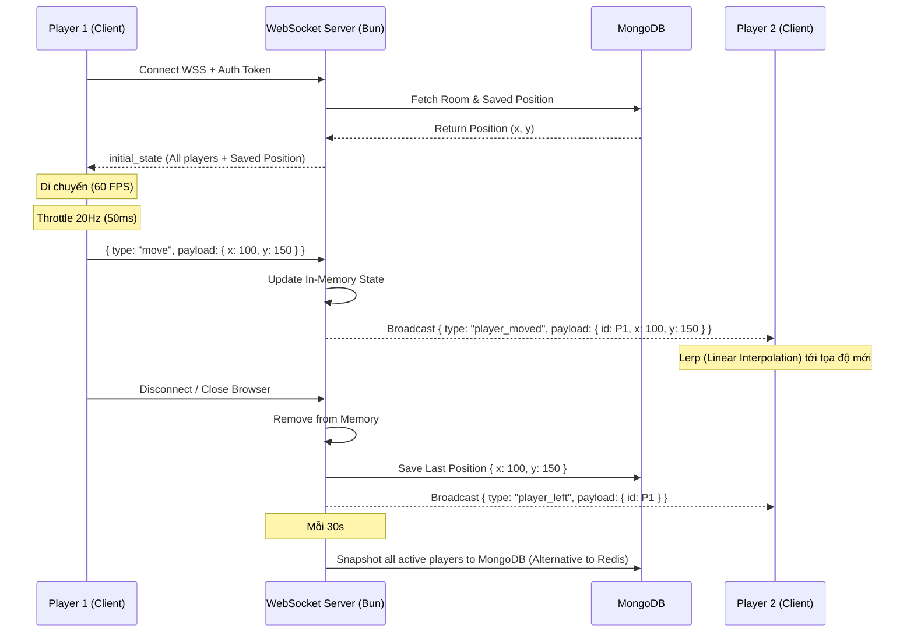

# Kiến Trúc Hệ Thống - The Gathering

Tài liệu này mô tả kiến trúc tổng thể của hệ thống **The Gathering**, bao gồm sơ đồ tương tác giữa các dịch vụ, luồng xử lý thời gian thực (WebSocket) và kiến trúc truyền phát Media (LiveKit SFU).

---

## 1. High-Level System Architecture (Kiến Trúc Tổng Thể)

Kiến trúc kết hợp giữa mô hình Client-Server truyền thống cho dữ liệu tĩnh và kết nối Real-time cho tương tác thời gian thực.

```mermaid
graph TD
    %% Client Side
    subgraph Client [Client Side (React + Vite)]
        UI[React UI / DOM]
        Engine[PixiJS Canvas Engine]
        WS_Client[WebSocket Client]
        RTC_Client[LiveKit WebRTC Client]
        
        UI <--> Engine
    end

    %% Backend Server
    subgraph Backend [Backend Server (Bun + ElysiaJS)]
        API[REST API Handlers]
        WS_Server[WebSocket Server]
        Auth[JWT Authentication]
        Admin[Admin Dashboard API]
    end

    %% External Services
    subgraph Services [External Services & DB]
        MongoDB[(MongoDB)]
        LiveKit[LiveKit Server / SFU]
    end

    %% Connections
    UI -- "HTTP/REST (Auth, Room Data)" --> API
    Engine -- "Update Position (20Hz)" --> WS_Client
    WS_Client -- "WSS (JSON Payloads)" <--> WS_Server
    RTC_Client -- "WebRTC (Audio/Video)" <--> LiveKit
    
    API -- "Read/Write" --> MongoDB
    WS_Server -- "Periodic Snapshots (30s)" --> MongoDB
    WS_Server -- "Save Whiteboard State" --> MongoDB
    API -- "Generate Token" --> LiveKit
    UI -- "Save Theme" --> LocalStorage

    %% Styling
    classDef client fill:#e0f2fe,stroke:#0284c7,stroke-width:2px;
    classDef server fill:#dcfce7,stroke:#16a34a,stroke-width:2px;
    classDef external fill:#fef08a,stroke:#ca8a04,stroke-width:2px;
    
    class UI,Engine,WS_Client,RTC_Client client;
    class API,WS_Server,Auth server;
    class MongoDB,LiveKit external;
```

---

## 2. Real-time Synchronization Flow (Luồng Đồng Bộ Vị Trí)

Mô tả cách thức hệ thống đồng bộ vị trí của hàng trăm người chơi với độ trễ thấp thông qua WebSockets. Quá trình này được tối ưu bằng kỹ thuật **Client-Side Prediction** và **Throttling**.



---

## 3. WebRTC Media Flow (Kiến trúc LiveKit SFU)

Hệ thống sử dụng kiến trúc **SFU (Selective Forwarding Unit)** thay vì **P2P (Peer-to-Peer) Mesh** để đảm bảo băng thông ổn định khi có nhiều người cùng mở mic/camera trong một vùng không gian (Spatial Audio).

```mermaid
graph LR
    subgraph Mesh [P2P Mesh (Không sử dụng)]
        direction LR
        P1_M((P1)) <--> P2_M((P2))
        P1_M <--> P3_M((P3))
        P2_M <--> P3_M
        Note1[Băng thông = O(N²)<br>CPU Client quá tải]
    end

    subgraph SFU [LiveKit SFU (Kiến trúc đang dùng)]
        direction LR
        P1_S((P1)) -- "1 Up" --> LK{LiveKit<br>SFU}
        P2_S((P2)) -- "1 Up" --> LK
        P3_S((P3)) -- "1 Up" --> LK
        
        LK -- "2 Down" --> P1_S
        LK -- "2 Down" --> P2_S
        LK -- "2 Down" --> P3_S
        Note2[Băng thông = O(N)<br>Giảm tải Client tối đa]
    end

    %% Styling
    style Mesh fill:#fee2e2,stroke:#ef4444,stroke-dasharray: 5 5
    style SFU fill:#ecfdf5,stroke:#10b981
```

### Các tính năng Media & UI nổi bật:
1. **Web Audio API Spatial Audio:** Thay vì sử dụng âm thanh mặc định, hệ thống tích hợp Web Audio API để xử lý Spatial Audio. Điều này bao gồm:
    - **Exponential Volume Decay:** Âm lượng giảm dần theo hàm mũ khi người chơi di chuyển xa nguồn phát.
    - **Stereo Panning:** Điều hướng âm thanh trái/phải dựa trên vị trí tương đối (X coordinate) của người chơi so với nguồn phát.
2. **Directional Seat Snapping:** Tính năng ngồi (phím E) không chỉ dừng lại ở việc cố định vị trí mà còn tự động điều chỉnh hướng nhìn của nhân vật (Orientation) dựa trên cấu hình ghế trong bản đồ, tạo cảm giác tự nhiên khi làm việc nhóm.
3. **Spatial Video Overlay:** Hệ thống tự động tính toán tọa độ màn hình (Screen Coordinates) từ tọa độ thế giới (World Coordinates) để hiển thị video track của người chơi ngay trên đầu avatar của họ, giúp nhận diện người đang nói một cách trực quan nhất.
4. **Spatial Chat (Nearby Chat):** Hệ thống tích hợp thuật toán lọc tin nhắn dựa trên vị trí thực tế. Client chỉ hiển thị tin nhắn từ những người chơi trong bán kính 250 pixels, giúp giả lập môi trường trò chuyện thực tế và bảo mật không gian riêng tư.
5. **Phone Interaction (Q Key):** Tích hợp animation hai giai đoạn (Rút máy & Giữ máy) được đồng bộ hóa tức thì qua WebSocket. Khi thay đổi trạng thái điện thoại, hệ thống sẽ bỏ qua bộ lọc Throttle để phát tín hiệu broadcast ngay lập tức cho các người chơi khác.
6. **Atomic Room Joining:** Sử dụng lệnh `$addToSet` của MongoDB để xử lý việc tham gia phòng, giúp ngăn chặn lỗi xung đột phiên bản (Version Conflict) và đảm bảo tính toàn vẹn dữ liệu khi nhiều người cùng tham gia hoặc hệ thống đang lưu Snapshot.
7. **Theme Persistence:** Hệ thống hỗ trợ Light/Dark mode với khả năng ghi nhớ lựa chọn của người dùng thông qua LocalStorage và đồng bộ màu sắc cho toàn bộ UI (Sidebar, Chat, Modals).
8. **Fullscreen Immersive Views:** Các module như Chat và Calendar được thiết kế dưới dạng lớp phủ toàn màn hình (Overlay) với kiến trúc Sidebar riêng, giúp tối ưu diện tích tương tác mà không cần rời khỏi không gian 2D.
9. **Image-Based Backgrounds:** Hỗ trợ render ảnh tĩnh (PNG/JPG) chất lượng cao làm nền bản đồ thay vì tileset truyền thống, giúp tối ưu hiệu năng và đạt tính thẩm mỹ tối đa (ví dụ: Café Lounge).
10. **Collaborative Whiteboard:** Tích hợp Excalidraw với cơ chế đồng bộ real-time qua WebSocket và lưu trữ trạng thái vào MongoDB, cho phép làm việc nhóm hiệu quả.
11. **Admin Dashboard:** Hệ thống quản trị tập trung cho phép kiểm soát người dùng (Set Admin via CLI/UI), quản lý phòng họp và diễn đàn một cách trực quan.
12. **マルチプレイヤー Reliability:** Cơ chế Snapshot định kỳ mỗi 30 giây giúp bảo toàn dữ liệu vị trí người chơi ngay cả khi server gặp sự cố, thay thế hoàn toàn nhu cầu sử dụng Redis.
13. **Google One Tap & OTP:** Hệ thống xác thực đa phương thức tích hợp Google One Tap (không gây nhiễu UI) và đăng nhập qua mã OTP gửi tới Email.
14. **Glassmorphic UI Design:** Thanh điều khiển (Bottom Bar) và các cửa sổ Overlay được thiết kế với phong cách Glassmorphism (Backdrop blur, border mờ) giúp giao diện trở nên sang trọng và hiện đại, đồng nhất với trải nghiệm "Premium co-working space".
