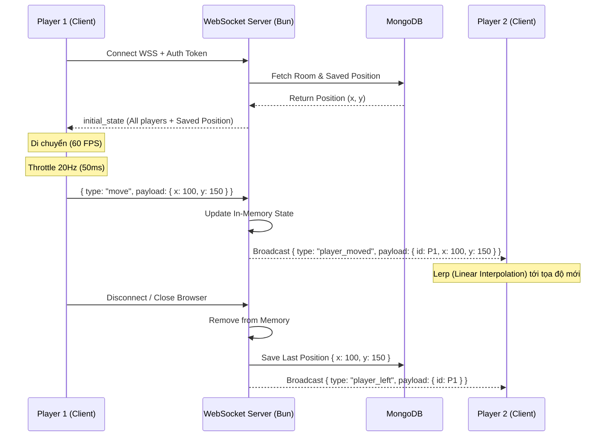

# Kiến Trúc Hệ Thống - The Gathering

Tài liệu này mô tả kiến trúc tổng thể của hệ thống **The Gathering**, bao gồm sơ đồ tương tác giữa các dịch vụ, luồng xử lý thời gian thực (WebSocket) và kiến trúc truyền phát Media (LiveKit SFU).

---

## 1. High-Level System Architecture (Kiến Trúc Tổng Thể)

Kiến trúc kết hợp giữa mô hình Client-Server truyền thống cho dữ liệu tĩnh và kết nối Real-time cho tương tác thời gian thực.

```mermaid
graph TD
    %% Client Side
    subgraph Client [Client Side (React + Vite)]
        UI[React UI / DOM]
        Engine[PixiJS Canvas Engine]
        WS_Client[WebSocket Client]
        RTC_Client[LiveKit WebRTC Client]
        
        UI <--> Engine
    end

    %% Backend Server
    subgraph Backend [Backend Server (Bun + ElysiaJS)]
        API[REST API Handlers]
        WS_Server[WebSocket Server]
        Auth[JWT Authentication]
    end

    %% External Services
    subgraph Services [External Services & DB]
        MongoDB[(MongoDB)]
        LiveKit[LiveKit Server / SFU]
    end

    %% Connections
    UI -- "HTTP/REST (Auth, Room Data)" --> API
    Engine -- "Update Position (20Hz)" --> WS_Client
    WS_Client -- "WSS (JSON Payloads)" <--> WS_Server
    RTC_Client -- "WebRTC (Audio/Video)" <--> LiveKit
    
    API -- "Read/Write" --> MongoDB
    WS_Server -- "Save Position on Close" --> MongoDB
    API -- "Generate Token" --> LiveKit
    UI -- "Save Theme" --> LocalStorage

    %% Styling
    classDef client fill:#e0f2fe,stroke:#0284c7,stroke-width:2px;
    classDef server fill:#dcfce7,stroke:#16a34a,stroke-width:2px;
    classDef external fill:#fef08a,stroke:#ca8a04,stroke-width:2px;
    
    class UI,Engine,WS_Client,RTC_Client client;
    class API,WS_Server,Auth server;
    class MongoDB,LiveKit external;
```

---

## 2. Real-time Synchronization Flow (Luồng Đồng Bộ Vị Trí)

Mô tả cách thức hệ thống đồng bộ vị trí của hàng trăm người chơi với độ trễ thấp thông qua WebSockets. Quá trình này được tối ưu bằng kỹ thuật **Client-Side Prediction** và **Throttling**.



---

## 3. WebRTC Media Flow (Kiến trúc LiveKit SFU)

Hệ thống sử dụng kiến trúc **SFU (Selective Forwarding Unit)** thay vì **P2P (Peer-to-Peer) Mesh** để đảm bảo băng thông ổn định khi có nhiều người cùng mở mic/camera trong một vùng không gian (Spatial Audio).

```mermaid
graph LR
    subgraph Mesh [P2P Mesh (Không sử dụng)]
        direction LR
        P1_M((P1)) <--> P2_M((P2))
        P1_M <--> P3_M((P3))
        P2_M <--> P3_M
        Note1[Băng thông = O(N²)<br>CPU Client quá tải]
    end

    subgraph SFU [LiveKit SFU (Kiến trúc đang dùng)]
        direction LR
        P1_S((P1)) -- "1 Up" --> LK{LiveKit<br>SFU}
        P2_S((P2)) -- "1 Up" --> LK
        P3_S((P3)) -- "1 Up" --> LK
        
        LK -- "2 Down" --> P1_S
        LK -- "2 Down" --> P2_S
        LK -- "2 Down" --> P3_S
        Note2[Băng thông = O(N)<br>Giảm tải Client tối đa]
    end

    %% Styling
    style Mesh fill:#fee2e2,stroke:#ef4444,stroke-dasharray: 5 5
    style SFU fill:#ecfdf5,stroke:#10b981
```

### Các tính năng Media & UI nổi bật:
1. **Spatial Audio:** Client (PixiJS) liên tục tính toán khoảng cách Euclidean (Distance) giữa bản thân và các Remote Players. Nếu `distance < threshold`, volume của Track Audio được điều chỉnh tăng/giảm tuyến tính.
2. **Zone Isolation:** Khi người chơi bước vào `Conference Room`, thuật toán bỏ qua khoảng cách và ép `Volume = 1.0` cho tất cả những người cùng trong Zone, đồng thời ngắt âm thanh từ bên ngoài.
3. **Theme Persistence:** Hệ thống hỗ trợ Light/Dark mode với khả năng ghi nhớ lựa chọn của người dùng thông qua LocalStorage và đồng bộ màu sắc cho toàn bộ UI (Sidebar, Chat, Modals).
4. **Fullscreen Immersive Views:** Các module như Chat và Calendar được thiết kế dưới dạng lớp phủ toàn màn hình (Overlay) với kiến trúc Sidebar riêng, giúp tối ưu diện tích tương tác mà không cần rời khỏi không gian 2D.
5. **Robust Tile Mapping:** Sử dụng logic map dựa trên tên file nguồn (source-based mapping) thay vì GID cứng nhắc, cho phép hỗ trợ nhiều loại Tileset phức tạp mà không bị lỗi hiển thị.
